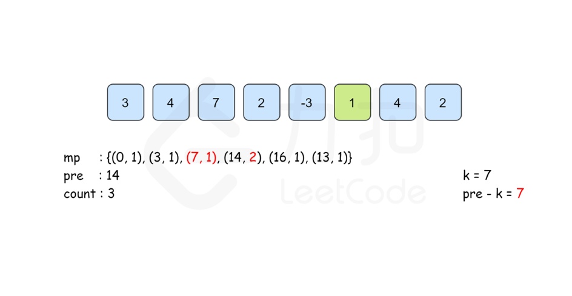

## 前缀和

### [Lc_560. 和为 K 的子数组](https://leetcode.cn/problems/subarray-sum-equals-k/)

给你一个整数数组 `nums` 和一个整数 `k` ，请你统计并返回 *该数组中和为 `k` 的子数组的个数* 。

**示例 1：**

```
输入：nums = [1,1,1], k = 2
输出：2
```

**示例 2：**

```
输入：nums = [1,2,3], k = 3
输出：2
```

**提示：**

- `1 <= nums.length <= 2 * 104`
- `-1000 <= nums[i] <= 1000`
- `-107 <= k <= 107`

```java
//暴力解法
class Solution {
    public int subarraySum(int[] nums, int k) {
        int len = nums.length;
        int ans = 0;
        for(int i = 0; i < len; i++){
            int sum = 0;
            for(int j = i; j >= 0; j--){//必须要从后往前找，从前往后难于找子数组
                sum += nums[j];
                if(sum == k){
                    ans++;
                }
            }
        }
        return ans;
    }
}
```

```java
//前缀和，复杂度和暴力一样   
class Solution {
    public int subarraySum(int[] nums, int k) {
        int len = nums.length;
        int ans = 0;
        int[] preSum = new int[len+1];
        preSum[0] = 0;
        for(int i = 0; i < len; i++){
            preSum[i+1] = preSum[i] + nums[i];
        }

        for(int i = 1; i <= len; i++){
            for(int j = i-1; j >= 0; j--){
                int sum = preSum[i] - preSum[j];//其中preSum[i] - preSum[j]就是j到i之间的数和
                if(sum == k){
                    ans++;
                }
            }
        }
        return ans;
    }
}
```



关于mp.put(0, 1); 这一行的作用就是为了应对 nums[0] +nums[1] + ... + nums[i] == k 的情况的, 也就是从下标 0 累加到下标 i, 举个例子说明, 如数组 [1, 2, 3, 6], 那么这个数组的累加和数组为 [1, 3, 6, 12] 如果 k = 6, 假如map中没有预先 put 一个 (0, 1) , 如果此时我们来到了累加和为 6 的位置, 这时map中的情况是 (1, 1), (3, 1), 而 mp.containsKey(pre - k) , 这时 pre - k 也就是 6 - 6 = 0, 因为 map 中没有 (0, 1) 所以 count 的值没有加一, 其实这个时候我们就是忽略了从下标 0 累加到下标 i 等于 k 的情况, 我们仅仅是统计了从下标大于 0 到某个位置等于 k 的所有答案,

至于为什么是 count += mp.get(pre - k); 呢 ? 举个例子: k = 6, 数组 [1, 2, 3, 0, 6] 累加和为: [1, 3, 6, 6, 12], 明显答案应该是 4, 当我们来到第一个累加和为 6 的位置上时, pre - k = 0, 也就是说从下标 0 到当前位置的累加和是一个答案, 当来到第二个 6 的位置上时, 也就是说从下标 0 到当前位置的累加和是一个答案, 而当来到 12 位置上时, pre - k = 6, 也就是说从累加和为 6 的子数组的后一个位置到当前位置也是满足条件的答案, 而累加和为 6 的子数组只有一个吗 ? 不 ! 这个例子中他有两个, 所以 count 是 加 mp.get(pre - k);, 而不是加 1,

```java
//该前缀和方法为，记录每次出现的前缀和次数，如果当前前缀减去k的值包含在记录当中，那么根据前缀和的性质，就会有从前到此为k的，更新
class Solution {
    public int subarraySum(int[] nums, int k) {
        int len = nums.length;
        Map<Integer,Integer> map = new HashMap<>();
        int ans = 0;
        int preSum = 0;
        map.put(0,1);
        for(int i = 0; i < len; i++){
            preSum += nums[i];
            if(map.containsKey(preSum - k)){
                ans += map.get(preSum-k);//不是直接ans++原因，1，-1,0时。见上
            }
            map.put(preSum,map.getOrDefault(preSum,0) + 1);
        }
        return ans;
    }
}
```


