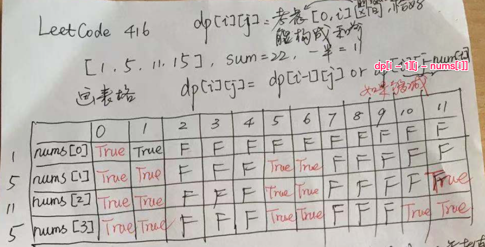

## 动态规划

### 思想

​	首先找到初始化条件，需要使用前一个得出的结果。找出其状态转义方程，有时候会借助一维或二维数组，有时候不用。

### Lc_5.最长回文子串

给你一个字符串 s，找到 s 中最长的回文子串。 

示例 1：
输入：s = "babad"
输出："bab"
解释："aba" 同样是符合题意的答案。

示例 2：
输入：s = "cbbd"
输出："bb"

链接：https://leetcode-cn.com/problems/longest-palindromic-substring

```java
//此题借助二维数组。初始化条件为每个字符为其串的回文子串，当两个字符相等时，状态转移方程为其中间包括的子串是否为回文子串，及dp[j+1][i-1],（j为行，子串的头，i为列，子串的尾），将该状态赋给
class Solution {
    public String longestPalindrome(String s) {
        int length = s.length();
        int[][] dp = new int[length][length];
        for(int i = 0; i < length; i++){
            dp[i][i] = 1;
        }
        int begin = 0;
        int maxlen = 1;
        char[] cs = s.toCharArray();
        for(int i = 1; i < length; i++){
            for(int j = 0; j < i; j++){//每次都从头开始

                if(cs[i] == cs[j]){//如果有相等的两个字符
                    if(i - j < 3){//如果子串的大小长度小于3的情况：aa，aba
                        dp[j][i] = 1;
                    }else{
                        dp[j][i] = dp[j+1][i-1];//使用前一步的结果，及中间子串的状态
                    }
                    if((i - j + 1) > maxlen && dp[j][i] == 1){//加上该位置如果是回文子串，重新判断最大长度和其实位置
                        maxlen = i - j + 1;
                        begin = j;
                    }
                }else{
                    dp[j][i] = 0;
                }
            }
        }
        return s.substring(begin, begin + maxlen);

    }
}
```

### [Lc_647. 回文子串](https://leetcode.cn/problems/palindromic-substrings/)

给你一个字符串 `s` ，请你统计并返回这个字符串中 **回文子串** 的数目。

**回文字符串** 是正着读和倒过来读一样的字符串。

**子字符串** 是字符串中的由连续字符组成的一个序列。

具有不同开始位置或结束位置的子串，即使是由相同的字符组成，也会被视作不同的子串。

**示例 1：**

```
输入：s = "abc"
输出：3
解释：三个回文子串: "a", "b", "c"
```

**示例 2：**

```
输入：s = "aaa"
输出：6
解释：6个回文子串: "a", "a", "a", "aa", "aa", "aaa"
```

**提示：**

- `1 <= s.length <= 1000`
- `s` 由小写英文字母组成

```java
class Solution {
    public int countSubstrings(String s) {
        int len = s.length();
        int ans = 0;
        boolean[][] dp = new boolean[len][len];
        for(int i = 0; i < len; i++){
            for(int j = i; j >= 0; j--){
                // if(i - j < 1){         不能这样判断，当遇到aaa情况时，当i=2，j=1时，a=a，这样判断，就会找dp[2][1]这样不在整个动态查找中
                //     dp[j][i] = true;
                //     ans++;
                // }else if(s.charAt(i) == s.charAt(j)){
                //     if(dp[j+1][i-1]){
                //         dp[j][i] = true;
                //         ans++;
                //     }
                // }
                if(s.charAt(i) == s.charAt(j)){
                    if(i - j <= 1){
                        dp[j][i] = true;
                        ans++;
                    }else if(dp[j+1][i-1]){
                        dp[j][i] = true;
                        ans++;
                    }
                }
            }
        }
        return ans;
    }
}
```


### Lc_10.正则表达式匹配

给你一个字符串 s 和一个字符规律 p，请你来实现一个支持 '.' 和 '*' 的正则表达式匹配。*
'\.' 匹配任意单个字符
'\*'匹配零个或多个前面的那一个元素
所谓匹配，是要涵盖 整个 字符串 s的，而不是部分字符串。

示例 1：
输入：s = "aa", p = "a"
输出：false
解释："a" 无法匹配 "aa" 整个字符串。

示例 2:
输入：s = "aa", p = "a\*"
输出：true
解释：因为 '\*' 代表可以匹配零个或多个前面的那一个元素, 在这里前面的元素就是 'a'。因此，字符串 "aa" 可被视为 'a' 重复了一次。

示例 3：
输入：s = "ab", p = ".\*"
输出：true
解释：".*" 表示可匹配零个或多个'\*'任意字符（'.'）。

链接：https://leetcode-cn.com/problems/regular-expression-matching

```java
//使用二维数组记录状态，大小为length+1。初始状态：map[0][0]=true，状态转移条件:当子串中该位置为*时，首先记录如果匹配零个前面的值，子串向前两部的状态，如果父串此时位置字符和子串的前一个字符相等，则取父串前一个状态或子串前两步的状态，如果*前一个字符和父串当前的字符相等，取两种结果。如果当前 j 指向的字符为 '*'，则不妨把类似 'a*', 'b*' 等的当成整体看待。
/*   看下面的例子
            i
            |
   S  a  b [b] b  b  c  
   
   P  a [b  *] d  *  c
            |
            j
   注意到当 'b*' 匹配完 'b' 之后，它仍然可以继续发挥作用。
   因此可以只把 i 前移一位，而不丢弃 'b*', 转化为子问题 f[i-1][j]:  
         i
         | <--
   S  a [b] b  b  b  c  
   
   P  a [b  *] d  *  c
            |
            j 
   另外，也可以选择让 'b*' 不再进行匹配，把 'b*' 丢弃。
   转化为子问题 f[i][j-2]:
            i
            |
   S  a  b [b] b  b  c  
    
   P [a] b  *  d  *  c
      |
      j <--

3. 冗余的状态转移不会影响答案，
   因为当 j 指向 'b*' 中的 'b' 时, 这个状态对于答案是没有用的,
   原因参见评论区 稳中求胜 的解释, 当 j 指向 '*' 时,
   dp[i][j]只与dp[i][j-2]有关, 跳过了 dp[i][j-1].*/
//如果不是*，则取父子串前一个状态。
class Solution {
    public boolean isMatch(String s, String p) {
       int length1 = s.length();
       int length2 = p.length();
       boolean[][] map = new boolean[length1+1][length2+1];
       map[0][0] = true;

       for(int i = 0; i <= length1; i++){
           for(int j = 1; j <= length2; j++){
               if(p.charAt(j - 1) == '*'){
                   map[i][j] = map[i][j-2];//因为没有考虑一开始为*，i需要从零开始
                   if(match(s, p, i, j-1)){
                       map[i][j] = map[i][j] || map[i-1][j];
                   }
               }else {
                   if(match(s, p, i, j)){
                       map[i][j] = map[i-1][j-1];
                   }
               }

           }
       }
    
        return map[length1][length2];

    }

    boolean match(String s, String p, int i, int j){
        if( i == 0){
            return false;
        }
        if(p.charAt(j-1) == '.'){
            return true;
        }
        return s.charAt(i -1) == p.charAt(j-1);
    }
    
}
```

### [Lc_44. 通配符匹配](https://leetcode.cn/problems/wildcard-matching/)

难度困难893

给定一个字符串 (`s`) 和一个字符模式 (`p`) ，实现一个支持 `'?'` 和 `'*'` 的通配符匹配。

```
'?' 可以匹配任何单个字符。
'*' 可以匹配任意字符串（包括空字符串）。
```

两个字符串**完全匹配**才算匹配成功。

**说明:**

- `s` 可能为空，且只包含从 `a-z` 的小写字母。
- `p` 可能为空，且只包含从 `a-z` 的小写字母，以及字符 `?` 和 `*`。

**示例 1:**

```
输入:
s = "aa"
p = "a"
输出: false
解释: "a" 无法匹配 "aa" 整个字符串。
```

**示例 2:**

```
输入:
s = "aa"
p = "*"
输出: true
解释: '*' 可以匹配任意字符串。
```

**示例 3:**

```
输入:
s = "cb"
p = "?a"
输出: false
解释: '?' 可以匹配 'c', 但第二个 'a' 无法匹配 'b'。
```

**示例 4:**

```
输入:
s = "adceb"
p = "*a*b"
输出: true
解释: 第一个 '*' 可以匹配空字符串, 第二个 '*' 可以匹配字符串 "dce".
```

**示例 5:**

```
输入:
s = "acdcb"
p = "a*c?b"
输出: false
```

```java
class Solution {
    public boolean isMatch(String s, String p) {
        int len1 = s.length();
        int len2 = p.length();
        boolean[][] dp = new boolean[len1+1][len2+1];
        //当为s和p都为空串时
        dp[0][0] = true;
        //当s为空，p全为*时。同时处理p第一个为*的特殊情况
        for(int i = 1; i <= len2; i++){
            if(p.charAt(i-1) == '*'){
                dp[0][i] = true;
            }else{
                break;
            }
        }
        for(int i = 1; i <= len1; i++){
            for(int j = 1; j <= len2; j++){
                if(p.charAt(j-1) == '*'){
                    //当遇到*时，匹配字符时要取dp[i-1][j],不匹配字符时，看dp[i][j-1]
                    dp[i][j] = dp[i-1][j] || dp[i][j-1];
                }else if(p.charAt(j-1) == '?' || p.charAt(j-1) == s.charAt(i-1)){
                    dp[i][j] = dp[i-1][j-1];
                }
            }
        }
        return dp[len1][len2];
    }
}
```

### Lc_22.括号生成

数字 n 代表生成括号的对数，请你设计一个函数，用于能够生成所有可能的并且 有效的 括号组合。

示例 1：
输入：n = 3
输出：["((()))","(()())","(())()","()(())","()()()"]

示例 2：
输入：n = 1
输出：["()"]


链接：https://leetcode-cn.com/problems/generate-parentheses

```java
//动态规划：使用前几个状态，求第n个状态时。需要考虑前面组合相加为n-1的状态。
public List<String> generateParenthesis(int n) {
		LinkedList<LinkedList<String>> result = new LinkedList<LinkedList<String>>();
		if (n == 0)
			return new LinkedList<>();
		LinkedList<String> list0 = new LinkedList<String>();
		list0.add("");
		result.add(list0);
		LinkedList<String> list1 = new LinkedList<String>();
		list1.add("()");
		result.add(list1);
		for (int i = 2; i <= n; i++) {
			LinkedList<String> temp = new LinkedList<String>();
			for (int j = 0; j < i; j++) {
				List<String> str1 = result.get(j);
				List<String> str2 = result.get(i - 1 - j);
				for (String s1 : str1) {
					for (String s2 : str2) {
					  //String el = "(" + s1 + ")" + s2;这个和下面的都可以
                        String el = s1 + "(" + s2 + ")";
						temp.add(el);
					}
				}

			}
			result.add(temp);
		}
		return result.get(n);
	}
```

### Lc_32.最长有效括号

给你一个只包含 '(' 和 ')' 的字符串，找出最长有效（格式正确且连续）括号子串的长度。

示例 1：
输入：s = "(()"
输出：2
解释：最长有效括号子串是 "()"

示例 2：
输入：s = ")()())"
输出：4
解释：最长有效括号子串是 "()()"

示例 3：
输入：s = ""
输出：0

链接：https://leetcode-cn.com/problems/longest-valid-parentheses

```java
//使用一个一位数组记录每个位置的结果。如果为')'时，分两种情况：1：前一位置为'('时，根据此位置前两个状态结果加2，及'('前的状态。2：如果为')'时,且去掉中间的对应为'('时，类似：((()))情况时，需要看中间是否匹配，即i-1层的状态加2
class Solution {
    public int longestValidParentheses(String s) {
        int length = s.length();
        int[] arr = new int[length];
        int max = 0;
        for(int i = 1; i < length; i++){
            if(s.charAt(i) == ')'){
                if(s.charAt(i-1) == '('){
                    arr[i] = ((i - 2) >= 0 ? arr[i-2] : 0) + 2;
                }else if(i - arr[i-1]-1 >= 0 && s.charAt(i- arr[i-1]-1) == '('){
                    arr[i] = arr[i-1] + 2  +  ((i - arr[i-1] - 2 >= 0) ? arr[i - arr[i-1] - 2] : 0 );
                }
                if(arr[i] > max){
                    max = arr[i];
                }
            }
        }
        return max;
    }
}
```

### Lc_53.最大子数组和

给你一个整数数组 nums ，请你找出一个具有最大和的连续子数组（子数组最少包含一个元素），返回其最大和。
子数组 是数组中的一个连续部分。 

示例 1：
输入：nums = [-2,1,-3,4,-1,2,1,-5,4]
输出：6
解释：连续子数组 [4,-1,2,1] 的和最大，为 6 。

示例 2：
输入：nums = [1]
输出：1

示例 3：
输入：nums = [5,4,-1,7,8]

链接：https://leetcode-cn.com/problems/maximum-subarray

```java
//转移方程为：前一状态加本状态是否大于等于本状态
class Solution {
    public int maxSubArray(int[] nums) {
        int len = nums.length;
        int[] status = new int[len];
        status[0] = nums[0];
        int max = status[0];
        for(int i = 1; i < len; i++){
            if(status[i-1] + nums[i] >= nums[i]){
                status[i] = status[i-1] + nums[i];
            }else{
                status[i] = nums[i];
            }
            if(status[i] > max){
                max = status[i];
            }
        }
        return max;
    }
}
```

### Lc_55.跳跃游戏

给定一个非负整数数组 nums ，你最初位于数组的 第一个下标 。
数组中的每个元素代表你在该位置可以跳跃的最大长度。
判断你是否能够到达最后一个下标。

示例 1：

输入：nums = [2,3,1,1,4]
输出：true
解释：可以先跳 1 步，从下标 0 到达下标 1, 然后再从下标 1 跳 3 步到达最后一个下标。
示例 2：

输入：nums = [3,2,1,0,4]
输出：false
解释：无论怎样，总会到达下标为 3 的位置。但该下标的最大跳跃长度是 0 ， 所以永远不可能到达最后一个下标。

链接：https://leetcode-cn.com/problems/jump-game

```java
// dp解法。 思路就是dp[i] 的含义为：遍历到 i 这里时，
// 能跳跃的最长的距离。 比如 2 3 1 1 2 ，我遍历到下标为 2的时候，能跳跃到的最远下标为4。
// 但是在当前 i 下标时，前一个下标 i - 1 的最大跳跃距离跳越不到 i 时，则判定返回false 即dp[i - 1] < i 时。
// 同时 特判数组长度=1时，都是true。
class Solution {
    public boolean canJump(int[] nums) {
        if (nums.length == 1) {
            return true;
        }
        int[] dp = new int[nums.length];
        dp[0] = nums[0];
        for(int i = 1;i < nums.length - 1;i++){
            if (dp[i-1] < i) return false;
            dp[i] = Math.max(dp[i-1],nums[i] + i);
        }
        return dp[nums.length - 2] >= nums.length - 1;
    }
}
```

### [Lc_62. 不同路径](https://leetcode.cn/problems/unique-paths/)

一个机器人位于一个 `m x n` 网格的左上角 （起始点在下图中标记为 “Start” ）。

机器人每次只能向下或者向右移动一步。机器人试图达到网格的右下角（在下图中标记为 “Finish” ）。

问总共有多少条不同的路径？

**示例 1：**


```
输入：m = 3, n = 7
输出：28
```

**示例 2：**

```
输入：m = 3, n = 2
输出：3
解释：
从左上角开始，总共有 3 条路径可以到达右下角。
1. 向右 -> 向下 -> 向下
2. 向下 -> 向下 -> 向右
3. 向下 -> 向右 -> 向下
```

**示例 3：**

```
输入：m = 7, n = 3
输出：28
```

**示例 4：**

```
输入：m = 3, n = 3
输出：6
```

**提示：**

- `1 <= m, n <= 100`
- 题目数据保证答案小于等于 `2 * 109`

```java
//只能向下和向右走，先将边界都初始化为1。然后每个状态是其左边的加上上边的状态的和
class Solution {
    public int uniquePaths(int m, int n) {
        int[][] dp = new int[m][n];
        for(int i = 0; i < n; i++){
            dp[0][i] = 1;
        }

        for(int j = 0; j < m; j++){
            dp[j][0] = 1;
        }
        for(int i = 1; i < m; i++){
            for(int j = 1; j < n; j++){
                dp[i][j] = dp[i-1][j] + dp[i][j-1];
            }
        }
        return dp[m-1][n-1];
    }
}
```

### [Lc_63. 不同路径 II](https://leetcode.cn/problems/unique-paths-ii/)

一个机器人位于一个 `m x n` 网格的左上角 （起始点在下图中标记为 “Start” ）。

机器人每次只能向下或者向右移动一步。机器人试图达到网格的右下角（在下图中标记为 “Finish”）。

现在考虑网格中有障碍物。那么从左上角到右下角将会有多少条不同的路径？

网格中的障碍物和空位置分别用 `1` 和 `0` 来表示。

**示例 1：**


```
输入：obstacleGrid = [[0,0,0],[0,1,0],[0,0,0]]
输出：2
解释：3x3 网格的正中间有一个障碍物。
从左上角到右下角一共有 2 条不同的路径：
1. 向右 -> 向右 -> 向下 -> 向下
2. 向下 -> 向下 -> 向右 -> 向右
```

**示例 2：**


```
输入：obstacleGrid = [[0,1],[0,0]]
输出：1
```

**提示：**

- `m == obstacleGrid.length`
- `n == obstacleGrid[i].length`
- `1 <= m, n <= 100`
- `obstacleGrid[i][j]` 为 `0` 或 `1`

```java
class Solution {
    public int uniquePathsWithObstacles(int[][] obstacleGrid) {
        if(obstacleGrid[0][0] == 1){
            return 0;
        }
        int m = obstacleGrid.length;
        int n = obstacleGrid[0].length;
        int[][] dp = new int[m][n];
        for(int i = 0; i < m; i++){
            if(obstacleGrid[i][0] == 1){
                break;
            }
            dp[i][0] = 1;
        }
        for(int i = 0; i < n; i++){
            if(obstacleGrid[0][i] == 1){
                break;
            }
            dp[0][i] = 1;
        }
        for(int i = 1; i < m; i++){
            for(int j = 1; j < n; j++){
                if(obstacleGrid[i][j] == 1){
                    continue;
                }
                dp[i][j] = dp[i][j-1] + dp[i-1][j];
            }
        }
        return dp[m-1][n-1];
    }        
}
```

### Lc_64最小路径和

给定一个包含非负整数的 m x n 网格 grid ，请找出一条从左上角到右下角的路径，使得路径上的数字总和为最小。

说明：每次只能向下或者向右移动一步。

示例 1：

输入：grid = [[1,3,1],[1,5,1],[4,2,1]]
输出：7
解释：因为路径 1→3→1→1→1 的总和最小。

链接：https://leetcode-cn.com/problems/minimum-path-sum

```java
//同上思想
class Solution {
    public int minPathSum(int[][] grid) {
        int m = grid.length;
        int n = grid[0].length;
        for(int i = 1; i < m; i++){
            grid[i][0] += grid[i-1][0];
        }
        for(int j = 1; j < n; j++){
            grid[0][j] += grid[0][j-1];
        }

        for(int i = 1; i < m; i++){
            for(int j = 1; j < n; j++){
                grid[i][j] += Math.min(grid[i-1][j],grid[i][j-1]);
            }
        }

        return grid[m-1][n-1];
    }
}
```

### Lc_70.爬楼梯

假设你正在爬楼梯。需要 n 阶你才能到达楼顶。
每次你可以爬 1 或 2 个台阶。你有多少种不同的方法可以爬到楼顶呢？

示例 1：

输入：n = 2
输出：2
解释：有两种方法可以爬到楼顶。

1. 1 阶 + 1 阶
2. 2 阶
示例 2：

输入：n = 3
输出：3
解释：有三种方法可以爬到楼顶。
1. 1 阶 + 1 阶 + 1 阶
2. 1 阶 + 2 阶
3. 2 阶 + 1 阶

链接：https://leetcode-cn.com/problems/climbing-stairs

```java
//因为每次只能走一步或两部，所以状态方程为：此时状态的前一步的状态加上前两步的状态
class Solution {
    public int climbStairs(int n) {
        if(n == 1){
            return 1;
        }
        int[] dp = new int[n];
        dp[0] = 1;
        dp[1] = 2;
        for(int i = 2; i < n; i++){
            dp[i] = dp[i-1] + dp[i-2];
        }
        return dp[n-1];
    }
}
```

### Lc_72.编辑距离

给你两个单词 word1 和 word2， 请返回将 word1 转换成 word2 所使用的最少操作数  。

你可以对一个单词进行如下三种操作：
插入一个字符
删除一个字符
替换一个字符

示例 1：
输入：word1 = "horse", word2 = "ros"
输出：3
解释：
horse -> rorse (将 'h' 替换为 'r')
rorse -> rose (删除 'r')
rose -> ros (删除 'e')

示例 2：
输入：word1 = "intention", word2 = "execution"
输出：5
解释：
intention -> inention (删除 't')
inention -> enention (将 'i' 替换为 'e')
enention -> exention (将 'n' 替换为 'x')
exention -> exection (将 'n' 替换为 'c')
exection -> execution (插入 'u')

链接：https://leetcode-cn.com/problems/edit-distance

```java
//考虑到有空值的情况，dp的大小为length+1，初始的时候应考虑为空，各个字母转化为其单词的步数，即每行对应的下标。如果两者对应下标相等，取对应下标前一坐标的状态。如果不相等，则考虑word1，替换该下标、先增后删除该下标、增加该下标值得情况的最小值，即：dp状态矩阵的左上角，上边和左边的值
class Solution {
    public int minDistance(String word1, String word2) {
        int length1 = word1.length();
        int length2 = word2.length();

        int[][] dp = new int[length1+1][length2+1];

        for(int i = 0; i <= length1; i++){
            dp[i][0] = i;
        }
        for(int i = 0; i <= length2; i++){
            dp[0][i] = i;
        }

        for(int i = 1; i <= length1; i++){
            for(int j = 1; j <= length2; j++){
                if(word1.charAt(i-1) == word2.charAt(j-1)){
                    dp[i][j] = dp[i-1][j-1];
                }else{
                    dp[i][j] = 1 +  Math.min((dp[i-1][j]<dp[i][j-1]?dp[i-1][j]:dp[i][j-1]),dp[i-1][j-1]);
                }
            }
        }
        return dp[length1][length2];
    }
}
```

### Lc_78.子集

给你一个整数数组 nums ，数组中的元素 互不相同 。返回该数组所有可能的子集（幂集）。
解集 不能 包含重复的子集。你可以按 任意顺序 返回解集。

示例 1：
输入：nums = [1,2,3]
输出：[[],[1],[2],[1,2],[3],[1,3],[2,3],[1,2,3]]

示例 2：
输入：nums = [0]
输出：[[],[0]]

链接：https://leetcode-cn.com/problems/subsets

```java
//使用一维数组，初始状态为空，取前面的每一个状态，加上下标字符
class Solution {
    public List<List<Integer>> subsets(int[] nums) {//dp
        List<List<Integer>> ans = new ArrayList<>();
        List<Integer> elist = new ArrayList<>();
        ans.add(elist);
        for(int i = 0; i < nums.length; i++){
            int num = nums[i];
            int len = ans.size();
            for(int j = 0; j < len; j++){
                List<Integer> list = ans.get(j);
                List<Integer> sublist = new ArrayList<>(list);
                sublist.add(num);
                ans.add(sublist);
            }
        }
        return ans;
    }
}
```

### Lc_84.柱状图中最大矩形

给定 n 个非负整数，用来表示柱状图中各个柱子的高度。每个柱子彼此相邻，且宽度为 1 。
求在该柱状图中，能够勾勒出来的矩形的最大面积。

示例 1:
输入：heights = [2,1,5,6,2,3]
输出：10
解释：最大的矩形为图中红色区域，面积为 10

示例 2：
输入： heights = [2,4]
输出： 4

链接：https://leetcode-cn.com/problems/largest-rectangle-in-histogram

| 2    | 2    | 3    | 4    | 5    | 6    |
| ---- | ---- | ---- | ---- | ---- | ---- |
|      | 1    | 2    | 3    | 4    | 5    |
|      |      | 5    | 10   | 6    | 8    |
|      |      |      | 6    | 4    |      |
|      |      |      |      | 2    |      |
|      |      |      |      |      | 3    |

```java
//初始为对角线等于各个值，从左到右，从上到下依次填写右上矩形。但是该题会报内存溢出。
class Solution {
    public int largestRectangleArea(int[] heights) {
        int len = heights.length;
        int ans = 0;
        int[][] dp = new int[len][len];
        for(int i = 0; i < len; i++){
            dp[i][i] = heights[i];
            if(ans < heights[i]){
                ans = heights[i];
            }
        }
        //dp公式为通过前一个结果，结果除以下标相减(长度)，得出最小，如果下标值大于得出的最小，加得出的最小值。如果下标值小于前得出的最小值，则根据该下标称长度，得出最新的面积。
        for(int i = 1; i < len; i++){
            for(int j = 0; j < i; j++){
                int min_index = dp[j][i-1]/(i - j);
                if(heights[i] > min_index){
                    dp[j][i] = dp[j][i-1] + min_index;
                }else{//如果当前下标为最小值
                    dp[j][i] = heights[i] * (i - j + 1);
                }

                if(dp[j][i] > ans){
                    ans = dp[j][i];
                }
            }
        }
        return ans;
    }
}
```

### Lc_96.不同的二叉搜索树

给你一个整数 n ，求恰由 n 个节点组成且节点值从 1 到 n 互不相同的 二叉搜索树 有多少种？返回满足题意的二叉搜索树的种数。

示例 1：


输入：n = 3
输出：5

示例 2：
输入：n = 1
输出：1

链接：https://leetcode-cn.com/problems/unique-binary-search-trees

```java
//二叉搜索树的概念：左子树小于右子树。
//动态规划,初始化1个节点时为1，然后假设从1到n各个作为根节点时的情况总和，左右子树节点的数量，该数量就是n个节点对应的二叉搜索树。左右子树结点数量对应二叉搜索树相乘。
class Solution {
    public int numTrees(int n) {
        int[] dp = new int[n+1];
        dp[0] = 1;
        dp[1] = 1;
        if(n = 1){//1<=n<=19
            return 1;
        }
        for(int i = 2; i <= n; i++){
            int tmp = 0;
            for(int j = 1; j <= i; j++){
            //tmp += ((j-1)==0 ? 1:dp[j-1])*((i-j)==0? 1: dp[i-j]);   如果0下标不设为1，要额外判断左右节点为零时要乘1，而不是0
                tmp +=  dp[j-1]*dp[i-j];//左右情况可以自由组合，所以是乘
            }
            dp[i] = tmp;
        }
        return dp[n];
    }
}
```

### [Lc_139. 单词拆分](https://leetcode-cn.com/problems/word-break/)

给你一个字符串 `s` 和一个字符串列表 `wordDict` 作为字典。请你判断是否可以利用字典中出现的单词拼接出 `s` 。

**注意：**不要求字典中出现的单词全部都使用，并且字典中的单词可以重复使用。

**示例 1：**

```
输入: s = "leetcode", wordDict = ["leet", "code"]
输出: true
解释: 返回 true 因为 "leetcode" 可以由 "leet" 和 "code" 拼接成。
```

**示例 2：**

```
输入: s = "applepenapple", wordDict = ["apple", "pen"]
输出: true
解释: 返回 true 因为 "applepenapple" 可以由 "apple" "pen" "apple" 拼接成。
     注意，你可以重复使用字典中的单词。
```

**示例 3：**

```
输入: s = "catsandog", wordDict = ["cats", "dog", "sand", "and", "cat"]
输出: false
```

**提示：**

- `1 <= s.length <= 300`
- `1 <= wordDict.length <= 1000`
- `1 <= wordDict[i].length <= 20`
- `s` 和 `wordDict[i]` 仅有小写英文字母组成
- `wordDict` 中的所有字符串 **互不相同**

```java
//初始化头为true。递归表达式为：依次从头扫描到下标，如果从头开始到小标位置中含有该单词，且前面的也包含则设为true。
class Solution {
    public boolean wordBreak(String s, List<String> wordDict) {
        Set<String> set = new HashSet<>();
        boolean[] dp = new boolean[s.length()+1];
        for(String sub: wordDict){
            set.add(sub);
        }
        dp[0] = true;
        for(int i = 1; i <= s.length(); i++){
            for(int j = 0; j < i; j++){
                if(dp[j]&&set.contains(s.substring(j,i))){
                    dp[i] = true;
                    break;
                }
            }
        }

        return dp[s.length()];
    }
}
```

### [Lc_152. 乘积最大子数组](https://leetcode-cn.com/problems/maximum-product-subarray/)

给你一个整数数组 `nums` ，请你找出数组中乘积最大的非空连续子数组（该子数组中至少包含一个数字），并返回该子数组所对应的乘积。

测试用例的答案是一个 **32-位** 整数。

**子数组** 是数组的连续子序列。

**示例 1:**

```
输入: nums = [2,3,-2,4]
输出: 6
解释: 子数组 [2,3] 有最大乘积 6。
```

**示例 2:**

```
输入: nums = [-2,0,-1]
输出: 0
解释: 结果不能为 2, 因为 [-2,-1] 不是子数组。
```

**提示:**

- `1 <= nums.length <= 2 * 104`
- `-10 <= nums[i] <= 10`
- `nums` 的任何前缀或后缀的乘积都 **保证** 是一个 **32-位** 整数

```java
//主要思想就是维护两个最大和最小的动态数组，当碰到正数时，最大利用大动态数组更新，最小利用小更新，碰到负数反过来一样。
class Solution {
    public int maxProduct(int[] nums) {
        int length = nums.length;
        if(length == 1){
            return nums[0];
        }
        int[] dp_max = new int[length];
        int[] dp_min = new int[length];
        dp_max[0] = nums[0];
        dp_min[0] = nums[0];
        int ans = nums[0];
        for(int i = 1; i < length; i++){
            if(nums[i] > 0){
                dp_max[i] = dp_max[i-1] > 0? dp_max[i-1] * nums[i] : nums[i];
                dp_min[i] = dp_min[i-1] < 0 ? dp_min[i-1] * nums[i] : nums[i];
            }else if(nums[i] < 0){
                dp_max[i] = dp_min[i-1] < 0? dp_min[i-1] * nums[i] : nums[i];
                dp_min[i] = dp_max[i-1] > 0? dp_max[i-1] * nums[i] : nums[i];
            }else{//此处else取消也可以
                dp_max[i] = 0;
                dp_min[i] = 0;
            }
            ans = Math.max(ans, dp_max[i]);
        }
        return ans;
    }
}
```

```java
class Solution {
    public int maxProduct(int[] nums) {
        int length = nums.length;
        if(length == 1){
            return nums[0];
        }
        int[] dp_max = new int[length];
        int[] dp_min = new int[length];
        dp_max[0] = nums[0];
        dp_min[0] = nums[0];
        int ans = nums[0];//不能初始一个常数，可能会失败如：0，-1
        for(int i = 1; i < length; i++){
            //利用此条件也可以
            //dp_max[i] = Math.max(dp_min[i-1] * nums[i],Math.max(dp_max[i-1] * nums[i], nums[i]));
        	//dp_min[i] = Math.min(dp_max[i-1] * nums[i], Math.min(dp_min[i-1] * nums[i], nums[i]));
            if(nums[i] > 0){
                dp_max[i] = Math.max(dp_max[i-1] * nums[i] , nums[i]);
                dp_min[i] = Math.min(dp_min[i-1] * nums[i] , nums[i]);
            }else{
                dp_max[i] = Math.max(dp_min[i-1] * nums[i] , nums[i]);
                dp_min[i] = Math.min(dp_max[i-1] * nums[i] , nums[i]);
            }
            ans = Math.max(ans, dp_max[i]);
        }
        return ans;
    }
}
```

```java
//利用两个常数，代替两个数组，空间复杂度降到O(1)
class Solution {
    public int maxProduct(int[] nums) {
        int length = nums.length;
        if(length == 1){
            return nums[0];
        }

        int max = nums[0];
        int min = nums[0];
        int ans = nums[0];
        for(int i = 1; i < length; i++){
            int tmp_max = max;
            int tmp_min = min;
            max = Math.max(tmp_max * nums[i],Math.max(tmp_min * nums[i], nums[i]));
            min = Math.min(tmp_min * nums[i], Math.min(tmp_max * nums[i], nums[i]));

            ans = Math.max(ans, max);
        }

        return ans;
    }
}
```

### [Lc_198. 打家劫舍](https://leetcode-cn.com/problems/house-robber/)

你是一个专业的小偷，计划偷窃沿街的房屋。每间房内都藏有一定的现金，影响你偷窃的唯一制约因素就是相邻的房屋装有相互连通的防盗系统，**如果两间相邻的房屋在同一晚上被小偷闯入，系统会自动报警**。

给定一个代表每个房屋存放金额的非负整数数组，计算你 **不触动警报装置的情况下** ，一夜之内能够偷窃到的最高金额。

**示例 1：**

```
输入：[1,2,3,1]
输出：4
解释：偷窃 1 号房屋 (金额 = 1) ，然后偷窃 3 号房屋 (金额 = 3)。
     偷窃到的最高金额 = 1 + 3 = 4 。
```

**示例 2：**

```
输入：[2,7,9,3,1]
输出：12
解释：偷窃 1 号房屋 (金额 = 2), 偷窃 3 号房屋 (金额 = 9)，接着偷窃 5 号房屋 (金额 = 1)。
     偷窃到的最高金额 = 2 + 9 + 1 = 12 。
```

**提示：**

- `1 <= nums.length <= 100`
- `0 <= nums[i] <= 400`

```java
//初始化取第一个。递归转移状态分为两种：1是直接取前一个状态，中间间隔一个，即取该位置的前两个位置时，2是取前一个位置的前一个转态，即取前一个去掉前一个位置的值时，也是中间间隔2个
class Solution {
    public int rob(int[] nums) {
        int length = nums.length;
        if(length == 1){
            return nums[0];
        }
        int[] dp = new int[length];
        dp[0] = nums[0];
        int ans = dp[0];
        for(int i = 1; i < length; i++){
            int front = dp[i-1] - nums[i-1] + nums[i];//如果不取前一个位置，取该位置的前一个状态
            int front_front = ((i-2) >= 0?dp[i-2]:0) + nums[i];//i2>=0为了处理i=1时情况
            dp[i] = Math.max(front,front_front);
            ans = Math.max(ans,dp[i]);
        }
        return ans;
    }
}
```

```java
public int rob(int[] nums) {
    if (nums.length == 0) {
        return 0;
    }
    // 子问题：
    // f(k) = 偷 [0..k) 房间中的最大金额

    // f(0) = 0
    // f(1) = nums[0]
    // f(k) = max{ rob(k-1), nums[k-1] + rob(k-2) }

    int N = nums.length;
    int[] dp = new int[N+1];
    dp[0] = 0;
    dp[1] = nums[0];
    for (int k = 2; k <= N; k++) {
        dp[k] = Math.max(dp[k-1], nums[k-1] + dp[k-2]);
    }
    return dp[N];
}
```

```java
//空间优化
public int rob(int[] nums) {
    int prev = 0;
    int curr = 0;

    // 每次循环，计算“偷到当前房子为止的最大金额”
    for (int i : nums) {
        // 循环开始时，curr 表示 dp[k-1]，prev 表示 dp[k-2]
        // dp[k] = max{ dp[k-1], dp[k-2] + i }
        int temp = Math.max(curr, prev + i);
        prev = curr;
        curr = temp;
        // 循环结束时，curr 表示 dp[k]，prev 表示 dp[k-1]
    }

    return curr;
}
```

### [Lc_221. 最大正方形](https://leetcode.cn/problems/maximal-square/)

在一个由 `'0'` 和 `'1'` 组成的二维矩阵内，找到只包含 `'1'` 的最大正方形，并返回其面积。

**示例 1：**


```
输入：matrix = [["1","0","1","0","0"],["1","0","1","1","1"],["1","1","1","1","1"],["1","0","0","1","0"]]
输出：4
```

**示例 2：**


```
输入：matrix = [["0","1"],["1","0"]]
输出：1
```

**示例 3：**

```
输入：matrix = [["0"]]
输出：0
```

**提示：**

- `m == matrix.length`
- `n == matrix[i].length`
- `1 <= m, n <= 300`
- `matrix[i][j]` 为 `'0'` 或 `'1'`

```java
//去一个大小和原数组一样大小的数组，初始化为原始的上和左。转移方程为每次算左边、右边和左上角最小的正方形边长edge。然后此时的面积就是：edge*edge + 2*edge +1
class Solution {
    public int maximalSquare(char[][] matrix) {
        int row = matrix.length;
        int col = matrix[0].length;
        int[][] mat = new int[row][col];
        for(int i = 0; i < row; i++){
            for(int j = 0; j < col; j++){
                if(matrix[i][j] == '0'){
                    mat[i][j] = 0;
                }else{
                    mat[i][j] = 1;
                }
            }
        }
        int[][] dp = new int [row][col];
        int ans = 0;
        for(int i = 0 ; i < row ; i ++){
            dp[i][0] = mat[i][0];
            if(mat[i][0] == 1){
                ans = 1;
            }
        }
        for(int i = 0; i < col; i++){
            dp[0][i] = mat[0][i];
            if(mat[0][i] == 1){
                ans = 1;
            }
        }
       
        for(int i = 1; i < row; i++){
            for(int j = 1; j < col; j++){
                if(mat[i][j] == 1 && dp[i-1][j] >= 1 && dp[i][j-1] >= 1 && dp[i-1][j-1]>=1){
                    int edge = Math.min((int)Math.sqrt(dp[i-1][j-1]),Math.min((int)Math.sqrt(dp[i-1][j]),(int)Math.sqrt(dp[i][j-1])));//由面积算边
                    dp[i][j] = edge*edge + 2*edge + mat[i][j];
                    
                }else{
                    dp[i][j] = mat[i][j];
                }
                ans = Math.max(ans, dp[i][j]);
            }
        }
        return ans;

    }
}
```

```java
//由上面的思想后，直接可以计算边长
class Solution {
    public int maximalSquare(char[][] matrix) {
        int row = matrix.length;
        int col = matrix[0].length;
        int[][] dp = new int [row][col];
        int edge = 0;
        for(int i = 0; i < row; i++){
            for(int j = 0; j < col; j++){
               if(matrix[i][j] == '1'){
                   if(i == 0 || j == 0){
                       dp[i][j] = 1;
                   }else{
                       dp[i][j] = Math.min(dp[i-1][j-1], Math.min(dp[i-1][j], dp[i][j-1])) + 1;
                   }
                   edge = Math.max(edge, dp[i][j]);//不用放到外边，在此计算即可，因为外边是0的情况，不用再判断
               }
            }
        }
        return edge*edge;
    }
}
```

### [Lc_279. 完全平方数](https://leetcode.cn/problems/perfect-squares/)

给你一个整数 `n` ，返回 *和为 `n` 的完全平方数的最少数量* 。

**完全平方数** 是一个整数，其值等于另一个整数的平方；换句话说，其值等于一个整数自乘的积。例如，`1`、`4`、`9` 和 `16` 都是完全平方数，而 `3` 和 `11` 不是。

**示例 1：**

```
输入：n = 12
输出：3 
解释：12 = 4 + 4 + 4
```

**示例 2：**

```
输入：n = 13
输出：2
解释：13 = 4 + 9
```

**提示：**

- `1 <= n <= 104`

```java
//初始化为0，递归的状态就是此时的数所包含的平方数一定在1-根号n范围内
class Solution {
    public int numSquares(int n) {
        int[] dp = new int[n+1];
        for(int i = 1; i <= n; i++){
            int min = Integer.MAX_VALUE;
            for(int j = 1; j*j <= i; j++){
                min = Math.min(min, dp[i - j*j]);
            }
            dp[i] = min + 1;
        }
        return dp[n];
    }
}
```

### [Lc_300. 最长递增子序列](https://leetcode.cn/problems/longest-increasing-subsequence/)

给你一个整数数组 `nums` ，找到其中最长严格递增子序列的长度。

**子序列** 是由数组派生而来的序列，删除（或不删除）数组中的元素而不改变其余元素的顺序。例如，`[3,6,2,7]` 是数组 `[0,3,1,6,2,2,7]` 的子序列。

**示例 1：**

```
输入：nums = [10,9,2,5,3,7,101,18]
输出：4
解释：最长递增子序列是 [2,3,7,101]，因此长度为 4 。
```

**示例 2：**

```
输入：nums = [0,1,0,3,2,3]
输出：4
```

**示例 3：**

```
输入：nums = [7,7,7,7,7,7,7]
输出：1
```

**提示：**

- `1 <= nums.length <= 2500`
- `-104 <= nums[i] <= 104`

**进阶：**

- 你能将算法的时间复杂度降低到 `O(n log(n))` 吗?

```java
//转移条件方程为，每个数需要考虑前面所有的数，依次对比，如果遇到比该数小的，则存在递增，此时则根据小数的dp进行加一更新
class Solution {
    public int lengthOfLIS(int[] nums) {
        int length = nums.length;
        int[] dp = new int[length];
        dp[0] = 1;
        int ans = 1;
        for(int i = 1; i < length; i++){
            dp[i] = 1;
            for(int j = 0; j < i; j++){
                if(nums[i] > nums[j]){
                    dp[i] = Math.max(dp[i], dp[j]+1);//不能遇到就加1，如4，2，8
                }
            }
            ans = Math.max(ans,dp[i]);
        }
       
        return ans;
    }
}
```

### [Lc_309. 最佳买卖股票时机含冷冻期](https://leetcode.cn/problems/best-time-to-buy-and-sell-stock-with-cooldown/)

给定一个整数数组`prices`，其中第 `prices[i]` 表示第 `*i*` 天的股票价格 。

设计一个算法计算出最大利润。在满足以下约束条件下，你可以尽可能地完成更多的交易（多次买卖一支股票）:

- 卖出股票后，你无法在第二天买入股票 (即冷冻期为 1 天)。

**注意：**你不能同时参与多笔交易（你必须在再次购买前出售掉之前的股票）。

**示例 1:**

```
输入: prices = [1,2,3,0,2]
输出: 3 
解释: 对应的交易状态为: [买入, 卖出, 冷冻期, 买入, 卖出]
```

**示例 2:**

```
输入: prices = [1]
输出: 0
```

**提示：**

- `1 <= prices.length <= 5000`
- `0 <= prices[i] <= 1000`

```java
class Solution {
    public int maxProfit(int[] prices) {
        int length = prices.length;
        int[] dp = new int[length];
        dp[0] = 0;
        for(int i = 0; i < length-1; i++){
            if(prices[i] >= prices[i+1]){
                dp[i+1] = dp[i];
            }else{
                if(i > 0 && prices[i-1] > prices[i]){
                    dp[i+1] = Math.max(dp[i-1]- (prices[i-1] - prices[i]) + prices[i+1]-prices[i],dp[i]);//1,2,4,3,5
                    if(i >= 2){
                        dp[i+1] = Math.max(dp[i+1],dp[i-2]+prices[i+1]-prices[i]);
                    }else{
                        dp[i+1] = Math.max(dp[i+1],prices[i+1]-prices[i]);//2,1,4
                    }
                }else{
                    dp[i+1] = dp[i] + prices[i+1] - prices[i];
                }
            }
        }
        return dp[length-1];
    }
}
```

### [Lc_312. 戳气球](https://leetcode.cn/problems/burst-balloons/)

有 `n` 个气球，编号为`0` 到 `n - 1`，每个气球上都标有一个数字，这些数字存在数组 `nums` 中。

现在要求你戳破所有的气球。戳破第 `i` 个气球，你可以获得 `nums[i - 1] * nums[i] * nums[i + 1]` 枚硬币。 这里的 `i - 1` 和 `i + 1` 代表和 `i` 相邻的两个气球的序号。如果 `i - 1`或 `i + 1` 超出了数组的边界，那么就当它是一个数字为 `1` 的气球。

求所能获得硬币的最大数量。

**示例 1：**

```
输入：nums = [3,1,5,8]
输出：167
解释：
nums = [3,1,5,8] --> [3,5,8] --> [3,8] --> [8] --> []
coins =  3*1*5    +   3*5*8   +  1*3*8  + 1*8*1 = 167
```

**示例 2：**

```
输入：nums = [1,5]
输出：10
```

**提示：**

- `n == nums.length`
- `1 <= n <= 300`
- `0 <= nums[i] <= 100`

```java
//递归思想：自底向上，在i，j之间取一位置判断其作为戳破气球时所得的积分，该积分包括该位置与i和j的值，也包括i到k，k到j之间戳破气球的值
class Solution {    
    public int maxCoins(int[] nums) {
        int length = nums.length;
        int[] val = new int[length+2];
        val[0] = 1;
        val[length+1] = 1;
        for(int i = 1; i < length+1; i++){
            val[i] = nums[i-1];
        }

        int[][] dp = new int[length+2][length+2];

        for(int i = length - 1; i >=0; i--){
            for(int j = i+2; j < length+2; j++){
                for(int k = i+1; k < j; k++){
                    int sum = val[i] * val[k] * val[j];
                    sum += dp[i][k] +dp[k][j];
                    dp[i][j] = Math.max(sum, dp[i][j]);
                }
            }
        }
        return dp[0][length+1];
    }
}
```

### [Lc_322. 零钱兑换](https://leetcode.cn/problems/coin-change/)

给你一个整数数组 `coins` ，表示不同面额的硬币；以及一个整数 `amount` ，表示总金额。

计算并返回可以凑成总金额所需的 **最少的硬币个数** 。如果没有任何一种硬币组合能组成总金额，返回 `-1` 。

你可以认为每种硬币的数量是无限的。

**示例 1：**

```
输入：coins = [1, 2, 5], amount = 11
输出：3 
解释：11 = 5 + 5 + 1
```

**示例 2：**

```
输入：coins = [2], amount = 3
输出：-1
```

**示例 3：**

```
输入：coins = [1], amount = 0
输出：0
```

**提示：**

- `1 <= coins.length <= 12`
- `1 <= coins[i] <= 231 - 1`
- `0 <= amount <= 104`

```java
//采用记忆搜索，记录已经完成的结果，当遇到时，等于对树的剪枝
class Solution {
    public int coinChange(int[] coins, int amount) {
        int[] memo = new int[amount];
        return memorySeach(coins,amount,memo);
    }

    public int memorySeach(int[] coins, int amount, int[] memo){
        if(amount < 0){
            return -1;
        }
        if(amount == 0){
            return 0;
        }
        if(memo[amount -1] != 0){//当遇到已经处理过的情况，可以直接返回，也是记忆搜索的关键
            return memo[amount-1];
        }
        int min = Integer.MAX_VALUE;
        for(int i = 0; i < coins.length; i++){
            int res = memorySeach(coins, amount - coins[i],memo);
            if(res >=0 && res < min){
                min = res + 1;
            }
        }
        memo[amount - 1] = min == Integer.MAX_VALUE ? -1:min;
        return memo[amount-1];
    }
}
```

```java
//贪心加动态规划，结合上面记忆搜索的基础
class Solution {
    public int coinChange(int[] coins, int amount) {
        int[] dp = new int[amount+1];
        Arrays.fill(dp,amount+1);
        dp[0] = 0;
        for(int i = 1; i<=amount; i++){
            for(int j = 0; j < coins.length; j++){
                if(i >= coins[j]){
                    dp[i] = Math.min(dp[i],dp[i - coins[j]]+1);
                }
            }
        }
        return dp[amount] > amount ? -1 :dp[amount];
    }
}
```

### [Lc_337. 打家劫舍 III](https://leetcode.cn/problems/house-robber-iii/)

小偷又发现了一个新的可行窃的地区。这个地区只有一个入口，我们称之为 `root` 。

除了 `root` 之外，每栋房子有且只有一个“父“房子与之相连。一番侦察之后，聪明的小偷意识到“这个地方的所有房屋的排列类似于一棵二叉树”。 如果 **两个直接相连的房子在同一天晚上被打劫** ，房屋将自动报警。

给定二叉树的 `root` 。返回 ***在不触动警报的情况下** ，小偷能够盗取的最高金额* 。

**示例 1:**


```
输入: root = [3,2,3,null,3,null,1]
输出: 7 
解释: 小偷一晚能够盗取的最高金额 3 + 3 + 1 = 7
```

**示例 2:**


```
输入: root = [3,4,5,1,3,null,1]
输出: 9
解释: 小偷一晚能够盗取的最高金额 4 + 5 = 9
```

**提示：**

- 树的节点数在 `[1, 104]` 范围内
- `0 <= Node.val <= 104`

```java
//从题目中可以看出，取该节点时，其子节点不能取。
/*
我们可以用 f(o)表示选择 o 节点的情况下，o 节点的子树上被选择的节点的最大权值和；g(o)表示不选择 o 节点的情况下，o 节点的子树上被选择的节点的最大权值和；l 和 r 代表 o 的左右孩子。
当 o 被选中时，o 的左右孩子都不能被选中，故 o 被选中情况下子树上被选中点的最大权值和为 ll 和 rr 不被选中的最大权值和相加，即 f(o) = g(l) + g(r)。
当 o 不被选中时，o 的左右孩子可以被选中，也可以不被选中。对于 oo 的某个具体的孩子 xx，它对 oo 的贡献是 xx 被选中和不被选中情况下权值和的较大值。故 g(o) = max{f(l),g(l)}+max{f(r),g(r) },g(o)=max{f(l),g(l)}+max{f(r),g(r)}。
*/
//不选时考虑左边选或不选，以应对选的值小于其子节点选的情况
class Solution {
    Map<TreeNode,Integer> f = new HashMap<>();
    Map<TreeNode,Integer> g = new HashMap<>();
    public int rob(TreeNode root) {
        postOrder(root);
        return Math.max(f.getOrDefault(root,0),g.getOrDefault(root,0));
    }

    public void postOrder(TreeNode node){
        if(node == null){
            return;
        }
        
        postOrder(node.left);
        postOrder(node.right);
        
        f.put(node, node.val + g.getOrDefault(node.left,0) + g.getOrDefault(node.right,0));
        g.put(node,Math.max(g.getOrDefault(node.left,0), f.getOrDefault(node.left,0)) + Math.max(g.getOrDefault(node.right,0), f.getOrDefault(node.right,0)));
    }
}
```

```java
class Solution {
    public int rob(TreeNode root) {
        int[] s =  postOrder(root);
        return Math.max(s[0],s[1]);
    }

    public int[] postOrder(TreeNode node){
        if(node == null){
            return new int[]{0,0};
        }
        
        int[] left = postOrder(node.left);
        int[] right = postOrder(node.right);
        int select = node.val + left[1] + right[1];
        int noselect = Math.max(left[0],left[1]) +Math.max(right[0],right[1]);
        return new int[]{select,noselect};
    }
}
```

### [Lc_338. 比特位计数](https://leetcode.cn/problems/counting-bits/)

给你一个整数 `n` ，对于 `0 <= i <= n` 中的每个 `i` ，计算其二进制表示中 **`1` 的个数** ，返回一个长度为 `n + 1` 的数组 `ans` 作为答案。

**示例 1：**

```
输入：n = 2
输出：[0,1,1]
解释：
0 --> 0
1 --> 1
2 --> 10
```

**示例 2：**

```
输入：n = 5
输出：[0,1,1,2,1,2]
解释：
0 --> 0
1 --> 1
2 --> 10
3 --> 11
4 --> 100
5 --> 101
```

**提示：**

- `0 <= n <= 105`

```java
//dp思想：根据二进制可知，每当扩大一倍时，就会从增加一位，并且开头为1，此时1为一个。接下来在下一个二倍之内，可以使用当时二倍的坐标1的数（也就是1个）， 加上当前坐标与此时二倍之差时的1个个数之和

class Solution {
    public int[] countBits(int n) {
        if(n == 0){
            return new int[]{0};
        }
        int tmp = 1;
        int[] dp = new int[n+1];
        dp[0] = 0;
        dp[1] = 1;
        for(int i = 1; i <= n; i++){
            if(i == tmp*2){
                dp[i] = 1;
                tmp = i;
                continue;
            }
            dp[i] = dp[tmp] + dp[i-tmp];
        }
        return dp;
    }
}
```

### [Lc_416. 分割等和子集](https://leetcode.cn/problems/partition-equal-subset-sum/)

给你一个 **只包含正整数** 的 **非空** 数组 `nums` 。请你判断是否可以将这个数组分割成两个子集，使得两个子集的元素和相等。

**示例 1：**

```
输入：nums = [1,5,11,5]
输出：true
解释：数组可以分割成 [1, 5, 5] 和 [11] 。
```

**示例 2：**

```
输入：nums = [1,2,3,5]
输出：false
解释：数组不能分割成两个元素和相等的子集。
```

**提示：**

- `1 <= nums.length <= 200`
- `1 <= nums[i] <= 100`



```java
//不选择 nums[i]，如果在 [0, i - 1] 这个子区间内已经有一部分元素，使得它们的和为 j ，那么 dp[i][j] = true；选择 nums[i]，如果在 [0, i - 1] 这个子区间内就得找到一部分元素，使得它们的和为 j - nums[i]。
public class Solution {

    public boolean canPartition(int[] nums) {
        int len = nums.length;
        int sum = 0;
        for (int num : nums) {
            sum += num;
        }
        if ((sum & 1) == 1) {
            return false;
        }

        int target = sum / 2;
        boolean[][] dp = new boolean[len][target + 1];
        
        // 初始化成为 true 虽然不符合状态定义，但是从状态转移来说是完全可以的
        dp[0][0] = true;

        if (nums[0] <= target) {
            dp[0][nums[0]] = true;
        }
        for (int i = 1; i < len; i++) {
            for (int j = 0; j <= target; j++) {
                dp[i][j] = dp[i - 1][j];//先将上一状态取下来
                if (nums[i] <= j) {
                    dp[i][j] = dp[i - 1][j] || dp[i - 1][j - nums[i]];
                }
            }

            // 由于状态转移方程的特殊性，提前结束，可以认为是剪枝操作
            if (dp[i][target]) {
                return true;
            }
        }
        return dp[len - 1][target];
    }
}
```

```java
public class Solution {

    public boolean canPartition(int[] nums) {
        int len = nums.length;
        int sum = 0;
        for (int num : nums) {
            sum += num;
        }
        if ((sum & 1) == 1) {
            return false;
        }

        int target = sum / 2;
        boolean[] dp = new boolean[target + 1];
        dp[0] = true;

        if (nums[0] <= target) {
            dp[nums[0]] = true;
        }
        for (int i = 1; i < len; i++) {
            for (int j = target; nums[i] <= j; j--) {
                if (dp[target]) {
                    return true;
                }
                dp[j] = dp[j] || dp[j - nums[i]];
            }
        }
        return dp[target];
    }
}

压缩到一维时，要采用逆序。dp[j] = dp[j] || dp[j - nums[i]] 可以理解为 dp[j] （新）= dp[j] （旧） || dp[j - nums[i]] （旧），如果采用正序的话 dp[j - nums[i]]会被之前的操作更新为新值
```

### [Lc_91. 解码方法](https://leetcode.cn/problems/decode-ways/)

一条包含字母 `A-Z` 的消息通过以下映射进行了 **编码** ：

```
'A' -> "1"
'B' -> "2"
...
'Z' -> "26"
```

要 **解码** 已编码的消息，所有数字必须基于上述映射的方法，反向映射回字母（可能有多种方法）。例如，`"11106"` 可以映射为：

- `"AAJF"` ，将消息分组为 `(1 1 10 6)`
- `"KJF"` ，将消息分组为 `(11 10 6)`

注意，消息不能分组为 `(1 11 06)` ，因为 `"06"` 不能映射为 `"F"` ，这是由于 `"6"` 和 `"06"` 在映射中并不等价。

给你一个只含数字的 **非空** 字符串 `s` ，请计算并返回 **解码** 方法的 **总数** 。

题目数据保证答案肯定是一个 **32 位** 的整数。

**示例 1：**

```
输入：s = "12"
输出：2
解释：它可以解码为 "AB"（1 2）或者 "L"（12）。
```

**示例 2：**

```
输入：s = "226"
输出：3
解释：它可以解码为 "BZ" (2 26), "VF" (22 6), 或者 "BBF" (2 2 6) 。
```

**示例 3：**

```
输入：s = "0"
输出：0
解释：没有字符映射到以 0 开头的数字。
含有 0 的有效映射是 'J' -> "10" 和 'T'-> "20" 。
由于没有字符，因此没有有效的方法对此进行解码，因为所有数字都需要映射。
```

**提示：**

- `1 <= s.length <= 100`
- `s` 只包含数字，并且可能包含前导零。

```java
class Solution {
    public int numDecodings(String s) {
        int len = s.length();
        int[] dp = new int[len+1];
        dp[0] = 1;
        for(int i = 1; i <= len; i++){
            if(s.charAt(i-1) != '0'){
                dp[i] += dp[i-1];
            }
            if(i > 1 && s.charAt(i-2) != '0' && (s.charAt(i-2) - '0')*10 + (s.charAt(i-1) - '0') <= 26){
                dp[i] += dp[i-2];
            }
        }
        return dp[len];
    }
}
```

### [97. 交错字符串](https://leetcode.cn/problems/interleaving-string/)

难度中等764

给定三个字符串 `s1`、`s2`、`s3`，请你帮忙验证 `s3` 是否是由 `s1` 和 `s2` **交错** 组成的。

两个字符串 `s` 和 `t` **交错** 的定义与过程如下，其中每个字符串都会被分割成若干 **非空** 子字符串：

- `s = s1 + s2 + ... + sn`
- `t = t1 + t2 + ... + tm`
- `|n - m| <= 1`
- **交错** 是 `s1 + t1 + s2 + t2 + s3 + t3 + ...` 或者 `t1 + s1 + t2 + s2 + t3 + s3 + ...`

**注意：**`a + b` 意味着字符串 `a` 和 `b` 连接。

**示例 1：**


```
输入：s1 = "aabcc", s2 = "dbbca", s3 = "aadbbcbcac"
输出：true
```

**示例 2：**

```
输入：s1 = "aabcc", s2 = "dbbca", s3 = "aadbbbaccc"
输出：false
```

**示例 3：**

```
输入：s1 = "", s2 = "", s3 = ""
输出：true
```

 

**提示：**

- `0 <= s1.length, s2.length <= 100`
- `0 <= s3.length <= 200`
- `s1`、`s2`、和 `s3` 都由小写英文字母组成

**进阶：**您能否仅使用 `O(s2.length)` 额外的内存空间来解决它?

```java
class Solution {
    public boolean isInterleave(String s1, String s2, String s3) {
        int m = s1.length(), n = s2.length();
        if (s3.length() != m + n) return false;
        // 动态规划，dp[i,j]表示s1前i字符能与s2前j字符组成s3前i+j个字符；
        boolean[][] dp = new boolean[m+1][n+1];
        dp[0][0] = true;
        for (int i = 1; i <= m && s1.charAt(i-1) == s3.charAt(i-1); i++) 
            dp[i][0] = true; // 不相符直接终止
        for (int j = 1; j <= n && s2.charAt(j-1) == s3.charAt(j-1); j++) 
            dp[0][j] = true; // 不相符直接终止
        for (int i = 1; i <= m; i++) {
            for (int j = 1; j <= n; j++) {
                dp[i][j] = (dp[i - 1][j] && s3.charAt(i + j - 1) == s1.charAt(i - 1))
                    || (dp[i][j - 1] && s3.charAt(i + j - 1) == s2.charAt(j - 1));
            }
        }
        return dp[m][n];
    }
}
```

### [115. 不同的子序列](https://leetcode.cn/problems/distinct-subsequences/)

难度困难862

给定一个字符串 `s` 和一个字符串 `t` ，计算在 `s` 的子序列中 `t` 出现的个数。

字符串的一个 **子序列** 是指，通过删除一些（也可以不删除）字符且不干扰剩余字符相对位置所组成的新字符串。（例如，`"ACE"` 是 `"ABCDE"` 的一个子序列，而 `"AEC"` 不是）

题目数据保证答案符合 32 位带符号整数范围。

 

**示例 1：**

```
输入：s = "rabbbit", t = "rabbit"
输出：3
解释：
如下图所示, 有 3 种可以从 s 中得到 "rabbit" 的方案。
rabbbit
rabbbit
rabbbit
```

**示例 2：**

```
输入：s = "babgbag", t = "bag"
输出：5
解释：
如下图所示, 有 5 种可以从 s 中得到 "bag" 的方案。 
babgbag
babgbag
babgbag
babgbag
babgbag
```

**提示：**

- `0 <= s.length, t.length <= 1000`
- `s` 和 `t` 由英文字母组成

```java
class Solution {
    public int ans = 0;
    // public int numDistinct(String s, String t) {		会超时

    //     dfs(s,t,0,0);
    //     return ans;
    // }
    // public void dfs(String s, String t,int begin, int index){
    //     if(index == t.length()){
    //         ans++;
    //         return;
    //     }
    //     for(int i = begin; i < s.length(); i++){
    //         if(s.charAt(i) == t.charAt(index)){
    //             dfs(s,t,i+1,index+1);
    //         }
    //     }
    // }
    // public int numDistinct(String s, String t){
    //     int row = t.length();
    //     int col = s.length();
    //     if(row > col){
    //         return 0;
    //     }
    //     int[][] dp = new int[row][col];
    //     for(int i = 0; i < col; i++){
    //         if(s.charAt(i) == t.charAt(0)){
    //             dp[0][i] = 1;
    //         }
    //     }
    //     for(int i = 1; i < row; i++){
    //         for(int j = i; j < col; j++){
    //             if(s.charAt(j) == t.charAt(i)){
    //                 int tmp = 0;
    //                 for(int k = 0; k < j; k++){
    //                     tmp += dp[i-1][k];
    //                 }
    //                 dp[i][j] = tmp;
    //             }
    //         }
    //     }
    //     int ans = 0;
    //     for(int i = 0; i < col; i++){
    //         ans += dp[row-1][i];
    //     }
    //     return ans;
    // }
     public int numDistinct(String s, String t) {
        int m = s.length(), n = t.length();
        if (m < n) {
            return 0;
        }
        int[][] dp = new int[m + 1][n + 1];
        for (int i = 0; i <= m; i++) {
            dp[i][n] = 1;
        }
        for (int i = m - 1; i >= 0; i--) {
            char sChar = s.charAt(i);
            for (int j = n - 1; j >= 0; j--) {
                char tChar = t.charAt(j);
                if (sChar == tChar) {
                    dp[i][j] = dp[i + 1][j + 1] + dp[i + 1][j];
                } else {
                    dp[i][j] = dp[i + 1][j];
                }
            }
        }
        return dp[0][0];
    }
}
```

### [120. 三角形最小路径和](https://leetcode.cn/problems/triangle/)

难度中等1101

给定一个三角形 `triangle` ，找出自顶向下的最小路径和。

每一步只能移动到下一行中相邻的结点上。**相邻的结点** 在这里指的是 **下标** 与 **上一层结点下标** 相同或者等于 **上一层结点下标 + 1** 的两个结点。也就是说，如果正位于当前行的下标 `i` ，那么下一步可以移动到下一行的下标 `i` 或 `i + 1` 。

**示例 1：**

```
输入：triangle = [[2],[3,4],[6,5,7],[4,1,8,3]]
输出：11
解释：如下面简图所示：
   2
  3 4
 6 5 7
4 1 8 3
自顶向下的最小路径和为 11（即，2 + 3 + 5 + 1 = 11）。
```

**示例 2：**

```
输入：triangle = [[-10]]
输出：-10
```

**提示：**

- `1 <= triangle.length <= 200`
- `triangle[0].length == 1`
- `triangle[i].length == triangle[i - 1].length + 1`
- `-104 <= triangle[i][j] <= 104`

**进阶：**

- 你可以只使用 `O(n)` 的额外空间（`n` 为三角形的总行数）来解决这个问题吗？

```java
class Solution {
    public int minimumTotal(List<List<Integer>> triangle) {
        int size = triangle.size();
        if(size == 1){
            return triangle.get(0).get(0);
        }
        int[] dp = new int[size];
        dp[0] = triangle.get(0).get(0);
        for(int i = 1; i < size; i++){
            dp[i] = dp[i-1] + triangle.get(i).get(i);//提前更新最后一个，因为循环中会改变前一个
            //for(int j = 1; j < i; j++){//一样从后往前，不然会被提前覆盖
            for (int j = i - 1; j > 0; --j) {
                dp[j] = Math.min(dp[j-1], dp[j]) + triangle.get(i).get(j);
            }
            dp[0] = dp[0] + triangle.get(i).get(0);//循环中要用到0，最后设置0位置
            
        }
        int ans = dp[0];
        for(int i = 1; i < size; i++){
            if(dp[i] < ans){
                ans = dp[i];
            }
        }
        return ans;
    }
}
```

### [122. 买卖股票的最佳时机 II](https://leetcode.cn/problems/best-time-to-buy-and-sell-stock-ii/)

难度中等1823

给你一个整数数组 `prices` ，其中 `prices[i]` 表示某支股票第 `i` 天的价格。

在每一天，你可以决定是否购买和/或出售股票。你在任何时候 **最多** 只能持有 **一股** 股票。你也可以先购买，然后在 **同一天** 出售。

返回 *你能获得的 **最大** 利润* 。

**示例 1：**

```
输入：prices = [7,1,5,3,6,4]
输出：7
解释：在第 2 天（股票价格 = 1）的时候买入，在第 3 天（股票价格 = 5）的时候卖出, 这笔交易所能获得利润 = 5 - 1 = 4 。
     随后，在第 4 天（股票价格 = 3）的时候买入，在第 5 天（股票价格 = 6）的时候卖出, 这笔交易所能获得利润 = 6 - 3 = 3 。
     总利润为 4 + 3 = 7 。
```

**示例 2：**

```
输入：prices = [1,2,3,4,5]
输出：4
解释：在第 1 天（股票价格 = 1）的时候买入，在第 5 天 （股票价格 = 5）的时候卖出, 这笔交易所能获得利润 = 5 - 1 = 4 。
     总利润为 4 。
```

**示例 3：**

```
输入：prices = [7,6,4,3,1]
输出：0
解释：在这种情况下, 交易无法获得正利润，所以不参与交易可以获得最大利润，最大利润为 0 。
```

**提示：**

- `1 <= prices.length <= 3 * 104`
- `0 <= prices[i] <= 104`

```java
class Solution {
    public int maxProfit(int[] prices) {
        // int ans = 0;
        // for(int i = 1; i < prices.length; i++){
        //     if(prices[i-1] < prices[i]){
        //         ans += prices[i] - prices[i-1];
        //     }
        // }
        // return ans;
        int n = prices.length;
        int dp0 = 0;//没持有股票的状态
        int dp1 = -prices[0];//持有股票的状态
        for (int i = 1; i < n; ++i) {
            int newDp0 = Math.max(dp0, dp1 + prices[i]);
            int newDp1 = Math.max(dp1, dp0 - prices[i]);
            dp0 = newDp0;
            dp1 = newDp1;
        }
        return dp0;
    }
}
```

### [123. 买卖股票的最佳时机 III](https://leetcode.cn/problems/best-time-to-buy-and-sell-stock-iii/)

难度困难1217

给定一个数组，它的第 `i` 个元素是一支给定的股票在第 `i` 天的价格。

设计一个算法来计算你所能获取的最大利润。你最多可以完成 **两笔** 交易。

**注意：**你不能同时参与多笔交易（你必须在再次购买前出售掉之前的股票）。

**示例 1:**

```
输入：prices = [3,3,5,0,0,3,1,4]
输出：6
解释：在第 4 天（股票价格 = 0）的时候买入，在第 6 天（股票价格 = 3）的时候卖出，这笔交易所能获得利润 = 3-0 = 3 。
     随后，在第 7 天（股票价格 = 1）的时候买入，在第 8 天 （股票价格 = 4）的时候卖出，这笔交易所能获得利润 = 4-1 = 3 。
```

**示例 2：**

```
输入：prices = [1,2,3,4,5]
输出：4
解释：在第 1 天（股票价格 = 1）的时候买入，在第 5 天 （股票价格 = 5）的时候卖出, 这笔交易所能获得利润 = 5-1 = 4 。   
     注意你不能在第 1 天和第 2 天接连购买股票，之后再将它们卖出。   
     因为这样属于同时参与了多笔交易，你必须在再次购买前出售掉之前的股票。
```

**示例 3：**

```
输入：prices = [7,6,4,3,1] 
输出：0 
解释：在这个情况下, 没有交易完成, 所以最大利润为 0。
```

**示例 4：**

```
输入：prices = [1]
输出：0
```

**提示：**

- `1 <= prices.length <= 105`
- `0 <= prices[i] <= 105`

```java
class Solution {
    public int maxProfit(int[] prices) {
        int n = prices.length;
        int buy1 = -prices[0], sell1 = 0;
        int buy2 = -prices[0], sell2 = 0;
        for (int i = 1; i < n; ++i) {
            buy1 = Math.max(buy1, -prices[i]);
            sell1 = Math.max(sell1, buy1 + prices[i]);
            buy2 = Math.max(buy2, sell1 - prices[i]);
            sell2 = Math.max(sell2, buy2 + prices[i]);
        }
        return sell2;
    }
}
```

### [131. 分割回文串](https://leetcode.cn/problems/palindrome-partitioning/)

难度中等1263

给你一个字符串 `s`，请你将 `s` 分割成一些子串，使每个子串都是 **回文串** 。返回 `s` 所有可能的分割方案。

**回文串** 是正着读和反着读都一样的字符串。

**示例 ：**

```
输入：s = "aab"
输出：[["a","a","b"],["aa","b"]]
```

**示例 2：**

```
输入：s = "a"
输出：[["a"]]
```

**提示：**

- `1 <= s.length <= 16`
- `s` 仅由小写英文字母组成

```java
class Solution {
    public List<List<String>> partition(String s) {
        
        int len = s.length();
        List<List<String>> res = new ArrayList<>();
        if (len == 0) {
            return res;
        }

        // Stack 这个类 Java 的文档里推荐写成 Deque<Integer> stack = new ArrayDeque<Integer>();
        // 注意：只使用 stack 相关的接口
        Deque<String> stack = new ArrayDeque<>();
        char[] charArray = s.toCharArray();
        dfs(charArray, 0, len, stack, res);
        return res;
    }

    /**
     * @param charArray
     * @param index     起始字符的索引
     * @param len       字符串 s 的长度，可以设置为全局变量
     * @param path      记录从根结点到叶子结点的路径
     * @param res       记录所有的结果
     */
    private void dfs(char[] charArray, int index, int len, Deque<String> path, List<List<String>> res) {
        if (index == len) {
            res.add(new ArrayList<>(path));
            return;
        }

        for (int i = index; i < len; i++) {
            // 因为截取字符串是消耗性能的，因此，采用传子串下标的方式判断一个子串是否是回文子串
            if (!checkPalindrome(charArray, index, i)) {
                continue;
            }
            path.addLast(new String(charArray, index, i + 1 - index));
            dfs(charArray, i + 1, len, path, res);
            path.removeLast();
        }
    }

    /**
     * 这一步的时间复杂度是 O(N)，优化的解法是，先采用动态规划，把回文子串的结果记录在一个表格里
     *
     * @param charArray
     * @param left      子串的左边界，可以取到
     * @param right     子串的右边界，可以取到
     * @return
     */
    private boolean checkPalindrome(char[] charArray, int left, int right) {
        while (left < right) {
            if (charArray[left] != charArray[right]) {
                return false;
            }
            left++;
            right--;
        }
        return true;
    }
    
}
```

### [132. 分割回文串 II](https://leetcode.cn/problems/palindrome-partitioning-ii/)

难度困难617

给你一个字符串 `s`，请你将 `s` 分割成一些子串，使每个子串都是回文。

返回符合要求的 **最少分割次数** 。

**示例 1：**

```
输入：s = "aab"
输出：1
解释：只需一次分割就可将 s 分割成 ["aa","b"] 这样两个回文子串。
```

**示例 2：**

```
输入：s = "a"
输出：0
```

**示例 3：**

```
输入：s = "ab"
输出：1
```

**提示：**

- `1 <= s.length <= 2000`
- `s` 仅由小写英文字母组成

```java
class Solution {
    public int minCut(String s) {
        int n = s.length();
        char[] c = s.toCharArray();
        boolean[][] f= new boolean[n][n];
        for(int r = 0; r < n; r++){
            for(int l = r; l >= 0; l--){
                if(l == r){
                    f[l][r] = true;
                }else{
                    if(c[l] == c[r]){
                        if(r - l == 1 || f[l+1][r-1]){
                            f[l][r] = true;
                        }
                    }
                }
            }
        }

        int[] ans = new int[n];
        for(int r = 0; r < n; r++){
            if(f[0][r]){
                ans[r] = 0;
            }else{
                ans[r] = r;
                for(int l = 1; l <= r; l++){//因为上面已经考虑0了，所以可以从1开始
                    if(f[l][r]){
                        ans[r] = Math.min(ans[r], ans[l-1] + 1);//l从1开始，不会越界
                    }
                }
            }
        }
        return ans[n-1];
    }
}
```

### [174. 地下城游戏](https://leetcode.cn/problems/dungeon-game/)

难度困难665

一些恶魔抓住了公主（**P**）并将她关在了地下城的右下角。地下城是由 M x N 个房间组成的二维网格。我们英勇的骑士（**K**）最初被安置在左上角的房间里，他必须穿过地下城并通过对抗恶魔来拯救公主。

骑士的初始健康点数为一个正整数。如果他的健康点数在某一时刻降至 0 或以下，他会立即死亡。

有些房间由恶魔守卫，因此骑士在进入这些房间时会失去健康点数（若房间里的值为*负整数*，则表示骑士将损失健康点数）；其他房间要么是空的（房间里的值为 *0*），要么包含增加骑士健康点数的魔法球（若房间里的值为*正整数*，则表示骑士将增加健康点数）。

为了尽快到达公主，骑士决定每次只向右或向下移动一步。

**编写一个函数来计算确保骑士能够拯救到公主所需的最低初始健康点数。**

例如，考虑到如下布局的地下城，如果骑士遵循最佳路径 `右 -> 右 -> 下 -> 下`，则骑士的初始健康点数至少为 **7**。

| -2 (K) | -3   | 3      |
| ------ | ---- | ------ |
| -5     | -10  | 1      |
| 10     | 30   | -5 (P) |

**说明:**

- 骑士的健康点数没有上限。
- 任何房间都可能对骑士的健康点数造成威胁，也可能增加骑士的健康点数，包括骑士进入的左上角房间以及公主被监禁的右下角房间。

```java
//从前往后的话，需要记录两个状态，不太方便。从后往前则只需要记录一个状态
class Solution {
    public int calculateMinimumHP(int[][] dungeon) {
        int m = dungeon.length;
        int n = dungeon[0].length;
        int[][] dp = new int[m+1][n+1];
        for (int i = 0; i <= m; ++i) {
            Arrays.fill(dp[i], Integer.MAX_VALUE);
        }
        dp[m][n - 1] = dp[m - 1][n] = 1;
        for (int i = m - 1; i >= 0; --i) {
            for (int j = n - 1; j >= 0; --j) {
                int minn = Math.min(dp[i + 1][j], dp[i][j + 1]);//取前一个中最小的
             //因为是从后往前，记录的为所需的生命值的正数，当遇到加生命值，如果加的生命值超过所需的就会变为负数，此时需要重新记录之前到此所需的生命值，此时更新为1
                dp[i][j] = Math.max(minn - dungeon[i][j], 1);
            }
        }
        return dp[0][0];
    }
}
```

