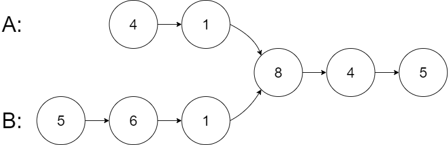

## 双指针

### Lc_011.盛最多水的容器

给定一个长度为 n 的整数数组 height 。有 n 条垂线，第 i 条线的两个端点是 (i, 0) 和 (i, height[i]) 。
找出其中的两条线，使得它们与 x 轴共同构成的容器可以容纳最多的水。
返回容器可以储存的最大水量。
说明：你不能倾斜容器。

示例 1：
输入：[1,8,6,2,5,4,8,3,7]
输出：49 
解释：图中垂直线代表输入数组 [1,8,6,2,5,4,8,3,7]。在此情况下，容器能够容纳水（表示为蓝色部分）的最大值为 49。

示例 2：
输入：height = [1,1]
输出：1

链接：https://leetcode-cn.com/problems/container-with-most-water

```java
class Solution {
    public int maxArea(int[] height) {
        int left = 0;
        int right = height.length -1;
        int max = 0;
        while(right > left){
            int tmp = (right - left) * Math.min(height[left], height[right]);
            if(tmp > max){
                max = tmp;
            }
            if(height[left] > height[right]){
                right--;
            }else{
                left++;
            }
        }
        return max;

    }
}
```

### Lc_015.三数之和

给你一个包含 n 个整数的数组 nums，判断 nums 中是否存在三个元素 a，b，c ，使得 a + b + c = 0 ？请你找出所有和为 0 且不重复的三元组。
注意：答案中不可以包含重复的三元组。

示例 1：
输入：nums = [-1,0,1,2,-1,-4]
输出：[[-1,-1,2],[-1,0,1]]

示例 2：
输入：nums = []
输出：[]

示例 3：
输入：nums = [0]
输出：[]

链接：https://leetcode-cn.com/problems/3sum

```java
//排序+双指针
class Solution {
    public List<List<Integer>> threeSum(int[] nums) {       
        Arrays.sort(nums);
        List<List<Integer>> ans = new ArrayList<List<Integer>>(); 

        if(nums.length < 3){
            return ans;
        }

        for(int i = 0; i < nums.length-2; i++){

           if(nums[i] > 0){//已经排序，如果起始大于零，即可结束
               break;
           }
           
           int left = i + 1;
           int right = nums.length -1;

           while(left < right){

               if(i > 0 && nums[i] == nums[i-1]){//去重
                break;
                } 

               if(nums[i] + nums[left] + nums[right] == 0){
                   ans.add(new ArrayList<Integer>(Arrays.asList(nums[i], nums[left], nums[right])));
                   left++;
                   right--;
                   while(nums[left] == nums[left -1] && left < right){
                       left++;
                   }
                   while(nums[right] == nums[right+1] && left < right){
                       right--;
                   }
               }else if(nums[i] + nums[left] + nums[right] < 0){
                   left++;
               }else{
                   right--;
               }
           }
        }
        return ans;
    }
}
```

### [Lc_16. 最接近的三数之和](https://leetcode.cn/problems/3sum-closest/)

给你一个长度为 `n` 的整数数组 `nums` 和 一个目标值 `target`。请你从 `nums` 中选出三个整数，使它们的和与 `target` 最接近。

返回这三个数的和。

假定每组输入只存在恰好一个解。

**示例 1：**

```
输入：nums = [-1,2,1,-4], target = 1
输出：2
解释：与 target 最接近的和是 2 (-1 + 2 + 1 = 2) 。
```

**示例 2：**

```
输入：nums = [0,0,0], target = 1
输出：0
```

**提示：**

- `3 <= nums.length <= 1000`
- `-1000 <= nums[i] <= 1000`
- `-104 <= target <= 104`

```java
class Solution {
    public int threeSumClosest(int[] nums, int target) {
        Arrays.sort(nums);
        int ans_sum = Integer.MAX_VALUE;
        int ans = Integer.MAX_VALUE;
        for(int i = 0; i < nums.length-2; i++){
            int left = i + 1;
            int right = nums.length-1;
            while(left < right){
                int tmp = nums[i] + nums[left] + nums[right] - target;
                if(Math.abs(tmp) < ans_sum){
                    ans_sum = Math.abs(tmp);
                    ans = nums[i] + nums[left] + nums[right];
                }
                if(tmp == 0){
                    return ans;
                }else if(tmp < 0){
                    left++;
                }else{
                    right--;
                }
            }
        }
        return ans;
    }
}
```

### [Lc_18. 四数之和](https://leetcode.cn/problems/4sum/)

给你一个由 `n` 个整数组成的数组 `nums` ，和一个目标值 `target` 。请你找出并返回满足下述全部条件且**不重复**的四元组 `[nums[a], nums[b], nums[c], nums[d]]` （若两个四元组元素一一对应，则认为两个四元组重复）：

- `0 <= a, b, c, d < n`
- `a`、`b`、`c` 和 `d` **互不相同**
- `nums[a] + nums[b] + nums[c] + nums[d] == target`

你可以按 **任意顺序** 返回答案 。

**示例 1：**

```
输入：nums = [1,0,-1,0,-2,2], target = 0
输出：[[-2,-1,1,2],[-2,0,0,2],[-1,0,0,1]]
```

**示例 2：**

```
输入：nums = [2,2,2,2,2], target = 8
输出：[[2,2,2,2]]
```

**提示：**

- `1 <= nums.length <= 200`
- `-109 <= nums[i] <= 109`
- `-109 <= target <= 109`

```java
class Solution {
    public List<List<Integer>> fourSum(int[] nums, int target) {
        List<List<Integer>> anslist = new ArrayList<>();
        Arrays.sort(nums);
        for(int i = 0; i < nums.length - 3; i++){
            if(i > 0 && nums[i] == nums[i-1]){
                continue;
            }
            if((long)nums[i] + nums[i+1] + nums[i+2] + nums[i+3] > target){
                break;
            }
            if((long)nums[i] + nums[nums.length-1] + nums[nums.length-2] + nums[nums.length-3] < target){
                continue;
            }
            for(int j = i+1; j < nums.length - 2; j++){
                if(j > i+1 && nums[j] == nums[j-1]){
                    continue;
                }
                if((long)nums[i] + nums[j+1] + nums[j+2] + nums[j] > target){
                    break;
                }
                if((long)nums[i] + nums[nums.length-1] + nums[nums.length-2] + nums[j] < target){
                    continue;
                }
                int left = j + 1;
                int rigth = nums.length-1;
                while(left < rigth){
                    int tmp3 = target - nums[i] - nums[j] - nums[left] - nums[rigth];
                    if(tmp3 == 0){
                        anslist.add(Arrays.asList(nums[i],nums[j],nums[left],nums[rigth]));
                        while(++left < rigth && (nums[left] == nums[left-1]));                        
                        while(--rigth > left && (nums[rigth] == nums[rigth+1]));  
                    }else if(tmp3 > 0){
                        left++;
                    }else{
                        rigth--;
                    }
                }
            }
        }
        return anslist;
    }
}
```

### Lc_42.接雨水

给定 n 个非负整数表示每个宽度为 1 的柱子的高度图，计算按此排列的柱子，下雨之后能接多少雨水。

示例 1：
输入：height = [0,1,0,2,1,0,1,3,2,1,2,1]
输出：6
解释：上面是由数组 [0,1,0,2,1,0,1,3,2,1,2,1] 表示的高度图，在这种情况下，可以接 6 个单位的雨水（蓝色部分表示雨水）。 

示例 2：
输入：height = [4,2,0,3,2,5]
输出：9

链接：https://leetcode-cn.com/problems/trapping-rain-water

```java
//使用双指针比较，较小的移动，并且在移动过程中更新其左右的最大值
class Solution {
    public int trap(int[] height) {
        int len = height.length;
        int left = 0;
        int right = len - 1;
        int left_max = height[0];
        int right_max = height[len - 1];
        int ans = 0;

        while(left <= right){
           
            if(height[left] >= left_max){//加上等号，保证如果left_max比right_max大时，避免减多，不加等号需要在else中再多一个判断此时left_max是否大于rigt_max
                left_max = height[left];
            }else{
                ans += Math.min(right_max, left_max) - height[left];
            }

            if(height[right] >= right_max){
                right_max = height[right];
            }else{
                ans += Math.min(right_max, left_max) - height[right];
            }

            if(left_max < right_max){
                left++;
            }else{
                right--;
            }

        }

        return ans;

    }
}
```

### Lc_75.颜色分类

给定一个包含红色、白色和蓝色、共 n 个元素的数组 nums ，原地对它们进行排序，使得相同颜色的元素相邻，并按照红色、白色、蓝色顺序排列。
我们使用整数 0、 1 和 2 分别表示红色、白色和蓝色。
必须在不使用库的sort函数的情况下解决这个问题。

示例 1：
输入：nums = [2,0,2,1,1,0]
输出：[0,0,1,1,2,2]

示例 2：
输入：nums = [2,0,1]
输出：[0,1,2]

链接：https://leetcode-cn.com/problems/sort-colors

```java
//只需要考虑为0，2的情况，利用i来移动左右指针
class Solution {
    public void sortColors(int[] nums) {
        int n = nums.length;
        int p0 = 0, p2 = n - 1;
        for (int i = 0; i <= p2; ++i) {
            while (i <= p2 && nums[i] == 2) {
                int temp = nums[i];
                nums[i] = nums[p2];
                nums[p2] = temp;
                --p2;
            }
            if (nums[i] == 0) {
                int temp = nums[i];
                nums[i] = nums[p0];
                nums[p0] = temp;
                ++p0;
            }
        }
    }
}
```

### Lc_56.合并区间

以数组 intervals 表示若干个区间的集合，其中单个区间为 intervals[i] = [starti, endi] 。请你合并所有重叠的区间，并返回 一个不重叠的区间数组，该数组需恰好覆盖输入中的所有区间 。

示例 1：
输入：intervals = [[1,3],[2,6],[8,10],[15,18]]
输出：[[1,6],[8,10],[15,18]]
解释：区间 [1,3] 和 [2,6] 重叠, 将它们合并为 [1,6].

示例 2：
输入：intervals = [[1,4],[4,5]]
输出：[[1,5]]
解释：区间 [1,4] 和 [4,5] 可被视为重叠区间。

链接：https://leetcode-cn.com/problems/merge-intervals

```java
//排序+双指针。因为每段已经排序和对第一个元素排序，左指针指向排序的小区间，即[0]，右指针不断跟新
class Solution {
    public int[][] merge(int[][] intervals) {
        Arrays.sort(intervals,(o1,o2) -> o1[0] - o2[0]);//lambda
        List<int[]> res = new ArrayList<>();

        for(int i = 0; i < intervals.length; i++){
            int left = intervals[i][0];
            int right = intervals[i][1];
            while(i+1 < intervals.length && right >= intervals[i+1][0]){
                if(right <= intervals[i+1][1]){ //以防[[1,4],[2,3]]情况
                    right = intervals[i+1][1];
                }
                i++;
            }
            res.add(new int[]{left,right});
        }
        return res.toArray(new int[0][]);//List转数组
    }
}
```

#### [Lc_141. 环形链表](https://leetcode-cn.com/problems/linked-list-cycle/)

给你一个链表的头节点 `head` ，判断链表中是否有环。

如果链表中有某个节点，可以通过连续跟踪 `next` 指针再次到达，则链表中存在环。 为了表示给定链表中的环，评测系统内部使用整数 `pos` 来表示链表尾连接到链表中的位置（索引从 0 开始）。**注意：`pos` 不作为参数进行传递** 。仅仅是为了标识链表的实际情况。

*如果链表中存在环* ，则返回 `true` 。 否则，返回 `false` 。

**示例 1：**


```
输入：head = [3,2,0,-4], pos = 1
输出：true
解释：链表中有一个环，其尾部连接到第二个节点。
```

**示例 2：**


```
输入：head = [1,2], pos = 0
输出：true
解释：链表中有一个环，其尾部连接到第一个节点。
```

**示例 3：**


```
输入：head = [1], pos = -1
输出：false
解释：链表中没有环。
```

 

**提示：**

- 链表中节点的数目范围是 `[0, 104]`
- `-105 <= Node.val <= 105`
- `pos` 为 `-1` 或者链表中的一个 **有效索引** 。

```java
//快慢双指针
/**
 * Definition for singly-linked list.
 * class ListNode {
 *     int val;
 *     ListNode next;
 *     ListNode(int x) {
 *         val = x;
 *         next = null;
 *     }
 * }
 */
public class Solution {
    public boolean hasCycle(ListNode head) {
        if(head == null){
            return false;
        }
        ListNode slow = head;
        ListNode fast = head.next;
        while(slow != fast){ 
            slow = slow.next;
            if(fast != null){
                if(fast.next!= null){
                    fast = fast.next.next;
                }else{
                fast = fast.next;
                }
            }                          

            if(slow==null && fast==null){
                return false;
            }
        }
        return true;
    }
}
```

```java
public class Solution {
    public boolean hasCycle(ListNode head) {
        if (head == null || head.next == null) {
            return false;
        }
        ListNode slow = head;
        ListNode fast = head.next;
        while (slow != fast) {
            if (fast == null || fast.next == null) {
                return false;
            }
            slow = slow.next;
            fast = fast.next.next;
        }
        return true;
    }
}
```

```java
//只要快的为空，说明没有环则为false
public class Solution {
    public boolean hasCycle(ListNode head) {
        ListNode s = head, f = head;
        while(f != null && f.next != null){ 
            s = s.next;
            f = f.next.next;
            if(s == f) return true;
        }
        return false;
    }
}
```

### [Lc_142. 环形链表 II](https://leetcode-cn.com/problems/linked-list-cycle-ii/)

给定一个链表的头节点  `head` ，返回链表开始入环的第一个节点。 *如果链表无环，则返回 `null`。*

如果链表中有某个节点，可以通过连续跟踪 `next` 指针再次到达，则链表中存在环。 为了表示给定链表中的环，评测系统内部使用整数 `pos` 来表示链表尾连接到链表中的位置（**索引从 0 开始**）。如果 `pos` 是 `-1`，则在该链表中没有环。**注意：`pos` 不作为参数进行传递**，仅仅是为了标识链表的实际情况。

**不允许修改** 链表。

**示例 1：**


```
输入：head = [3,2,0,-4], pos = 1
输出：返回索引为 1 的链表节点
解释：链表中有一个环，其尾部连接到第二个节点。
```

**示例 2：**


```
输入：head = [1,2], pos = 0
输出：返回索引为 0 的链表节点
解释：链表中有一个环，其尾部连接到第一个节点。
```

**示例 3：**


```
输入：head = [1], pos = -1
输出：返回 null
解释：链表中没有环。 
```

**提示：**

- 链表中节点的数目范围在范围 `[0, 104]` 内
- `-105 <= Node.val <= 105`
- `pos` 的值为 `-1` 或者链表中的一个有效索引

**进阶：**你是否可以使用 `O(1)` 空间解决此题？

```java
/**
 当快慢指针第一次相遇时，设head到入口为l，慢指针在环李走了d。则快指针比慢多走了2倍。而相遇节点再绕环走到此处刚好是l+d，因为此处刚好是d，所以剩下的就是l，只需要慢指针再走l和从头出发的相遇即可。
 */
public class Solution {
    public ListNode detectCycle(ListNode head) {  
        ListNode low = head;
        ListNode fast = head;
        while(fast != null && fast.next != null){
            low = low.next;
            fast = fast.next.next;
            if(low == fast){
                ListNode pre = head;
                while(pre != low){
                    pre = pre.next;
                    low = low.next;
                }
                return pre;
            }
        }
        return null;
    }
}
```

### [Lc_160. 相交链表](https://leetcode-cn.com/problems/intersection-of-two-linked-lists/)

给你两个单链表的头节点 `headA` 和 `headB` ，请你找出并返回两个单链表相交的起始节点。如果两个链表不存在相交节点，返回 `null` 。

图示两个链表在节点 `c1` 开始相交**：**

[](https://assets.leetcode-cn.com/aliyun-lc-upload/uploads/2018/12/14/160_statement.png)

题目数据 **保证** 整个链式结构中不存在环。

**注意**，函数返回结果后，链表必须 **保持其原始结构** 。

**自定义评测：**

**评测系统** 的输入如下（你设计的程序 **不适用** 此输入）：

- `intersectVal` - 相交的起始节点的值。如果不存在相交节点，这一值为 `0`
- `listA` - 第一个链表
- `listB` - 第二个链表
- `skipA` - 在 `listA` 中（从头节点开始）跳到交叉节点的节点数
- `skipB` - 在 `listB` 中（从头节点开始）跳到交叉节点的节点数

评测系统将根据这些输入创建链式数据结构，并将两个头节点 `headA` 和 `headB` 传递给你的程序。如果程序能够正确返回相交节点，那么你的解决方案将被 **视作正确答案** 。

**示例 1：**

[

```
输入：intersectVal = 8, listA = [4,1,8,4,5], listB = [5,6,1,8,4,5], skipA = 2, skipB = 3
输出：Intersected at '8'
解释：相交节点的值为 8 （注意，如果两个链表相交则不能为 0）。
从各自的表头开始算起，链表 A 为 [4,1,8,4,5]，链表 B 为 [5,6,1,8,4,5]。
在 A 中，相交节点前有 2 个节点；在 B 中，相交节点前有 3 个节点。
```

**示例 2：**

[](https://assets.leetcode.com/uploads/2018/12/13/160_example_2.png)

```
输入：intersectVal = 2, listA = [1,9,1,2,4], listB = [3,2,4], skipA = 3, skipB = 1
输出：Intersected at '2'
解释：相交节点的值为 2 （注意，如果两个链表相交则不能为 0）。
从各自的表头开始算起，链表 A 为 [1,9,1,2,4]，链表 B 为 [3,2,4]。
在 A 中，相交节点前有 3 个节点；在 B 中，相交节点前有 1 个节点。
```

**示例 3：**

[](https://assets.leetcode.com/uploads/2018/12/13/160_example_3.png)

```
输入：intersectVal = 0, listA = [2,6,4], listB = [1,5], skipA = 3, skipB = 2
输出：null
解释：从各自的表头开始算起，链表 A 为 [2,6,4]，链表 B 为 [1,5]。
由于这两个链表不相交，所以 intersectVal 必须为 0，而 skipA 和 skipB 可以是任意值。
这两个链表不相交，因此返回 null 。
```

**提示：**

- `listA` 中节点数目为 `m`
- `listB` 中节点数目为 `n`
- `1 <= m, n <= 3 * 104`
- `1 <= Node.val <= 105`
- `0 <= skipA <= m`
- `0 <= skipB <= n`
- 如果 `listA` 和 `listB` 没有交点，`intersectVal` 为 `0`
- 如果 `listA` 和 `listB` 有交点，`intersectVal == listA[skipA] == listB[skipB]`

**进阶：**你能否设计一个时间复杂度 `O(m + n)` 、仅用 `O(1)` 内存的解决方案？

```java
/**
 * Definition for singly-linked list.
 * public class ListNode {
 *     int val;
 *     ListNode next;
 *     ListNode(int x) {
 *         val = x;
 *         next = null;
 *     }
 * }
 */
public class Solution {//算步差，重新走
    public ListNode getIntersectionNode(ListNode headA, ListNode headB) {
        int l1 = 0;
        int l2 = 0;
        ListNode p1 = headA;
        ListNode p2 = headB;
        while(p1.next != null){
            l1++;
            p1 = p1.next;
        }
        while(p2.next != null){
            l2++;
            p2 = p2.next;
        }
        if(p1 != p2){
            return null;
        }
        int diff = l1 - l2;
        if(diff > 0){
            p1 = headA;
            while(diff>0){
                p1 = p1.next;
                diff--;
            }
            p2 = headB;
        }else{
            p2 = headB;
            while(diff<0){
                p2 = p2.next;
                diff++;
            }
            p1 = headA;
        }

        while(p1 != p2){
            p1 = p1.next;
            p2 = p2.next;
        }
        return p1;

    }
}
```

```java
//与上方思想相同，采用双指针，只不过不是计算出步差，而是一方到达结尾时，指向另一方的开头，两次即可完成。如果没有交点时，两者都为空
public class Solution {
    public ListNode getIntersectionNode(ListNode headA, ListNode headB) {
        if (headA == null || headB == null) {
            return null;
        }
        ListNode pA = headA, pB = headB;
        while (pA != pB) {
            pA = pA == null ? headB : pA.next;
            pB = pB == null ? headA : pB.next;
        }
        return pA;
    }
}
```

### [Lc_283. 移动零](https://leetcode.cn/problems/move-zeroes/)

给定一个数组 `nums`，编写一个函数将所有 `0` 移动到数组的末尾，同时保持非零元素的相对顺序。

**请注意** ，必须在不复制数组的情况下原地对数组进行操作。

**示例 1:**

```
输入: nums = [0,1,0,3,12]
输出: [1,3,12,0,0]
```

**示例 2:**

```
输入: nums = [0]
输出: [0]
```

**提示**:

- `1 <= nums.length <= 104`
- `-231 <= nums[i] <= 231 - 1`

```java
//使用双指针，right找第一个不为0的，left找第一个为零的
class Solution {
    public void moveZeroes(int[] nums) {
        int left = 0;
        int right = 0;
        while(right < nums.length || left < nums.length){
            while(right < nums.length&&nums[right] == 0){
                right++;
            }
            while(left < nums.length && nums[left] != 0){
                left++;
            }
            if(right < nums.length && left < nums.length && left<right){//第三个条件以防1,0这种情况
                int tmp = nums[left];
                nums[left] = nums[right];
                nums[right] = tmp;
            }
            if(left > right){//1,0,1时left会大于right
                left = right;
            }
            left++;
            right++; 
        }  
    }
}
```

```java
//优化思想：right一直向后查找，left记录的是已经完成的后一个位置，当right指向不为0的时候，则将该数加到已经完成的后一个位置。
class Solution {
    public void moveZeroes(int[] nums) {
        int left = 0;
        int right = 0;
        while(right < nums.length){
           if(nums[right] != 0){
               swap(nums,left,right);
               left++;
           }
           right++;
        }  
    }
    public void swap(int[] nums,int left, int right){
        int tmp = nums[left];
        nums[left] = nums[right];
        nums[right] = tmp;
    }
}
```

#### [Lc_287. 寻找重复数](https://leetcode.cn/problems/find-the-duplicate-number/)

给定一个包含 `n + 1` 个整数的数组 `nums` ，其数字都在 `[1, n]` 范围内（包括 `1` 和 `n`），可知至少存在一个重复的整数。

假设 `nums` 只有 **一个重复的整数** ，返回 **这个重复的数** 。

你设计的解决方案必须 **不修改** 数组 `nums` 且只用常量级 `O(1)` 的额外空间。

**示例 1：**

```
输入：nums = [1,3,4,2,2]
输出：2
```

**示例 2：**

```
输入：nums = [3,1,3,4,2]
输出：3
```

**提示：**

- `1 <= n <= 105`
- `nums.length == n + 1`
- `1 <= nums[i] <= n`
- `nums` 中 **只有一个整数** 出现 **两次或多次** ，其余整数均只出现 **一次**

**进阶：**

- 如何证明 `nums` 中至少存在一个重复的数字?
- 你可以设计一个线性级时间复杂度 `O(n)` 的解决方案吗？

```java
//由题目可知，muns一定存在重复的数，并且数的范围为1-n，所以不断跳走，一定存在环。类似找链表环的入口一题。
class Solution {
    public int findDuplicate(int[] nums) {
        int slow = 0;
        int fast = 0;
        do{
            slow = nums[slow];
            fast = nums[nums[fast]];
        }while(slow != fast);
        slow = 0;
        while(slow != fast){
            slow = nums[slow];
            fast = nums[fast];
        }
        return slow;
    }
}
```

### [Lc_26. 删除有序数组中的重复项](https://leetcode.cn/problems/remove-duplicates-from-sorted-array/)

给你一个 **升序排列** 的数组 `nums` ，请你**[ 原地](http://baike.baidu.com/item/原地算法)** 删除重复出现的元素，使每个元素 **只出现一次** ，返回删除后数组的新长度。元素的 **相对顺序** 应该保持 **一致** 。

由于在某些语言中不能改变数组的长度，所以必须将结果放在数组nums的第一部分。更规范地说，如果在删除重复项之后有 `k` 个元素，那么 `nums` 的前 `k` 个元素应该保存最终结果。

将最终结果插入 `nums` 的前 `k` 个位置后返回 `k` 。

不要使用额外的空间，你必须在 **[原地 ](https://baike.baidu.com/item/原地算法)修改输入数组** 并在使用 O(1) 额外空间的条件下完成。

**判题标准:**

系统会用下面的代码来测试你的题解:

```
int[] nums = [...]; // 输入数组
int[] expectedNums = [...]; // 长度正确的期望答案

int k = removeDuplicates(nums); // 调用

assert k == expectedNums.length;
for (int i = 0; i < k; i++) {
    assert nums[i] == expectedNums[i];
}
```

如果所有断言都通过，那么您的题解将被 **通过**。

**示例 1：**

```
输入：nums = [1,1,2]
输出：2, nums = [1,2,_]
解释：函数应该返回新的长度 2 ，并且原数组 nums 的前两个元素被修改为 1, 2 。不需要考虑数组中超出新长度后面的元素。
```

**示例 2：**

```
输入：nums = [0,0,1,1,1,2,2,3,3,4]
输出：5, nums = [0,1,2,3,4]
解释：函数应该返回新的长度 5 ， 并且原数组 nums 的前五个元素被修改为 0, 1, 2, 3, 4 。不需要考虑数组中超出新长度后面的元素。
```

**提示：**

- `0 <= nums.length <= 3 * 104`
- `-104 <= nums[i] <= 104`
- `nums` 已按 **升序** 排列

```java
class Solution {
    public int removeDuplicates(int[] nums) {
        if(nums.length == 0){
            return 0;
        }
        int ans = 0;
        for(int i = 0; i < nums.length-1; i++){
            if(nums[i] == nums[i+1]){
                continue;
            }else{
                ans++;
                nums[ans] = nums[i+1];
            }
        }
        return ans+1;
    }
}
```

### [Lc_27. 移除元素](https://leetcode.cn/problems/remove-element/)

给你一个数组 `nums` 和一个值 `val`，你需要 **[原地](https://baike.baidu.com/item/原地算法)** 移除所有数值等于 `val` 的元素，并返回移除后数组的新长度。

不要使用额外的数组空间，你必须仅使用 `O(1)` 额外空间并 **[原地 ](https://baike.baidu.com/item/原地算法)修改输入数组**。

元素的顺序可以改变。你不需要考虑数组中超出新长度后面的元素。

**说明:**

为什么返回数值是整数，但输出的答案是数组呢?

请注意，输入数组是以**「引用」**方式传递的，这意味着在函数里修改输入数组对于调用者是可见的。

你可以想象内部操作如下:

```
// nums 是以“引用”方式传递的。也就是说，不对实参作任何拷贝
int len = removeElement(nums, val);

// 在函数里修改输入数组对于调用者是可见的。
// 根据你的函数返回的长度, 它会打印出数组中 该长度范围内 的所有元素。
for (int i = 0; i < len; i++) {
    print(nums[i]);
}
```

**示例 1：**

```
输入：nums = [3,2,2,3], val = 3
输出：2, nums = [2,2]
解释：函数应该返回新的长度 2, 并且 nums 中的前两个元素均为 2。你不需要考虑数组中超出新长度后面的元素。例如，函数返回的新长度为 2 ，而 nums = [2,2,3,3] 或 nums = [2,2,0,0]，也会被视作正确答案。
```

**示例 2：**

```
输入：nums = [0,1,2,2,3,0,4,2], val = 2
输出：5, nums = [0,1,4,0,3]
解释：函数应该返回新的长度 5, 并且 nums 中的前五个元素为 0, 1, 3, 0, 4。注意这五个元素可为任意顺序。你不需要考虑数组中超出新长度后面的元素。
```

**提示：**

- `0 <= nums.length <= 100`
- `0 <= nums[i] <= 50`
- `0 <= val <= 100`

```java
class Solution {
    public int removeElement(int[] nums, int val) {
        if(nums.length == 0){
            return 0;
        }
        int ans = 0;
        for(int i = 0; i < nums.length; i++){
            if(nums[i] == val){
                continue;
            }else{
                nums[ans] = nums[i];
                ans++;
            }
        }
        return ans;
    }
}
```

### [Lc_26. 删除有序数组中的重复项](https://leetcode.cn/problems/remove-duplicates-from-sorted-array/)

给你一个 **升序排列** 的数组 `nums` ，请你**[ 原地](http://baike.baidu.com/item/原地算法)** 删除重复出现的元素，使每个元素 **只出现一次** ，返回删除后数组的新长度。元素的 **相对顺序** 应该保持 **一致** 。

由于在某些语言中不能改变数组的长度，所以必须将结果放在数组nums的第一部分。更规范地说，如果在删除重复项之后有 `k` 个元素，那么 `nums` 的前 `k` 个元素应该保存最终结果。

将最终结果插入 `nums` 的前 `k` 个位置后返回 `k` 。

不要使用额外的空间，你必须在 **[原地 ](https://baike.baidu.com/item/原地算法)修改输入数组** 并在使用 O(1) 额外空间的条件下完成。

**判题标准:**

系统会用下面的代码来测试你的题解:

```
int[] nums = [...]; // 输入数组
int[] expectedNums = [...]; // 长度正确的期望答案

int k = removeDuplicates(nums); // 调用

assert k == expectedNums.length;
for (int i = 0; i < k; i++) {
    assert nums[i] == expectedNums[i];
}
```

如果所有断言都通过，那么您的题解将被 **通过**。

**示例 1：**

```
输入：nums = [1,1,2]
输出：2, nums = [1,2,_]
解释：函数应该返回新的长度 2 ，并且原数组 nums 的前两个元素被修改为 1, 2 。不需要考虑数组中超出新长度后面的元素。
```

**示例 2：**

```
输入：nums = [0,0,1,1,1,2,2,3,3,4]
输出：5, nums = [0,1,2,3,4]
解释：函数应该返回新的长度 5 ， 并且原数组 nums 的前五个元素被修改为 0, 1, 2, 3, 4 。不需要考虑数组中超出新长度后面的元素。
```

**提示：**

- `0 <= nums.length <= 3 * 104`
- `-104 <= nums[i] <= 104`
- `nums` 已按 **升序** 排列

```java
//ans可以看出left，i可以看成right
class Solution {
    public int removeDuplicates(int[] nums) {
        if(nums.length == 0){
            return 0;
        }
        int ans = 0;
        for(int i = 0; i < nums.length-1; i++){
            if(nums[i] == nums[i+1]){
                continue;
            }else{
                ans++;
                nums[ans] = nums[i+1];
            }
        }
        return ans+1;
    }
}
```

### [Lc_27. 移除元素](https://leetcode.cn/problems/remove-element/)

给你一个数组 `nums` 和一个值 `val`，你需要 **[原地](https://baike.baidu.com/item/原地算法)** 移除所有数值等于 `val` 的元素，并返回移除后数组的新长度。

不要使用额外的数组空间，你必须仅使用 `O(1)` 额外空间并 **[原地 ](https://baike.baidu.com/item/原地算法)修改输入数组**。

元素的顺序可以改变。你不需要考虑数组中超出新长度后面的元素。

**说明:**

为什么返回数值是整数，但输出的答案是数组呢?

请注意，输入数组是以**「引用」**方式传递的，这意味着在函数里修改输入数组对于调用者是可见的。

你可以想象内部操作如下:

```
// nums 是以“引用”方式传递的。也就是说，不对实参作任何拷贝
int len = removeElement(nums, val);

// 在函数里修改输入数组对于调用者是可见的。
// 根据你的函数返回的长度, 它会打印出数组中 该长度范围内 的所有元素。
for (int i = 0; i < len; i++) {
    print(nums[i]);
}
```

**示例 1：**

```
输入：nums = [3,2,2,3], val = 3
输出：2, nums = [2,2]
解释：函数应该返回新的长度 2, 并且 nums 中的前两个元素均为 2。你不需要考虑数组中超出新长度后面的元素。例如，函数返回的新长度为 2 ，而 nums = [2,2,3,3] 或 nums = [2,2,0,0]，也会被视作正确答案。
```

**示例 2：**

```
输入：nums = [0,1,2,2,3,0,4,2], val = 2
输出：5, nums = [0,1,4,0,3]
解释：函数应该返回新的长度 5, 并且 nums 中的前五个元素为 0, 1, 3, 0, 4。注意这五个元素可为任意顺序。你不需要考虑数组中超出新长度后面的元素。
```

**提示：**

- `0 <= nums.length <= 100`
- `0 <= nums[i] <= 50`
- `0 <= val <= 100`

```java
//ans可以看出left，i可以看成right
class Solution {
    public int removeElement(int[] nums, int val) {
        if(nums.length == 0){
            return 0;
        }
        int ans = 0;
        for(int i = 0; i < nums.length; i++){
            if(nums[i] == val){
                continue;
            }else{
                nums[ans] = nums[i];
                ans++;
            }
        }
        return ans;
    }
}
```

### [Lc_80. 删除有序数组中的重复项 II](https://leetcode.cn/problems/remove-duplicates-from-sorted-array-ii/)

给你一个有序数组 `nums` ，请你**[ 原地](http://baike.baidu.com/item/原地算法)** 删除重复出现的元素，使每个元素 **最多出现两次** ，返回删除后数组的新长度。

不要使用额外的数组空间，你必须在 **[原地 ](https://baike.baidu.com/item/原地算法)修改输入数组** 并在使用 O(1) 额外空间的条件下完成。

**说明：**

为什么返回数值是整数，但输出的答案是数组呢？

请注意，输入数组是以**「引用」**方式传递的，这意味着在函数里修改输入数组对于调用者是可见的。

你可以想象内部操作如下:

```
// nums 是以“引用”方式传递的。也就是说，不对实参做任何拷贝
int len = removeDuplicates(nums);

// 在函数里修改输入数组对于调用者是可见的。
// 根据你的函数返回的长度, 它会打印出数组中 该长度范围内 的所有元素。
for (int i = 0; i < len; i++) {
    print(nums[i]);
}
```

**示例 1：**

```
输入：nums = [1,1,1,2,2,3]
输出：5, nums = [1,1,2,2,3]
解释：函数应返回新长度 length = 5, 并且原数组的前五个元素被修改为 1, 1, 2, 2, 3 。 不需要考虑数组中超出新长度后面的元素。
```

```java
//使用双指针来记录
class Solution {
    public int removeDuplicates(int[] nums) {
        int len = nums.length;
        if(len <= 2){
            return len;
        }
        int ans = 1;
        int left = 0;
        int right = 1;
        while(right < len){
            while(right < len && nums[right-1] == nums[right]){//相等时一直让right往后走
                if(right-left < 2){//如果小于2则赋值
                    nums[ans++] = nums[right];
                }
                right++;
            }
            if(right >= len){
                break;
            }
            nums[ans++] = nums[right];//不相等时，直接赋值并往后走
            left = right;
            right++;
        }
        return ans;
    }
}
```

```java
//快慢指针
class Solution {
    public int removeDuplicates(int[] nums) {
        int n = nums.length;
        if (n <= 2) {
            return n;
        }
        int slow = 2, fast = 2;
        while (fast < n) {
            if (nums[slow - 2] != nums[fast]) {
                nums[slow] = nums[fast];
                ++slow;
            }
            ++fast;
        }
        return slow;
    }
}
```

### [Lc_88. 合并两个有序数组](https://leetcode.cn/problems/merge-sorted-array/)

给你两个按 **非递减顺序** 排列的整数数组 `nums1` 和 `nums2`，另有两个整数 `m` 和 `n` ，分别表示 `nums1` 和 `nums2` 中的元素数目。

请你 **合并** `nums2` 到 `nums1` 中，使合并后的数组同样按 **非递减顺序** 排列。

**注意：**最终，合并后数组不应由函数返回，而是存储在数组 `nums1` 中。为了应对这种情况，`nums1` 的初始长度为 `m + n`，其中前 `m` 个元素表示应合并的元素，后 `n` 个元素为 `0` ，应忽略。`nums2` 的长度为 `n` 。

**示例 1：**

```
输入：nums1 = [1,2,3,0,0,0], m = 3, nums2 = [2,5,6], n = 3
输出：[1,2,2,3,5,6]
解释：需要合并 [1,2,3] 和 [2,5,6] 。
合并结果是 [1,2,2,3,5,6] ，其中斜体加粗标注的为 nums1 中的元素。
```

**示例 2：**

```
输入：nums1 = [1], m = 1, nums2 = [], n = 0
输出：[1]
解释：需要合并 [1] 和 [] 。
合并结果是 [1] 。
```

**示例 3：**

```
输入：nums1 = [0], m = 0, nums2 = [1], n = 1
输出：[1]
解释：需要合并的数组是 [] 和 [1] 。
合并结果是 [1] 。
注意，因为 m = 0 ，所以 nums1 中没有元素。nums1 中仅存的 0 仅仅是为了确保合并结果可以顺利存放到 nums1 中。
```

**提示：**

- `nums1.length == m + n`
- `nums2.length == n`
- `0 <= m, n <= 200`
- `1 <= m + n <= 200`
- `-109 <= nums1[i], nums2[j] <= 109`

**进阶：**你可以设计实现一个时间复杂度为 `O(m + n)` 的算法解决此问题吗？

```java
class Solution {
    public void merge(int[] nums1, int m, int[] nums2, int n) {
        int tail = m + n - 1;
        int p1 = m-1;
        int p2 = n-1;
        while(p1 >= 0 || p2 >= 0){
            if(p1 == -1){
                nums1[tail--] = nums2[p2--];
            }else if(p2 == -1){
                nums1[tail--] = nums1[p1--];
            }else if(nums1[p1] > nums2[p2]){
                nums1[tail--] = nums1[p1--];
            }else{
                nums1[tail--] = nums2[p2--];
            }
        }
    }
}

```

### [109. 有序链表转换二叉搜索树](https://leetcode.cn/problems/convert-sorted-list-to-binary-search-tree/)

难度中等754

给定一个单链表的头节点  `head` ，其中的元素 **按升序排序** ，将其转换为高度平衡的二叉搜索树。

本题中，一个高度平衡二叉树是指一个二叉树*每个节点* 的左右两个子树的高度差不超过 1。

**示例 1:**


```
输入: head = [-10,-3,0,5,9]
输出: [0,-3,9,-10,null,5]
解释: 一个可能的答案是[0，-3,9，-10,null,5]，它表示所示的高度平衡的二叉搜索树。
```

**示例 2:**

```
输入: head = []
输出: []
```

**提示:**

- `head` 中的节点数在`[0, 2 * 104]` 范围内
- `-105 <= Node.val <= 105`

```java
class Solution {
    public TreeNode sortedListToBST(ListNode head) {
        if(head == null){
            return null;
        }
        return helper(head,null);
    }
    private TreeNode helper(ListNode head,ListNode tail){
        if(head == tail){
            return null;
        }
        ListNode fast = head;
        ListNode slow = head;
        while(fast != tail && fast.next != tail){//快慢指针
            fast = fast.next.next;
            slow = slow.next;
        }
        TreeNode root = new TreeNode(slow.val);
        root.left = helper(head,slow);
        root.right = helper(slow.next,tail);
        return root;
    }
}
```

### [125. 验证回文串](https://leetcode.cn/problems/valid-palindrome/)

难度简单570

如果在将所有大写字符转换为小写字符、并移除所有非字母数字字符之后，短语正着读和反着读都一样。则可以认为该短语是一个 **回文串** 。

字母和数字都属于字母数字字符。

给你一个字符串 `s`，如果它是 **回文串** ，返回 `true` ；否则，返回 `false` 。

**示例 1：**

```
输入: s = "A man, a plan, a canal: Panama"
输出：true
解释："amanaplanacanalpanama" 是回文串。
```

**示例 2：**

```
输入：s = "race a car"
输出：false
解释："raceacar" 不是回文串。
```

**示例 3：**

```
输入：s = " "
输出：true
解释：在移除非字母数字字符之后，s 是一个空字符串 "" 。
由于空字符串正着反着读都一样，所以是回文串。
```

**提示：**

- `1 <= s.length <= 2 * 105`
- `s` 仅由可打印的 ASCII 字符组成

```java
class Solution {
    public boolean isPalindrome(String s) {
        int len = s.length();
        int left = 0;
        int right = len - 1;
        while(left < right){
            while(left < right && !Character.isLetterOrDigit(s.charAt(left))){
                left++;
            }
            while(left < right && !Character.isLetterOrDigit(s.charAt(right))){
                right--;
            }
            if(left < right){
                if(Character.toLowerCase(s.charAt(left)) != Character.toLowerCase(s.charAt(right))){
                    return false;
                }
                left++;
                right--;
            }
        }
        return true;
    }
}
```

### [167. 两数之和 II - 输入有序数组](https://leetcode.cn/problems/two-sum-ii-input-array-is-sorted/)

难度中等889

给你一个下标从 **1** 开始的整数数组 `numbers` ，该数组已按 **非递减顺序排列** ，请你从数组中找出满足相加之和等于目标数 `target` 的两个数。如果设这两个数分别是 `numbers[index1]` 和 `numbers[index2]` ，则 `1 <= index1 < index2 <= numbers.length` 。

以长度为 2 的整数数组 `[index1, index2]` 的形式返回这两个整数的下标 `index1` 和 `index2`。

你可以假设每个输入 **只对应唯一的答案** ，而且你 **不可以** 重复使用相同的元素。

你所设计的解决方案必须只使用常量级的额外空间。

**示例 1：**

```
输入：numbers = [2,7,11,15], target = 9
输出：[1,2]
解释：2 与 7 之和等于目标数 9 。因此 index1 = 1, index2 = 2 。返回 [1, 2] 。
```

**示例 2：**

```
输入：numbers = [2,3,4], target = 6
输出：[1,3]
解释：2 与 4 之和等于目标数 6 。因此 index1 = 1, index2 = 3 。返回 [1, 3] 。
```

**示例 3：**

```
输入：numbers = [-1,0], target = -1
输出：[1,2]
解释：-1 与 0 之和等于目标数 -1 。因此 index1 = 1, index2 = 2 。返回 [1, 2] 。
```

**提示：**

- `2 <= numbers.length <= 3 * 104`
- `-1000 <= numbers[i] <= 1000`
- `numbers` 按 **非递减顺序** 排列
- `-1000 <= target <= 1000`
- **仅存在一个有效答案**

```java
class Solution {
    public int[] twoSum(int[] numbers, int target) {

        int left = 0;
        int right = numbers.length - 1;
        // while(left < right){
        //     int tmp = numbers[left] + numbers[right];
        //     if(tmp == target){
        //         return new int[]{left+1, right+1};
        //     }else if(tmp > target){
        //         right--;
        //     }else{
        //         left++;
        //     }
        // }普通双指针
        while(left < right){
            int mid = (left + right) >> 1;
            int tmp = numbers[left] + numbers[right];
            if(tmp == target){
                return new int[]{left+1, right+1};
            }else if(numbers[left] + numbers[mid] > target){//利用二分优化
                right = mid - 1;
            }else if(numbers[mid] + numbers[right] < target){
                left = mid + 1;
            }else if(tmp > target){
                right--;
            }else{
                left++;
            }
        }

        return new int[]{};
    }
}
```

