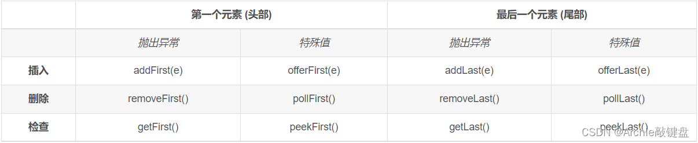

## 栈

​	java中，stack是动态数组不安全，尽量使用Deque的接口ArrayDeque类。[不使用stack的原因](https://mp.weixin.qq.com/s/Ba8jrULf8NJbENK6WGrVWg)。


**Queue队列**

**压入元素(添加)：add()、offer()**
相同：未超出容量，从队尾压入元素，返回压入的那个元素。
区别：在超出容量时，add()方法会对抛出异常，offer()返回false

**弹出元素(删除)：remove()、poll()**
相同：容量大于0的时候，删除并返回队头被删除的那个元素。
区别：在容量为0的时候，remove()会抛出异常，poll()返回false

**获取队头元素(不删除)：element()、peek()**
相同：容量大于0的时候，都返回队头元素。但是不删除。
区别：容量为0的时候，element()会抛出异常，peek()返回null。


**双端队列**

**Java堆栈Stack类已经过时，Java官方推荐使用Deque替代Stack使用。Deque堆栈操作方法：push()、pop()、peek()。**

deque 是“double ended queue（双端队列）”的缩写，通常读为“deck”。双端队列顾名思义就是队列的两个端口都能进出。

Deque的实现类是LinkedList,ArrayDeque,LinkedBlockingDeque，其中LinkedList是最常用的。值得注意的是，LinkedList也实现了List接口。

大多数Deque既可以是有容量限制也可以是无固定容量限制。

双端队列的插入、删除和检查方法各有两种形式，如下：



成功删除时会返回删除的值

值得注意的是，插入操作要使用插入操作的特殊值形式，因为插入操作一般不允许失败。

由于双端队列的既能实现先进先出，也能实现先进后出，因此，双端队列一般有三种用途：

```java
 - 作为普通队列（先进先出）
   Queue queue = new LinkedList()或Deque deque = new LinkedList()
 - 作为堆栈（先进后出）
   Deque deque = new LinkedList()
- 作为双端队列（两端可进出）
  Deque deque = new LinkedList()
```

**Java堆栈Stack类已经过时，Java官方推荐使用Deque替代Stack使用。Deque堆栈操作方法：push()、pop()、peek()。**


以下是双端队列与堆栈方法的等效方法对比：


### Lc_020.有效括号匹配

给定一个只包括 '('，')'，'{'，'}'，'['，']' 的字符串 s ，判断字符串是否有效。
有效字符串需满足：
左括号必须用相同类型的右括号闭合。
左括号必须以正确的顺序闭合。

示例 1：
输入：s = "()"
输出：true

示例 2：
输入：s = "()[]{}"
输出：true

示例 3：
输入：s = "(]"
输出：false

示例 4：
输入：s = "([)]"
输出：false

示例 5：
输入：s = "{[]}"
输出：true

链接：https://leetcode-cn.com/problems/valid-parentheses

```java
class Solution {
    public boolean isValid(String s) {
        Stack<Character> stack = new Stack<>();
        for(int i = 0; i < s.length(); i++){
            if(s.charAt(i) == ')' && !stack.isEmpty()){
                if(stack.pop() != '('){
                    return false;
                }
            }else if(s.charAt(i) == '}' && !stack.isEmpty()){
                if(stack.pop() != '{'){
                    return false;
                }
            }else if(s.charAt(i) == ']' && !stack.isEmpty()){
                if(stack.pop() != '['){
                    return false;
                }
            }else{
                stack.push(s.charAt(i));
            }
        }
        if(!stack.isEmpty()){
            return false;
        }
        return true;

    }
}
```

### Lc_84.柱状图最大的矩形

给定 n 个非负整数，用来表示柱状图中各个柱子的高度。每个柱子彼此相邻，且宽度为 1 。
求在该柱状图中，能够勾勒出来的矩形的最大面积。

示例 1:
输入：heights = [2,1,5,6,2,3]
输出：10
解释：最大的矩形为图中红色区域，面积为 10

示例 2：
输入： heights = [2,4]
输出： 4

链接：https://leetcode-cn.com/problems/largest-rectangle-in-histogram

```java
//单调栈
class Solution {
    public int largestRectangleArea(int[] heights) {
        Deque<Integer> statck = new ArrayDeque<>();
        int ans = 0;
        for(int i = 0; i <= heights.length; i++){
            //当栈不为空，切下一个元素小于栈中最后一个元素时，需要让栈中出栈，，单调栈，并根据出栈计算面积
            //i == heights.length为了处理遍历完栈中还有元素
            while(!statck.isEmpty() && (i == heights.length || heights[statck.peekLast()] > heights[i])){
                int top = statck.pollLast();
                int index = statck.isEmpty() ? -1 : statck.peekLast();//为了处理中间已经删除的元素造成的距离差异
                ans = Math.max(ans,(i - index - 1) * heights[top]);
            }
            if(i < heights.length){
                statck.addLast(i);
            }
        }
        return ans;
    }
}
```

### Lc_85.最大矩形

给定一个仅包含 0 和 1 、大小为 rows x cols 的二维二进制矩阵，找出只包含 1 的最大矩形，并返回其面积。

示例 1：


输入：matrix = [["1","0","1","0","0"],["1","0","1","1","1"],["1","1","1","1","1"],["1","0","0","1","0"]]
输出：6
解释：最大矩形如上图所示。

示例 2：
输入：matrix = []
输出：0

示例 3：
输入：matrix = [["0"]]
输出：0

示例 4：
输入：matrix = [["1"]]
输出：1

链接：https://leetcode-cn.com/problems/maximal-rectangle

```java
//和上面一题一样，只不过将一个二维矩阵按行按层转化为每个一维数组，作为和上一题一样的条件
class Solution {
    public int maximalRectangle(char[][] matrix) {
        int m = matrix.length;
        int n = matrix[0].length;
        int[][] row = new int[m][n];
        for(int i = 0; i < m; i++){
            for(int j = 0; j < n;j++){
                if(matrix[i][j] == '1'){
                    row[i][j] = ((i == 0) ? 0 : row[i-1][j]) + 1;
                }else{
                    row[i][j] = 0;
                }
            }
        }
        int ans = 0;
        for(int i = 0; i < m; i++){
            int[] each_row = new int[n];
            System.arraycopy(row[i],0,each_row,0,n);
            Deque<Integer> stack = new ArrayDeque<>();
            for(int j = 0; j <= n; j++){
                while(!stack.isEmpty() && (j == n || each_row[stack.peekLast()] > each_row[j])){
                    int high = stack.pollLast();
                    int index = stack.isEmpty() ? -1 : stack.peekLast();
                    ans = Math.max(ans, (j - index - 1) * each_row[high]);
                }
                if(j < n){
                    stack.addLast(j);
                }
            }
        }
        return ans;
    }
}
```

```java
class Solution {
    public int maximalRectangle(char[][] matrix) {
        int m = matrix.length;
        int n = matrix[0].length;
        int[] row = new int[n];
        int ans = 0;
        for(int i = 0; i < m; i++){
            for(int j = 0; j < n;j++){
                if(matrix[i][j] == '1'){
                    row[j] += 1;
                }else{
                    row[j] = 0;
                }
            }
            ans = Math.max(ans,increaseStack(row));
        }
        return ans;
    }

    public int increaseStack(int[] each_row){
        int ans = 0;
        int n = each_row.length;
        Deque<Integer> stack = new ArrayDeque<>();
            for(int j = 0; j <= n; j++){
                while(!stack.isEmpty() && (j == n || each_row[stack.peekLast()] > each_row[j])){
                    int high = stack.pollLast();
                    int index = stack.isEmpty() ? -1 : stack.peekLast();
                    ans = Math.max(ans, (j - index - 1) * each_row[high]);
                }
                if(j < n){
                    stack.addLast(j);
                }
            }
        return ans;

    }
}
```

### Lc_94.二叉树遍历

给定一个二叉树的根节点 root ，返回 它的 中序 遍历 。

 

示例 1：
输入：root = [1,null,2,3]
输出：[1,3,2]

示例 2：
输入：root = []
输出：[]

链接：https://leetcode-cn.com/problems/binary-tree-inorder-traversal

```java
/**
 * Definition for a binary tree node.
 * public class TreeNode {
 *     int val;
 *     TreeNode left;
 *     TreeNode right;
 *     TreeNode() {}
 *     TreeNode(int val) { this.val = val; }
 *     TreeNode(int val, TreeNode left, TreeNode right) {
 *         this.val = val;
 *         this.left = left;
 *         this.right = right;
 *     }
 * }
 */
class Solution {
    public List<Integer> inorderTraversal(TreeNode root) {
        Deque<TreeNode> stack = new ArrayDeque<>();
        List<Integer> list = new ArrayList<>();
        while(root != null || !stack.isEmpty()){
            while(root != null){
                stack.addLast(root);
                root = root.left;
            }
            TreeNode tmp = stack.pollLast();
            list.add(tmp.val);
            root = tmp.right;
        }
        return list;
    }
}
```

### [Lc_98. 验证二叉搜索树](https://leetcode-cn.com/problems/validate-binary-search-tree/)

给你一个二叉树的根节点 `root` ，判断其是否是一个有效的二叉搜索树。

**有效** 二叉搜索树定义如下：

- 节点的左子树只包含 **小于** 当前节点的数。
- 节点的右子树只包含 **大于** 当前节点的数。
- 所有左子树和右子树自身必须也是二叉搜索树。

**示例 1：**


```
输入：root = [2,1,3]
输出：true
```

**示例 2：**


```
输入：root = [5,1,4,null,null,3,6]
输出：false
解释：根节点的值是 5 ，但是右子节点的值是 4 。
```

```java
/**
 * Definition for a binary tree node.
 * public class TreeNode {
 *     int val;
 *     TreeNode left;
 *     TreeNode right;
 *     TreeNode() {}
 *     TreeNode(int val) { this.val = val; }
 *     TreeNode(int val, TreeNode left, TreeNode right) {
 *         this.val = val;
 *         this.left = left;
 *         this.right = right;
 *     }
 * }
 */
class Solution {
    public boolean isValidBST(TreeNode root) {
        Deque<TreeNode> stack = new ArrayDeque<>();
        long pre = Long.MIN_VALUE;//使用Long以防仅一个节点时，该节点是是int的最大或最小值
        while(root != null || !stack.isEmpty()){
            while(root!= null){
                stack.addLast(root);
                root = root.left;
            }
            TreeNode top = stack.pollLast();
            if(top.val <= pre){//二叉搜索树为递增的，如果小于前一个就错
                return false;
            }
            pre = top.val;
            root = top.right;
        }
        return true;
    }
}
```

#### [Lc_155. 最小栈](https://leetcode-cn.com/problems/min-stack/)

设计一个支持 `push` ，`pop` ，`top` 操作，并能在常数时间内检索到最小元素的栈。

实现 `MinStack` 类:

- `MinStack()` 初始化堆栈对象。
- `void push(int val)` 将元素val推入堆栈。
- `void pop()` 删除堆栈顶部的元素。
- `int top()` 获取堆栈顶部的元素。
- `int getMin()` 获取堆栈中的最小元素。

**示例 1:**

```
输入：
["MinStack","push","push","push","getMin","pop","top","getMin"]
[[],[-2],[0],[-3],[],[],[],[]]

输出：
[null,null,null,null,-3,null,0,-2]

解释：
MinStack minStack = new MinStack();
minStack.push(-2);
minStack.push(0);
minStack.push(-3);
minStack.getMin();   --> 返回 -3.
minStack.pop();
minStack.top();      --> 返回 0.
minStack.getMin();   --> 返回 -2.
```

**提示：**

- `-231 <= val <= 231 - 1`
- `pop`、`top` 和 `getMin` 操作总是在 **非空栈** 上调用
- `push`, `pop`, `top`, and `getMin`最多被调用 `3 * 104` 次

```java
//采用辅助栈的形式，辅助栈只保存小值，如果入栈时，如果辅助栈为空或值小于等于辅助栈栈顶，则入栈，出栈时，如果出栈元素和辅助栈顶元素，辅助栈出
class MinStack {

    private Deque<Integer> stack;
    private Deque<Integer> helper;
    public MinStack() {
        stack = new ArrayDeque<>();
        helper = new ArrayDeque<>();
    }
    
    public void push(int val) {
        stack.addLast(val);
        if(helper.isEmpty() || helper.getLast() >= val){
            helper.addLast(val);
        }
    }
    
    public void pop() {
        int top = stack.removeLast();
        if(helper.getLast() == top){
            helper.removeLast();
        }
    }
    
    public int top() {
        return stack.getLast();
    }
    
    public int getMin() {
        return helper.getLast();
    }
}

/**
 * Your MinStack object will be instantiated and called as such:
 * MinStack obj = new MinStack();
 * obj.push(val);
 * obj.pop();
 * int param_3 = obj.top();
 * int param_4 = obj.getMin();
 */
```

```java
//不使用辅助栈，栈中存储的是与第一个的差值，用一个常数来记录最小值
class MinStack {

    private Deque<Long> stack;
    private long min_value;
    public MinStack() {
        stack = new ArrayDeque<>();
    }
    
    public void push(int val) {
       if(stack.isEmpty()){
            stack.addLast(0l);
            min_value = (long)val;
       }else{
           long diff = (long)val - min_value;
           stack.addLast(diff);
           min_value = diff > 0?min_value:min_value+diff;
       }
    }
    
    public void pop() {
        long top = stack.removeLast();
        if(top < 0){
            min_value = min_value - top;
        }
    }
    
    public int top() {
        long top = stack.getLast();
        if(top <= 0){//如果栈顶不为正数，说明此时栈顶为最小值，不需要减
            return (int)min_value;
        }
        return (int)(min_value + top); 
    }
    
    public int getMin() {
        return (int)min_value;
    }
}

```

### [Lc_739. 每日温度](https://leetcode.cn/problems/daily-temperatures/)

给定一个整数数组 `temperatures` ，表示每天的温度，返回一个数组 `answer` ，其中 `answer[i]` 是指在第 `i` 天之后，才会有更高的温度。如果气温在这之后都不会升高，请在该位置用 `0` 来代替。

**示例 1:**

```
输入: temperatures = [73,74,75,71,69,72,76,73]
输出: [1,1,4,2,1,1,0,0]
```

**示例 2:**

```
输入: temperatures = [30,40,50,60]
输出: [1,1,1,0]
```

**示例 3:**

```
输入: temperatures = [30,60,90]
输出: [1,1,0]
```

**提示：**

- `1 <= temperatures.length <= 105`
- `30 <= temperatures[i] <= 100`

```java
//使用单调栈，记录单调递减的下标
class Solution {
    public int[] dailyTemperatures(int[] temperatures) {
        int len = temperatures.length;
        int[] ans = new int[len];
        Deque<Integer> stack = new ArrayDeque<>();
        for(int i = 0; i < len; i++){
            while(!stack.isEmpty() && temperatures[stack.getLast()] < temperatures[i]){
                ans[stack.getLast()] = i-stack.getLast();//根据下标的距离算天数
                stack.removeLast();
            }
            stack.addLast(i);
        }
        return ans;
    }
}
```

