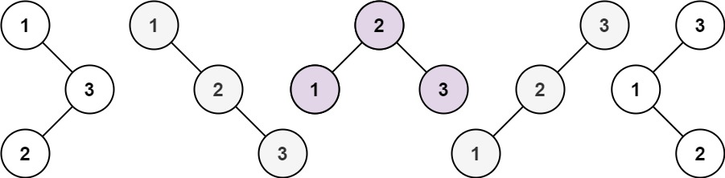

## 树

### Lc_94.二叉树遍历

给定一个二叉树的根节点 root ，返回 它的 中序 遍历 。

 

示例 1：
输入：root = [1,null,2,3]
输出：[1,3,2]

示例 2：
输入：root = []
输出：[]

链接：https://leetcode-cn.com/problems/binary-tree-inorder-traversal

```java
/**
 * Definition for a binary tree node.
 * public class TreeNode {
 *     int val;
 *     TreeNode left;
 *     TreeNode right;
 *     TreeNode() {}
 *     TreeNode(int val) { this.val = val; }
 *     TreeNode(int val, TreeNode left, TreeNode right) {
 *         this.val = val;
 *         this.left = left;
 *         this.right = right;
 *     }
 * }
 */
class Solution {
    public List<Integer> inorderTraversal(TreeNode root) {
        Deque<TreeNode> stack = new ArrayDeque<>();
        List<Integer> list = new ArrayList<>();
        while(root != null || !stack.isEmpty()){
            while(root != null){
                stack.addLast(root);
                root = root.left;
            }
            TreeNode tmp = stack.pollLast();
            list.add(tmp.val);
            root = tmp.right;
        }
        return list;
    }
}
```

### [Lc_98. 验证二叉搜索树](https://leetcode-cn.com/problems/validate-binary-search-tree/)

难度中等1558

给你一个二叉树的根节点 `root` ，判断其是否是一个有效的二叉搜索树。

**有效** 二叉搜索树定义如下：

- 节点的左子树只包含 **小于** 当前节点的数。
- 节点的右子树只包含 **大于** 当前节点的数。
- 所有左子树和右子树自身必须也是二叉搜索树。

**示例 1：**


```
输入：root = [2,1,3]
输出：true
```

**示例 2：**


```
输入：root = [5,1,4,null,null,3,6]
输出：false
解释：根节点的值是 5 ，但是右子节点的值是 4 。
```

```java
/**
 * Definition for a binary tree node.
 * public class TreeNode {
 *     int val;
 *     TreeNode left;
 *     TreeNode right;
 *     TreeNode() {}
 *     TreeNode(int val) { this.val = val; }
 *     TreeNode(int val, TreeNode left, TreeNode right) {
 *         this.val = val;
 *         this.left = left;
 *         this.right = right;
 *     }
 * }
 */
class Solution {
    public boolean isValidBST(TreeNode root) {
        Deque<TreeNode> stack = new ArrayDeque<>();
        long pre = Long.MIN_VALUE;//使用Long以防仅一个节点时，该节点是是int的最大或最小值
        while(root != null || !stack.isEmpty()){
            while(root!= null){
                stack.addLast(root);
                root = root.left;
            }
            TreeNode top = stack.pollLast();
            if(top.val <= pre){//二叉搜索树为递增的，如果小于前一个就错
                return false;
            }
            pre = top.val;
            root = top.right;
        }
        return true;
    }
}
```

### [Lc_208. 实现 Trie (前缀树)](https://leetcode.cn/problems/implement-trie-prefix-tree/)

**[Trie](https://baike.baidu.com/item/字典树/9825209?fr=aladdin)**（发音类似 "try"）或者说 **前缀树** 是一种树形数据结构，用于高效地存储和检索字符串数据集中的键。这一数据结构有相当多的应用情景，例如自动补完和拼写检查。

请你实现 Trie 类：

- `Trie()` 初始化前缀树对象。
- `void insert(String word)` 向前缀树中插入字符串 `word` 。
- `boolean search(String word)` 如果字符串 `word` 在前缀树中，返回 `true`（即，在检索之前已经插入）；否则，返回 `false` 。
- `boolean startsWith(String prefix)` 如果之前已经插入的字符串 `word` 的前缀之一为 `prefix` ，返回 `true` ；否则，返回 `false` 。

**示例：**

```
输入
["Trie", "insert", "search", "search", "startsWith", "insert", "search"]
[[], ["apple"], ["apple"], ["app"], ["app"], ["app"], ["app"]]
输出
[null, null, true, false, true, null, true]

解释
Trie trie = new Trie();
trie.insert("apple");
trie.search("apple");   // 返回 True
trie.search("app");     // 返回 False
trie.startsWith("app"); // 返回 True
trie.insert("app");
trie.search("app");     // 返回 True
```

**提示：**

- `1 <= word.length, prefix.length <= 2000`
- `word` 和 `prefix` 仅由小写英文字母组成
- `insert`、`search` 和 `startsWith` 调用次数 **总计** 不超过 `3 * 104` 次

```java
//核心思想是设立一个根节点，每个节点维护一个大小为26个来记录该节点后的情况
class Trie {
    Trie[] children;
    boolean isEnd;

    public Trie() {
        children = new Trie[26];
        isEnd = false;
    }
    
    public void insert(String word) {
        Trie node = this;//先找根节点
        for(int i = 0; i < word.length(); i++){
            int index = word.charAt(i) - 'a';
            if(node.children[index] == null){//判断是否含有该字母，没有则加
                node.children[index] = new Trie();
            }
            node = node.children[index];
        }
        node.isEnd = true;
    }
    
    public boolean search(String word) {
        boolean f = true;
        Trie node = this;
        for(int i = 0; i < word.length(); i++){
            int index = word.charAt(i) - 'a';
            if(node.children[index] == null){
                f = false;
                break;
            }
            node = node.children[index];
        }
        return f && node.isEnd;//search需要全匹配
    }
    
    public boolean startsWith(String prefix) {
        boolean f = true;
        Trie node = this;
        for(int i = 0; i < prefix.length(); i++){
            int index = prefix.charAt(i) - 'a';
            if(node.children[index] == null){
                f = false;
                break;
            }
            node = node.children[index];
        }
        return f;//这个只要含有prefix即可
    }
}

/**
 * Your Trie object will be instantiated and called as such:
 * Trie obj = new Trie();
 * obj.insert(word);
 * boolean param_2 = obj.search(word);
 * boolean param_3 = obj.startsWith(prefix);
 */
```

```java
class Trie {
    Trie[] children;
    boolean isEnd;

    public Trie() {
        children = new Trie[26];
        isEnd = false;
    }
    
    public void insert(String word) {
        Trie node = this;
        for(int i = 0; i < word.length(); i++){
            int index = word.charAt(i) - 'a';
            if(node.children[index] == null){
                node.children[index] = new Trie();
            }
            node = node.children[index];
        }
        node.isEnd = true;
    }
    
    public boolean search(String word) {
       
        return startsWith(word) && searchPrefix(word).isEnd;
    }
    
    public boolean startsWith(String prefix) {
        return searchPrefix(prefix) != null;
    }
    
    private Trie searchPrefix(String prefix) {//优化整合
        Trie node = this;
        for (int i = 0; i < prefix.length(); i++) {
            char ch = prefix.charAt(i);
            int index = ch - 'a';
            if (node.children[index] == null) {
                return null;
            }
            node = node.children[index];
        }
        return node;
    }
    
}
```

### [Lc_226. 翻转二叉树](https://leetcode.cn/problems/invert-binary-tree/)

给你一棵二叉树的根节点 `root` ，翻转这棵二叉树，并返回其根节点。 

**示例 1：**


```
输入：root = [4,2,7,1,3,6,9]
输出：[4,7,2,9,6,3,1]
```

**示例 2：**


```
输入：root = [2,1,3]
输出：[2,3,1]
```

**示例 3：**

```
输入：root = []
输出：[] 
```

**提示：**

- 树中节点数目范围在 `[0, 100]` 内
- `-100 <= Node.val <= 100`

```java
//后序递归
class Solution {
    public TreeNode invertTree(TreeNode root) {
        if(root == null){
            return null;
        }
        
        TreeNode left = invertTree(root.left);
        TreeNode right = invertTree(root.right);

        TreeNode tmp = left;
        root.left = right;
        root.right = tmp;
        return root;
    }
}
```

```java
	/**
     * 递归方式遍历反转
     */
    public TreeNode invertTree(TreeNode root) {
        if (root == null) {
            return null;
        }

        TreeNode temp = root.left;
        root.left = root.right;
        root.right = temp;

        invertTree(root.left);
        invertTree(root.right);
        return root;
    }

    /**
     * 层序遍历方式反转
     */
    public TreeNode invertTreeByQueue(TreeNode root) {
        if (root == null) {
            return null;
        }
        Queue<TreeNode> queue = new ArrayDeque<>();
        queue.offer(root);
        while (!queue.isEmpty()) {
            TreeNode node = queue.poll();
            TreeNode temp = node.left;
            node.left = node.right;
            node.right = temp;
            if (node.left != null) {
                queue.offer(node.left);
            }
            if (node.right != null) {
                queue.offer(node.right);
            }
        }
        return root;
    }

    /**
     * 深度优先遍历的方式反转
     */
    private TreeNode invertTreeByStack(TreeNode root) {
        if (root == null) {
            return null;
        }
        Stack<TreeNode> stack = new Stack<>();
        stack.push(root);
        while (!stack.isEmpty()) {
            int size = stack.size();
            for (int i = 0; i < size; i++) {
                TreeNode cur = stack.pop();
                TreeNode temp = cur.left;
                cur.left = cur.right;
                cur.right = temp;
                if (cur.right != null) {
                    stack.push(cur.right);
                }
                if (cur.left != null) {
                    stack.push(cur.left);
                }
            }
        }
        return root;
    }
```

### [Lc_538. 把二叉搜索树转换为累加树](https://leetcode.cn/problems/convert-bst-to-greater-tree/)

给出二叉 **搜索** 树的根节点，该树的节点值各不相同，请你将其转换为累加树（Greater Sum Tree），使每个节点 `node` 的新值等于原树中大于或等于 `node.val` 的值之和。

提醒一下，二叉搜索树满足下列约束条件：

- 节点的左子树仅包含键 **小于** 节点键的节点。
- 节点的右子树仅包含键 **大于** 节点键的节点。
- 左右子树也必须是二叉搜索树。

**注意：**本题和 1038: https://leetcode-cn.com/problems/binary-search-tree-to-greater-sum-tree/ 相同

**示例 1：**

****

```
输入：[4,1,6,0,2,5,7,null,null,null,3,null,null,null,8]
输出：[30,36,21,36,35,26,15,null,null,null,33,null,null,null,8]
```

**示例 2：**

```
输入：root = [0,null,1]
输出：[1,null,1]
```

**示例 3：**

```
输入：root = [1,0,2]
输出：[3,3,2]
```

**示例 4：**

```
输入：root = [3,2,4,1]
输出：[7,9,4,10]
```

**提示：**

- 树中的节点数介于 `0` 和 `104` 之间。
- 每个节点的值介于 `-104` 和 `104` 之间。
- 树中的所有值 **互不相同** 。
- 给定的树为二叉搜索树。

```java
//树为二叉搜索树，
class Solution {
    int tmp = 0;
    public TreeNode convertBST(TreeNode root) {
        RTL(root);
        return root;
    }

    public void RTL(TreeNode root){
        if(root == null){
            return;
        }
        RTL(root.right);
        tmp += root.val;
        root.val = tmp;
        RTL(root.left);
        
    }
}
```

### [Lc_543. 二叉树的直径](https://leetcode.cn/problems/diameter-of-binary-tree/)

给定一棵二叉树，你需要计算它的直径长度。一棵二叉树的直径长度是任意两个结点路径长度中的最大值。这条路径可能穿过也可能不穿过根结点。

**示例 :**
给定二叉树

```
          1
         / \
        2   3
       / \     
      4   5    
```

返回 **3**, 它的长度是路径 [4,2,1,3] 或者 [5,2,1,3]。

**注意：**两结点之间的路径长度是以它们之间边的数目表示。

```java
//对每个节点进行求左右子树的深度，因为可能子树中距离较大
class Solution {
    int ans = 0;
    public int diameterOfBinaryTree(TreeNode root) {
        if(root == null){
            return 0;
        }
        ans = Math.max(ans, (ILR(root.left) + ILR(root.right)));
        diameterOfBinaryTree(root.left);
        diameterOfBinaryTree(root.right);
        return ans;
    }
    public int ILR(TreeNode root){
        if(root == null){
            return 0;
        }
        int left = ILR(root.left) + 1;
        int right = ILR(root.right) +1;
        return Math.max(left, right);
    }
}
```

### [Lc_617. 合并二叉树](https://leetcode.cn/problems/merge-two-binary-trees/)

给你两棵二叉树： `root1` 和 `root2` 。

想象一下，当你将其中一棵覆盖到另一棵之上时，两棵树上的一些节点将会重叠（而另一些不会）。你需要将这两棵树合并成一棵新二叉树。合并的规则是：如果两个节点重叠，那么将这两个节点的值相加作为合并后节点的新值；否则，**不为** null 的节点将直接作为新二叉树的节点。

返回合并后的二叉树。

**注意:** 合并过程必须从两个树的根节点开始。

**示例 1：**


```
输入：root1 = [1,3,2,5], root2 = [2,1,3,null,4,null,7]
输出：[3,4,5,5,4,null,7]
```

**示例 2：**

```
输入：root1 = [1], root2 = [1,2]
输出：[2,2]
```

**提示：**

- 两棵树中的节点数目在范围 `[0, 2000]` 内
- `-104 <= Node.val <= 104`

```java
//错误的递归，因为当为null时，即不存在该节点，无法连接
class Solution {
    public TreeNode mergeTrees(TreeNode root1, TreeNode root2) {
        
        merge(root1,root2);
        return root1;
    }
    public void merge(TreeNode root1, TreeNode root2){
        if(root1 == null && root2 == null){
            return;
        }
        if(root1 == null){
            root1 = root2;//无法连接
            return;
        }
        if(root2 == null){
            root1 = root1;
            return;
        }
        root1.val = root1.val + root2.val;
        merge(root1.left,root2.left);
        merge(root1.right,root2.right);
    }
}
```

```java
//此方法会共用节点，不安全
class Solution {
    public TreeNode mergeTrees(TreeNode root1, TreeNode root2) {
        if(root1 == null && root2 == null){
            return null;
        }
        if(root1 == null){  
            return root2;
        }
        if(root2 == null){
            return root1;
        }
        
        root1.val = root1.val + root2.val;
        root1.left =  mergeTrees(root1.left,root2.left);
        root1.right = mergeTrees(root1.right,root2.right);
        
        return root1;
    }
}
```

```java
class Solution {
    public TreeNode mergeTrees(TreeNode root1, TreeNode root2) {
        if(root1 == null && root2 == null){
            return null;
        }
        if(root1 == null){  
            root1 = new TreeNode(0);//不共享内存，新建一个节点，因为继续对该节点递归，下面还要进行加法，所以赋值为零
        }
        if(root2 == null){
            return root1;
        }
        
        root1.val = root1.val + root2.val;
        root1.left =  mergeTrees(root1.left,root2.left);
        root1.right = mergeTrees(root1.right,root2.right);
        
        return root1;
    }
}
```

### [95. 不同的二叉搜索树 II](https://leetcode.cn/problems/unique-binary-search-trees-ii/)

给你一个整数 `n` ，请你生成并返回所有由 `n` 个节点组成且节点值从 `1` 到 `n` 互不相同的不同 **二叉搜索树** 。可以按 **任意顺序** 返回答案。

**示例 1：**



```
输入：n = 3
输出：[[1,null,2,null,3],[1,null,3,2],[2,1,3],[3,1,null,null,2],[3,2,null,1]]
```

**示例 2：**

```
输入：n = 1
输出：[[1]]
```

**提示：**

- `1 <= n <= 8`

```java
class Solution {
    public List<TreeNode> generateTrees(int n) {
        if (n == 0) {
            return new LinkedList<TreeNode>();
        }
        return generateTrees(1, n);
    }

    public List<TreeNode> generateTrees(int start, int end) {
        List<TreeNode> allTrees = new LinkedList<TreeNode>();
        if (start > end) {
            allTrees.add(null);
            return allTrees;
        }

        // 枚举可行根节点
        for (int i = start; i <= end; i++) {
            // 获得所有可行的左子树集合
            List<TreeNode> leftTrees = generateTrees(start, i - 1);

            // 获得所有可行的右子树集合
            List<TreeNode> rightTrees = generateTrees(i + 1, end);

            // 从左子树集合中选出一棵左子树，从右子树集合中选出一棵右子树，拼接到根节点上
            for (TreeNode left : leftTrees) {
                for (TreeNode right : rightTrees) {
                    TreeNode currTree = new TreeNode(i);
                    currTree.left = left;
                    currTree.right = right;
                    allTrees.add(currTree);
                }
            }
        }
        return allTrees;
    }
}
```

### [100. 相同的树](https://leetcode.cn/problems/same-tree/)

难度简单895

给你两棵二叉树的根节点 `p` 和 `q` ，编写一个函数来检验这两棵树是否相同。

如果两个树在结构上相同，并且节点具有相同的值，则认为它们是相同的。

**示例 1：**


```
输入：p = [1,2,3], q = [1,2,3]
输出：true
```

**示例 2：**


```
输入：p = [1,2], q = [1,null,2]
输出：false
```

**示例 3：**


```
输入：p = [1,2,1], q = [1,1,2]
输出：false
```

**提示：**

- 两棵树上的节点数目都在范围 `[0, 100]` 内
- `-104 <= Node.val <= 104`

```java
class Solution {
    
    public boolean isSameTree(TreeNode p, TreeNode q) {
        if(p == null || q == null){
            return p == q;
        }
        if(p.val != q.val){
            return false;
        }
        return isSameTree(p.left, q.left) && isSameTree(p.right, q.right);
    }
}
```

### [103. 二叉树的锯齿形层序遍历](https://leetcode.cn/problems/binary-tree-zigzag-level-order-traversal/)

难度中等690

给你二叉树的根节点 `root` ，返回其节点值的 **锯齿形层序遍历** 。（即先从左往右，再从右往左进行下一层遍历，以此类推，层与层之间交替进行）。

**示例 1：**


```
输入：root = [3,9,20,null,null,15,7]
输出：[[3],[20,9],[15,7]]
```

**示例 2：**

```
输入：root = [1]
输出：[[1]]
```

**示例 3：**

```
输入：root = []
输出：[]
```

**提示：**

- 树中节点数目在范围 `[0, 2000]` 内
- `-100 <= Node.val <= 100`

```java
class Solution {
    public List<List<Integer>> zigzagLevelOrder(TreeNode root) {
        List<List<Integer>> ans = new ArrayList<>();
        if (root == null) return ans;

        boolean isFromLeftToRight = true; // 方向，控制每一层的顺序
        LinkedList<TreeNode> queue = new LinkedList<>(); // 双端队列
        queue.addFirst(root);
        while (!queue.isEmpty()) {
            int curLevelSize = queue.size(); // 当前层节点数
            ArrayList<Integer> theLevelIntegers = new ArrayList<>(curLevelSize); 
            // 处理当前层
            for (int i = 0; i < curLevelSize; i++) {
                // 从左往右时：当前层依次从队尾弹出节点；孩子入队顺序：头进（先左再右）
                if (isFromLeftToRight) {
                    TreeNode node = queue.pollLast();
                    if (node.left != null) {
                        queue.addFirst(node.left);
                    }
                    if (node.right != null) {
                        queue.addFirst(node.right);
                    }
                    theLevelIntegers.add(i, node.val);
                }
                // 从右往左时：当前层依次从队头弹出节点；孩子入队顺序：尾进（先右再左）
                else {
                    TreeNode node = queue.pollFirst();
                    if (node.right != null) {
                        queue.addLast(node.right);
                    }
                    if (node.left != null) {
                        queue.addLast(node.left);
                    }
                    theLevelIntegers.add(i, node.val);
                }
            }
            ans.add(theLevelIntegers);
            isFromLeftToRight = !isFromLeftToRight; // 下一层，方向翻转
        }
        return ans;
    }
}
```

### [106. 从中序与后序遍历序列构造二叉树](https://leetcode.cn/problems/construct-binary-tree-from-inorder-and-postorder-traversal/)

难度中等832

给定两个整数数组 `inorder` 和 `postorder` ，其中 `inorder` 是二叉树的中序遍历， `postorder` 是同一棵树的后序遍历，请你构造并返回这颗 *二叉树* 。

 

**示例 1:**


```
输入：inorder = [9,3,15,20,7], postorder = [9,15,7,20,3]
输出：[3,9,20,null,null,15,7]
```

**示例 2:**

```
输入：inorder = [-1], postorder = [-1]
输出：[-1]
```

**提示:**

- `1 <= inorder.length <= 3000`
- `postorder.length == inorder.length`
- `-3000 <= inorder[i], postorder[i] <= 3000`
- `inorder` 和 `postorder` 都由 **不同** 的值组成
- `postorder` 中每一个值都在 `inorder` 中
- `inorder` **保证**是树的中序遍历
- `postorder` **保证**是树的后序遍历

```java
class Solution {
    public TreeNode buildTree(int[] inorder, int[] postorder) {

        return helper(inorder,0, inorder.length-1, postorder, 0, postorder.length-1);
    }
    public TreeNode helper(int[] inorder, int start, int end, int[] postorder, int rootleft, int rootIndex){
        if(start > end){
            return null;
        }
        TreeNode root = new TreeNode(postorder[rootIndex]);
        int index = 0;
        for(int i = start; i <= end; i++){
            if(postorder[rootIndex] == inorder[i]){
                break;
            }
            index++;
        }
        root.left = helper(inorder, start, start+index-1, postorder, rootleft, rootleft+index-1);
        root.right = helper(inorder, start+index+1, end, postorder, rootleft+index, rootIndex-1);
        return root;
    }
}
```

### [107. 二叉树的层序遍历 II](https://leetcode.cn/problems/binary-tree-level-order-traversal-ii/)

难度中等614

给你二叉树的根节点 `root` ，返回其节点值 **自底向上的层序遍历** 。 （即按从叶子节点所在层到根节点所在的层，逐层从左向右遍历）

**示例 1：**


```
输入：root = [3,9,20,null,null,15,7]
输出：[[15,7],[9,20],[3]]
```

**示例 2：**

```
输入：root = [1]
输出：[[1]]
```

**示例 3：**

```
输入：root = []
输出：[]
```

**提示：**

- 树中节点数目在范围 `[0, 2000]` 内
- `-1000 <= Node.val <= 1000`

```java
class Solution {
    public List<List<Integer>> levelOrderBottom(TreeNode root) {
        List<List<Integer>> ans = new ArrayList<>();
        if(root == null){
            return ans;
        }
        Queue<TreeNode> queue = new LinkedList<>();
        queue.offer(root);
        while(!queue.isEmpty()){
            int size = queue.size();
            List<Integer> tmplist = new ArrayList<>();
            for(int i = 0; i < size; i++){
                TreeNode tmp = queue.poll();
                if(tmp.left != null){
                    queue.offer(tmp.left);
                }
                if(tmp.right != null){
                    queue.offer(tmp.right);
                }
                tmplist.add(tmp.val);
            }
            ans.add(0,tmplist);
        }
        return ans;
    }
}
```

### [108. 将有序数组转换为二叉搜索树](https://leetcode.cn/problems/convert-sorted-array-to-binary-search-tree/)

难度简单1129

给你一个整数数组 `nums` ，其中元素已经按 **升序** 排列，请你将其转换为一棵 **高度平衡** 二叉搜索树。

**高度平衡** 二叉树是一棵满足「每个节点的左右两个子树的高度差的绝对值不超过 1 」的二叉树。

**示例 1：**


```
输入：nums = [-10,-3,0,5,9]
输出：[0,-3,9,-10,null,5]
解释：[0,-10,5,null,-3,null,9] 也将被视为正确答案：
```

**示例 2：**


```
输入：nums = [1,3]
输出：[3,1]
解释：[1,null,3] 和 [3,1] 都是高度平衡二叉搜索树。
```

**提示：**

- `1 <= nums.length <= 104`
- `-104 <= nums[i] <= 104`
- `nums` 按 **严格递增** 顺序排列

```java
class Solution {
    public TreeNode sortedArrayToBST(int[] nums) {
        int len = nums.length;
        return helper(nums,0,len-1);
    }
    public TreeNode helper(int[] nums, int left, int right){
        if(left > right){
            return null;
        }
        int rootIndex = (left + right + 1)/2;//向上取整
        TreeNode root = new TreeNode(nums[rootIndex]);
        root.left = helper(nums, left, rootIndex-1);
        root.right = helper(nums, rootIndex+1, right);
        return root;
    }
}
```

### [109. 有序链表转换二叉搜索树](https://leetcode.cn/problems/convert-sorted-list-to-binary-search-tree/)

难度中等754

给定一个单链表的头节点  `head` ，其中的元素 **按升序排序** ，将其转换为高度平衡的二叉搜索树。

本题中，一个高度平衡二叉树是指一个二叉树*每个节点* 的左右两个子树的高度差不超过 1。

**示例 1:**


```
输入: head = [-10,-3,0,5,9]
输出: [0,-3,9,-10,null,5]
解释: 一个可能的答案是[0，-3,9，-10,null,5]，它表示所示的高度平衡的二叉搜索树。
```

**示例 2:**

```
输入: head = []
输出: []
```

**提示:**

- `head` 中的节点数在`[0, 2 * 104]` 范围内
- `-105 <= Node.val <= 105`

```java
class Solution {
    public TreeNode sortedListToBST(ListNode head) {
        if(head == null){
            return null;
        }
        return helper(head,null);
    }
    private TreeNode helper(ListNode head,ListNode tail){
        if(head == tail){
            return null;
        }
        ListNode fast = head;
        ListNode slow = head;
        while(fast != tail && fast.next != tail){//快慢指针
            fast = fast.next.next;
            slow = slow.next;
        }
        TreeNode root = new TreeNode(slow.val);
        root.left = helper(head,slow);
        root.right = helper(slow.next,tail);
        return root;
    }
}
```

### [110. 平衡二叉树](https://leetcode.cn/problems/balanced-binary-tree/)

难度简单1129

给定一个二叉树，判断它是否是高度平衡的二叉树。

本题中，一棵高度平衡二叉树定义为：

> 一个二叉树*每个节点* 的左右两个子树的高度差的绝对值不超过 1 。

**示例 1：**


```
输入：root = [3,9,20,null,null,15,7]
输出：true
```

**示例 2：**


```
输入：root = [1,2,2,3,3,null,null,4,4]
输出：false
```

**示例 3：**

```
输入：root = []
输出：true
```

**提示：**

- 树中的节点数在范围 `[0, 5000]` 内
- `-104 <= Node.val <= 104`

```java
class Solution {
    // boolean f = true;
    // public boolean isBalanced(TreeNode root) {
    //     if(root == null){
    //         return true;
    //     }
    //     int tmp = helper(root);
    //     return f;
    // }
    // public int helper(TreeNode root){
    //     if(root == null || !f){
    //         return 0;
    //     }
    //     int left = 0;
    //     if(root.left != null)
    //     left = helper(root.left) + 1;
    //     int right = 0;
    //     if(root.right != null)
    //     right = helper(root.right) + 1;
    //     if(Math.abs(left-right) > 1){
    //         f = false;
    //     }
    //     return Math.max(left, right);
    // }
    public boolean isBalanced(TreeNode root) {
        return recur(root) != -1;
    }

    private int recur(TreeNode root) {
        if (root == null) return 0;
        int left = recur(root.left);
        if(left == -1) return -1;
        int right = recur(root.right);
        if(right == -1) return -1;
        return Math.abs(left - right) < 2 ? Math.max(left, right) + 1 : -1;
    }
}
```

### [111. 二叉树的最小深度](https://leetcode.cn/problems/minimum-depth-of-binary-tree/)

难度简单833

给定一个二叉树，找出其最小深度。

最小深度是从根节点到最近叶子节点的最短路径上的节点数量。

**说明：**叶子节点是指没有子节点的节点。

**示例 1：**


```
输入：root = [3,9,20,null,null,15,7]
输出：2
```

**示例 2：**

```
输入：root = [2,null,3,null,4,null,5,null,6]
输出：5
```

**提示：**

- 树中节点数的范围在 `[0, 105]` 内
- `-1000 <= Node.val <= 1000`

```java
class Solution {
    public int minDepth(TreeNode root) {
        // if(root == null){
        //     return 0;
        // }
        // int left = minDepth(root.left);
        // int right = minDepth(root.right);
        // if(left == 0 && right == 0){
        //     return 1;
        // }
        // if(left == 0){
        //     return right + 1;
        // }
        // if(right == 0){
        //     return left + 1;
        // }
        // return Math.min(left,right)+1;
        if (root == null) return 0;
        else if (root.left == null) return minDepth(root.right) + 1;
        else if (root.right == null) return minDepth(root.left) + 1;
        else return Math.min(minDepth(root.left), minDepth(root.right)) + 1;
    }
}
```

### [112. 路径总和](https://leetcode.cn/problems/path-sum/)

难度简单983

给你二叉树的根节点 `root` 和一个表示目标和的整数 `targetSum` 。判断该树中是否存在 **根节点到叶子节点** 的路径，这条路径上所有节点值相加等于目标和 `targetSum` 。如果存在，返回 `true` ；否则，返回 `false` 。

**叶子节点** 是指没有子节点的节点。

**示例 1：**


```
输入：root = [5,4,8,11,null,13,4,7,2,null,null,null,1], targetSum = 22
输出：true
解释：等于目标和的根节点到叶节点路径如上图所示。
```

**示例 2：**


```
输入：root = [1,2,3], targetSum = 5
输出：false
解释：树中存在两条根节点到叶子节点的路径：
(1 --> 2): 和为 3
(1 --> 3): 和为 4
不存在 sum = 5 的根节点到叶子节点的路径。
```

**示例 3：**

```
输入：root = [], targetSum = 0
输出：false
解释：由于树是空的，所以不存在根节点到叶子节点的路径。
```

**提示：**

- 树中节点的数目在范围 `[0, 5000]` 内
- `-1000 <= Node.val <= 1000`
- `-1000 <= targetSum <= 1000`

```java
class Solution {
    public boolean hasPathSum(TreeNode root, int targetSum) {
        if(root == null){
            return false;
        }
        if(root.val == targetSum && root.left == null && root.right == null){
            return true;
        }
        return hasPathSum(root.left, targetSum - root.val) || hasPathSum(root.right, targetSum - root.val);
    }
```

### [113. 路径总和 II](https://leetcode.cn/problems/path-sum-ii/)

难度中等836

给你二叉树的根节点 `root` 和一个整数目标和 `targetSum` ，找出所有 **从根节点到叶子节点** 路径总和等于给定目标和的路径。

**叶子节点** 是指没有子节点的节点。

**示例 1：**


```
输入：root = [5,4,8,11,null,13,4,7,2,null,null,5,1], targetSum = 22
输出：[[5,4,11,2],[5,8,4,5]]
```

**示例 2：**


```
输入：root = [1,2,3], targetSum = 5
输出：[]
```

**示例 3：**

```
输入：root = [1,2], targetSum = 0
输出：[]
```

**提示：**

- 树中节点总数在范围 `[0, 5000]` 内
- `-1000 <= Node.val <= 1000`
- `-1000 <= targetSum <= 1000`

```java
class Solution {
    public List<List<Integer>> pathSum(TreeNode root, int targetSum) {
        List<List<Integer>> ans = new ArrayList<>();
        if(root == null){
            return ans;
        }
        List<Integer> path = new ArrayList<Integer>();
        path.add(root.val);
        dfs(root, targetSum, ans, path);
        return ans;
    }
    public void dfs(TreeNode root, int targetSum, List<List<Integer>> ans, List<Integer> path){
        if(root == null /*|| (root.val == targetSum && (root.left != null || root.right != null))*/){//不能这样剪枝，因为，中间会有可能加上后面的也会有可能
            return;
        }
        if(root.val == targetSum && root.left == null && root.right == null){
            ans.add(new ArrayList<>(path));
            return;
        }
        if(root.left != null){
            path.add(root.left.val);
            dfs(root.left,targetSum - root.val, ans, path);
            path.remove(path.size()-1);
        }
        
        if(root.right != null){
            path.add(root.right.val);
            dfs(root.right,targetSum - root.val, ans, path);
            path.remove(path.size()-1);
        }
        
    }
}
```

### [116. 填充每个节点的下一个右侧节点指针](https://leetcode.cn/problems/populating-next-right-pointers-in-each-node/)

难度中等866

给定一个 **完美二叉树** ，其所有叶子节点都在同一层，每个父节点都有两个子节点。二叉树定义如下：

```
struct Node {
  int val;
  Node *left;
  Node *right;
  Node *next;
}
```

填充它的每个 next 指针，让这个指针指向其下一个右侧节点。如果找不到下一个右侧节点，则将 next 指针设置为 `NULL`。

初始状态下，所有 next 指针都被设置为 `NULL`。

**示例 1：**


```
输入：root = [1,2,3,4,5,6,7]
输出：[1,#,2,3,#,4,5,6,7,#]
解释：给定二叉树如图 A 所示，你的函数应该填充它的每个 next 指针，以指向其下一个右侧节点，如图 B 所示。序列化的输出按层序遍历排列，同一层节点由 next 指针连接，'#' 标志着每一层的结束。
```

**示例 2:**

```
输入：root = []
输出：[]
```

**提示：**

- 树中节点的数量在 `[0, 212 - 1]` 范围内
- `-1000 <= node.val <= 1000`

**进阶：**

- 你只能使用常量级额外空间。
- 使用递归解题也符合要求，本题中递归程序占用的栈空间不算做额外的空间复杂度。

```java
class Solution {
    // public Node connect(Node root) {
    //     if(root == null){
    //         return null;
    //     }
    //     Queue<Node> queue = new LinkedList<>();
    //     queue.offer(root);
    //     while(!queue.isEmpty()){
    //         Node tmp = new Node();
    //         int size = queue.size();
    //         for(int i = 0; i < size; i++){
    //             Node r = queue.poll();
    //             // 连接
    //             if (i < size - 1) {
    //                 r.next = queue.peek();
    //             }

    //             if(r.left != null){
    //                 queue.offer(r.left);
    //             }
    //             if(r.right != null){
    //                 queue.offer(r.right);
    //             }
                
    //             // tmp.next = r;这样会浪费层次个节点
    //             // tmp = r;
    //         }
    //     }
    //     return root;
    // }
    public Node connect(Node root) {//递归
        if(root==null){
            return root;
        }
        if(root.left!=null){
            root.left.next=root.right;
            root.right.next=root.next!=null?root.next.left:null;
            connect(root.left);
            connect(root.right);
        }
        return root;
    }
}
```

### [117. 填充每个节点的下一个右侧节点指针 II](https://leetcode.cn/problems/populating-next-right-pointers-in-each-node-ii/)

难度中等626

给定一个二叉树

```
struct Node {
  int val;
  Node *left;
  Node *right;
  Node *next;
}
```

填充它的每个 next 指针，让这个指针指向其下一个右侧节点。如果找不到下一个右侧节点，则将 next 指针设置为 `NULL`。

初始状态下，所有 next 指针都被设置为 `NULL`。

**进阶：**

- 你只能使用常量级额外空间。
- 使用递归解题也符合要求，本题中递归程序占用的栈空间不算做额外的空间复杂度。

**示例：**


```
输入：root = [1,2,3,4,5,null,7]
输出：[1,#,2,3,#,4,5,7,#]
解释：给定二叉树如图 A 所示，你的函数应该填充它的每个 next 指针，以指向其下一个右侧节点，如图 B 所示。序列化输出按层序遍历顺序（由 next 指针连接），'#' 表示每层的末尾。
```

**提示：**

- 树中的节点数小于 `6000`
- `-100 <= node.val <= 100`

```java
class Solution {
    public Node connect(Node root) {
        if(root == null){
            return null;
        }
        Queue<Node> queue = new LinkedList<>();
        queue.offer(root);
        while(!queue.isEmpty()){
            Node tmp = new Node();
            int size = queue.size();
            for(int i = 0; i < size; i++){
                Node r = queue.poll();
                // 连接
                if (i < size - 1) {
                    r.next = queue.peek();
                }

                if(r.left != null){
                    queue.offer(r.left);
                }
                if(r.right != null){
                    queue.offer(r.right);
                }
                
                // tmp.next = r;这样会浪费层次个节点
                // tmp = r;
            }
        }
        return root;
    }
}
```

### [129. 求根节点到叶节点数字之和](https://leetcode.cn/problems/sum-root-to-leaf-numbers/)

难度中等572

给你一个二叉树的根节点 `root` ，树中每个节点都存放有一个 `0` 到 `9` 之间的数字。

每条从根节点到叶节点的路径都代表一个数字：

- 例如，从根节点到叶节点的路径 `1 -> 2 -> 3` 表示数字 `123` 。

计算从根节点到叶节点生成的 **所有数字之和** 。

**叶节点** 是指没有子节点的节点。

**示例 1：**


```
输入：root = [1,2,3]
输出：25
解释：
从根到叶子节点路径 1->2 代表数字 12
从根到叶子节点路径 1->3 代表数字 13
因此，数字总和 = 12 + 13 = 25
```

**示例 2：**


```
输入：root = [4,9,0,5,1]
输出：1026
解释：
从根到叶子节点路径 4->9->5 代表数字 495
从根到叶子节点路径 4->9->1 代表数字 491
从根到叶子节点路径 4->0 代表数字 40
因此，数字总和 = 495 + 491 + 40 = 1026
```

**提示：**

- 树中节点的数目在范围 `[1, 1000]` 内
- `0 <= Node.val <= 9`
- 树的深度不超过 `10`

```java
class Solution {
    public int ans = 0;
    public int sumNumbers(TreeNode root) {
        if(root == null){
            return 0;
        }
        inOrder(root, 0);
        return ans;
    }
    private void inOrder(TreeNode root, int tmp){   
        tmp = tmp*10 + root.val;
        if(root.left == null && root.right == null){
            ans += tmp;
        }
        if(root.left != null)
        inOrder(root.left, tmp);
        if(root.right != null)
        inOrder(root.right, tmp);
    }
}
```

#### [144. 二叉树的前序遍历](https://leetcode.cn/problems/binary-tree-preorder-traversal/)

难度简单905

给你二叉树的根节点 `root` ，返回它节点值的 **前序** 遍历。

 

**示例 1：**


```
输入：root = [1,null,2,3]
输出：[1,2,3]
```

**示例 2：**

```
输入：root = []
输出：[]
```

**提示：**

- 树中节点数目在范围 `[0, 100]` 内
- `-100 <= Node.val <= 100`

**进阶：**递归算法很简单，你可以通过迭代算法完成吗？

```java

class Solution {
    // public List<Integer> preorderTraversal(TreeNode root) {
    //     List<Integer> ans = new ArrayList<>();
    //     if(root == null){
    //         return ans;
    //     }
    //     preOrder(root, ans);
    //     return ans;
    // }
    // private void preOrder(TreeNode root, List<Integer> ans){
    //     ans.add(root.val);
    //     if(root.left != null){
    //         preOrder(root.left, ans);
    //     }
    //     if(root.right != null){
    //         preOrder(root.right, ans);
    //     }
    // }

    public List<Integer> preorderTraversal(TreeNode root) {
        List<Integer> ans = new ArrayList<>();
        if(root == null){
            return ans;
        }
        Deque<TreeNode> stack = new LinkedList<>();
        TreeNode tmp = root;
        while(!stack.isEmpty() || tmp != null){
            while(tmp != null){
                ans.add(tmp.val);
                stack.push(tmp);
                tmp = tmp.left;
            }
            tmp = stack.pop();
            tmp = tmp.right;
        }
        return ans;
    }
}
```

### [145. 二叉树的后序遍历](https://leetcode.cn/problems/binary-tree-postorder-traversal/)

难度简单918

给你一棵二叉树的根节点 `root` ，返回其节点值的 **后序遍历** 。

**示例 1：**


```
输入：root = [1,null,2,3]
输出：[3,2,1]
```

**示例 2：**

```
输入：root = []
输出：[]
```

**示例 3：**

```
输入：root = [1]
输出：[1]
```

**提示：**

- 树中节点的数目在范围 `[0, 100]` 内
- `-100 <= Node.val <= 100`

**进阶：**递归算法很简单，你可以通过迭代算法完成吗？

```java
class Solution {
    // public List<Integer> postorderTraversal(TreeNode root) {
    //     List<Integer> ans = new ArrayList<>();
    //     if(root == null){
    //         return ans;
    //     }
    //     preOrder(root, ans);
    //     return ans;
    // }
    // private void preOrder(TreeNode root, List<Integer> ans){
    //     if(root.left != null){
    //         preOrder(root.left, ans);
    //     }
    //     if(root.right != null){
    //         preOrder(root.right, ans);
    //     }
    //     ans.add(root.val);
    // }
    public List<Integer> postorderTraversal(TreeNode root) {
        List<Integer> ans = new ArrayList<>();
        if(root == null){
            return ans;
        }
        Deque<TreeNode> stack = new LinkedList<>();
        TreeNode pre = null;
        while(root != null || !stack.isEmpty()){
            while(root != null){
                stack.push(root);
                root = root.left;
            }
            root = stack.pop();
            if (root.right == null || root.right == pre) {
                ans.add(root.val);
                pre = root;
                root = null;
            } else {
                stack.push(root);
                root = root.right;
            }
        }
        return ans;
    }
}
```

### [173. 二叉搜索树迭代器](https://leetcode.cn/problems/binary-search-tree-iterator/)

难度中等643

实现一个二叉搜索树迭代器类`BSTIterator` ，表示一个按中序遍历二叉搜索树（BST）的迭代器：

- `BSTIterator(TreeNode root)` 初始化 `BSTIterator` 类的一个对象。BST 的根节点 `root` 会作为构造函数的一部分给出。指针应初始化为一个不存在于 BST 中的数字，且该数字小于 BST 中的任何元素。
- `boolean hasNext()` 如果向指针右侧遍历存在数字，则返回 `true` ；否则返回 `false` 。
- `int next()`将指针向右移动，然后返回指针处的数字。

注意，指针初始化为一个不存在于 BST 中的数字，所以对 `next()` 的首次调用将返回 BST 中的最小元素。

你可以假设 `next()` 调用总是有效的，也就是说，当调用 `next()` 时，BST 的中序遍历中至少存在一个下一个数字。

**示例：**


```
输入
["BSTIterator", "next", "next", "hasNext", "next", "hasNext", "next", "hasNext", "next", "hasNext"]
[[[7, 3, 15, null, null, 9, 20]], [], [], [], [], [], [], [], [], []]
输出
[null, 3, 7, true, 9, true, 15, true, 20, false]

解释
BSTIterator bSTIterator = new BSTIterator([7, 3, 15, null, null, 9, 20]);
bSTIterator.next();    // 返回 3
bSTIterator.next();    // 返回 7
bSTIterator.hasNext(); // 返回 True
bSTIterator.next();    // 返回 9
bSTIterator.hasNext(); // 返回 True
bSTIterator.next();    // 返回 15
bSTIterator.hasNext(); // 返回 True
bSTIterator.next();    // 返回 20
bSTIterator.hasNext(); // 返回 False
```

**提示：**

- 树中节点的数目在范围 `[1, 105]` 内
- `0 <= Node.val <= 106`
- 最多调用 `105` 次 `hasNext` 和 `next` 操作

**进阶：**

- 你可以设计一个满足下述条件的解决方案吗？`next()` 和 `hasNext()` 操作均摊时间复杂度为 `O(1)` ，并使用 `O(h)` 内存。其中 `h` 是树的高度。

```java
/**
 * Definition for a binary tree node.
 * public class TreeNode {
 *     int val;
 *     TreeNode left;
 *     TreeNode right;
 *     TreeNode() {}
 *     TreeNode(int val) { this.val = val; }
 *     TreeNode(int val, TreeNode left, TreeNode right) {
 *         this.val = val;
 *         this.left = left;
 *         this.right = right;
 *     }
 * }
 */
class BSTIterator {
    private TreeNode cur;
    private Deque<TreeNode> stack;

    public BSTIterator(TreeNode root) {
        cur = root;
        stack = new LinkedList<>();
    }
    
    public int next() {
        while(cur != null){
            stack.push(cur);
            cur = cur.left;
        }
        cur = stack.pop();
        int ret = cur.val;
        cur = cur.right;
        return ret;
    }
    
    public boolean hasNext() {
        return cur != null || !stack.isEmpty();
    }
}

/**
 * Your BSTIterator object will be instantiated and called as such:
 * BSTIterator obj = new BSTIterator(root);
 * int param_1 = obj.next();
 * boolean param_2 = obj.hasNext();
 */
```

```java
class BSTIterator {
    private int idx;
    private List<Integer> list;

    public BSTIterator(TreeNode root) {
        idx = 0;
        list = new ArrayList<>();
        inorderTree(root,list);
    }
    
    public int next() {
        return list.get(idx++);
    }
    
    public boolean hasNext() {
        return idx < list.size();
    }

    private void inorderTree(TreeNode root, List<Integer> list){
        if(root == null){
            return;
        }
        if(root.left != null){
            inorderTree(root.left, list);
        }
        list.add(root.val);
        if(root.right != null){
            inorderTree(root.right, list);
        }
    }
}
```

