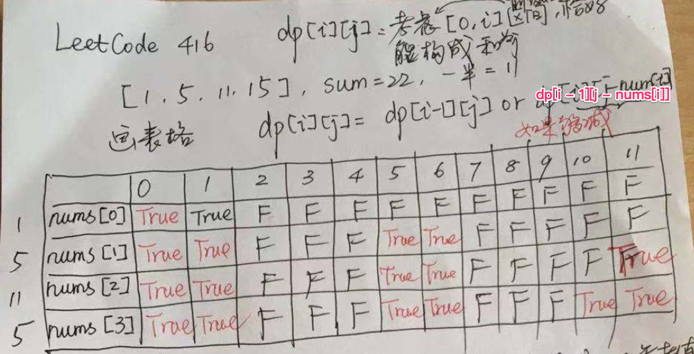

## 背包问题

### [Lc_416. 分割等和子集](https://leetcode.cn/problems/partition-equal-subset-sum/)

给你一个 **只包含正整数** 的 **非空** 数组 `nums` 。请你判断是否可以将这个数组分割成两个子集，使得两个子集的元素和相等。

**示例 1：**

```
输入：nums = [1,5,11,5]
输出：true
解释：数组可以分割成 [1, 5, 5] 和 [11] 。
```

**示例 2：**

```
输入：nums = [1,2,3,5]
输出：false
解释：数组不能分割成两个元素和相等的子集。
```

**提示：**

- `1 <= nums.length <= 200`
- `1 <= nums[i] <= 100`



```java
//不选择 nums[i]，如果在 [0, i - 1] 这个子区间内已经有一部分元素，使得它们的和为 j ，那么 dp[i][j] = true；选择 nums[i]，如果在 [0, i - 1] 这个子区间内就得找到一部分元素，使得它们的和为 j - nums[i]。
public class Solution {

    public boolean canPartition(int[] nums) {
        int len = nums.length;
        int sum = 0;
        for (int num : nums) {
            sum += num;
        }
        if ((sum & 1) == 1) {
            return false;
        }

        int target = sum / 2;
        boolean[][] dp = new boolean[len][target + 1];
        
        // 初始化成为 true 虽然不符合状态定义，但是从状态转移来说是完全可以的
        dp[0][0] = true;

        if (nums[0] <= target) {
            dp[0][nums[0]] = true;
        }
        for (int i = 1; i < len; i++) {
            for (int j = 0; j <= target; j++) {
                dp[i][j] = dp[i - 1][j];//先将上一状态取下来
                if (nums[i] <= j) {
                    dp[i][j] = dp[i - 1][j] || dp[i - 1][j - nums[i]];
                }
            }

            // 由于状态转移方程的特殊性，提前结束，可以认为是剪枝操作
            if (dp[i][target]) {
                return true;
            }
        }
        return dp[len - 1][target];
    }
}
```

```java
public class Solution {

    public boolean canPartition(int[] nums) {
        int len = nums.length;
        int sum = 0;
        for (int num : nums) {
            sum += num;
        }
        if ((sum & 1) == 1) {
            return false;
        }

        int target = sum / 2;
        boolean[] dp = new boolean[target + 1];
        dp[0] = true;

        if (nums[0] <= target) {
            dp[nums[0]] = true;
        }
        for (int i = 1; i < len; i++) {
            for (int j = target; nums[i] <= j; j--) {
                if (dp[target]) {
                    return true;
                }
                dp[j] = dp[j] || dp[j - nums[i]];
            }
        }
        return dp[target];
    }
}

压缩到一维时，要采用逆序。dp[j] = dp[j] || dp[j - nums[i]] 可以理解为 dp[j] （新）= dp[j] （旧） || dp[j - nums[i]] （旧），如果采用正序的话 dp[j - nums[i]]会被之前的操作更新为新值
```

