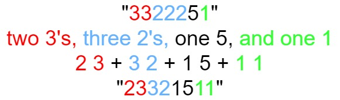

## 递归

### Lc_20.合并两个有序链表

将两个升序链表合并为一个新的 升序 链表并返回。新链表是通过拼接给定的两个链表的所有节点组成的。 

示例 1：
输入：l1 = [1,2,4], l2 = [1,3,4]
输出：[1,1,2,3,4,4]

示例 2：
输入：l1 = [], l2 = []
输出：[]

示例 3：
输入：l1 = [], l2 = [0]
输出：[0]

链接：https://leetcode-cn.com/problems/merge-two-sorted-lists

```java
class Solution {
    public ListNode mergeTwoLists(ListNode l1, ListNode l2) {
        if (l1 == null) {
            return l2;
        } else if (l2 == null) {
            return l1;
        } else if (l1.val < l2.val) {
            l1.next = mergeTwoLists(l1.next, l2);
            return l1;
        } else {
            l2.next = mergeTwoLists(l1, l2.next);
            return l2;
        }
    }
}
```

### Lc_23.合并k个有序链表

给你一个链表数组，每个链表都已经按升序排列。
请你将所有链表合并到一个升序链表中，返回合并后的链表。

示例 1：
输入：lists = [[1,4,5],[1,3,4],[2,6]]
输出：[1,1,2,3,4,4,5,6]
解释：链表数组如下：
[
  1->4->5,
  1->3->4,
  2->6
]
将它们合并到一个有序链表中得到。
1->1->2->3->4->4->5->6

示例 2：
输入：lists = []
输出：[]

示例 3：
输入：lists = [[]]
输出：[]

链接：https://leetcode-cn.com/problems/merge-k-sorted-lists

```java
//分治+递归
/**
 * Definition for singly-linked list.
 * public class ListNode {
 *     int val;
 *     ListNode next;
 *     ListNode() {}
 *     ListNode(int val) { this.val = val; }
 *     ListNode(int val, ListNode next) { this.val = val; this.next = next; }
 * }
 */
class Solution {
    public ListNode mergeKLists(ListNode[] lists) {
        if(lists == null || lists.length == 0){
            return null;
        }
        return merge(lists, 0, lists.length - 1);
    }

    public ListNode merge(ListNode[] lists, int left, int right){//分治
        if(left == right){
            return lists[left];
        }

        int mid = left + (right - left) / 2;
        ListNode l1 = merge(lists, left, mid);
        ListNode l2 = merge(lists, mid+1, right);
        return mergeTwoLists(l1, l2);
    }

    public ListNode mergeTwoLists(ListNode l1, ListNode l2){//递归
        if(l1 == null){
            return l2;
        }
        if(l2 == null){
            return l1;
        }
        if(l1.val < l2.val){
            l1.next = mergeTwoLists(l1.next, l2);
            return l1;
        }else{
            l2.next = mergeTwoLists(l1, l2.next);
            return l2;
        }
    }
}
```

### [Lc_94.二叉树遍历](https://leetcode-cn.com/problems/binary-tree-inorder-traversal)

给定一个二叉树的根节点 root ，返回 它的 中序 遍历 。

 

示例 1：
输入：root = [1,null,2,3]
输出：[1,3,2]

示例 2：
输入：root = []
输出：[]

```java
/**
 * Definition for a binary tree node.
 * public class TreeNode {
 *     int val;
 *     TreeNode left;
 *     TreeNode right;
 *     TreeNode() {}
 *     TreeNode(int val) { this.val = val; }
 *     TreeNode(int val, TreeNode left, TreeNode right) {
 *         this.val = val;
 *         this.left = left;
 *         this.right = right;
 *     }
 * }
 */
class Solution {
    public List<Integer> inorderTraversal(TreeNode root) {
        List<Integer> list = new ArrayList<>();
        inorder(root, list);
        return list;
    }
    public void inorder(TreeNode root, List<Integer> list){
        if(root == null){
            return;
        }
        inorder(root.left, list);
        list.add(root.val);
        inorder(root.right,list);
    }
}
```

### [Lc_98. 验证二叉搜索树](https://leetcode-cn.com/problems/validate-binary-search-tree/)

给你一个二叉树的根节点 `root` ，判断其是否是一个有效的二叉搜索树。

**有效** 二叉搜索树定义如下：

- 节点的左子树只包含 **小于** 当前节点的数。
- 节点的右子树只包含 **大于** 当前节点的数。
- 所有左子树和右子树自身必须也是二叉搜索树。

**示例 1：**


```
输入：root = [2,1,3]
输出：true
```

**示例 2：**


```
输入：root = [5,1,4,null,null,3,6]
输出：false
解释：根节点的值是 5 ，但是右子节点的值是 4 。
```

```java
/**
 * Definition for a binary tree node.
 * public class TreeNode {
 *     int val;
 *     TreeNode left;
 *     TreeNode right;
 *     TreeNode() {}
 *     TreeNode(int val) { this.val = val; }
 *     TreeNode(int val, TreeNode left, TreeNode right) {
 *         this.val = val;
 *         this.left = left;
 *         this.right = right;
 *     }
 * }
 */
class Solution {
    boolean f = true;
    public boolean isValidBST(TreeNode root) {
        inOrder(root,Long.MIN_VALUE,Long.MAX_VALUE);//使用Long以防仅一个节点时，该节点是是int的最大或最小值
        return f;
    }
    public void inOrder(TreeNode root,long left, long right){
        if(root == null){
            return;
        }
        if(root.val <= left || root.val >= right){
            f = false;
        }
        inOrder(root.left,left,root.val);
        // if(root.val <= left || root.val >= right){  先序和中序都可以
        //     f = false;
        // }
        inOrder(root.right,root.val,right);
    }
}
```

```java
class Solution {
    long pre = Long.MIN_VALUE;
    public boolean isValidBST(TreeNode root) {
        if (root == null) {
            return true;
        }
        // 访问左子树
        if (!isValidBST(root.left)) {
            return false;
        }
        // 访问当前节点：如果当前节点小于等于中序遍历的前一个节点，说明不满足BST，返回 false；否则继续遍历。
        // 二叉搜索树中序遍历一定是递增的，因此只需要判断当前节点值比上一个节点值大就好
        if (root.val <= pre) {
            return false;
        }
        pre = root.val;
        // 访问右子树
        return isValidBST(root.right);
    }
}
```

```java
class Solution {
    public boolean isValidBST(TreeNode root) {
        return isValidBST(root, Long.MIN_VALUE, Long.MAX_VALUE);
    }

    public boolean isValidBST(TreeNode node, long lower, long upper) {
        if (node == null) {
            return true;
        }
        if (node.val <= lower || node.val >= upper) {
            return false;
        }
        return isValidBST(node.left, lower, node.val) && isValidBST(node.right, node.val, upper);
    }
}
```

- ### [Lc_101. 对称二叉树](https://leetcode-cn.com/problems/symmetric-tree/)

  给你一个二叉树的根节点 `root` ， 检查它是否轴对称。

  **示例 1：**

  

  ```
  输入：root = [1,2,2,3,4,4,3]
  输出：true
  ```

  **示例 2：**

  

  ```
  输入：root = [1,2,2,null,3,null,3]
  输出：false
  ```

  **提示：**

  - 树中节点数目在范围 `[1, 1000]` 内
  - `-100 <= Node.val <= 100`

```java
/**
 * Definition for a binary tree node.
 * public class TreeNode {
 *     int val;
 *     TreeNode left;
 *     TreeNode right;
 *     TreeNode() {}
 *     TreeNode(int val) { this.val = val; }
 *     TreeNode(int val, TreeNode left, TreeNode right) {
 *         this.val = val;
 *         this.left = left;
 *         this.right = right;
 *     }
 * }
 */
class Solution {
    public boolean isSymmetric(TreeNode root) {
	    //return check(root,root);这样会多判断一遍
        return check(root.left,root.right);
     
    }
    public boolean check(TreeNode left, TreeNode right){
        if(left == null && right ==null){
            return true;
        }
        // if(left.val != right.val){错误，如果有空，则异常
        //     return false;
        // }
        if((left == null || right == null) || left.val != right.val){//应放成功之后，两个为空时
            return false;
        }
        return check(left.left, right.right) && check(left.right, right.left);
    }
}
```

### [Lc_104. 二叉树的最大深度](https://leetcode-cn.com/problems/maximum-depth-of-binary-tree/)

给定一个二叉树，找出其最大深度。

二叉树的深度为根节点到最远叶子节点的最长路径上的节点数。

**说明:** 叶子节点是指没有子节点的节点。

**示例：**
给定二叉树 `[3,9,20,null,null,15,7]`，

```
    3
   / \
  9  20
    /  \
   15   7
```

返回它的最大深度 3 。

```java
/**
 * Definition for a binary tree node.
 * public class TreeNode {
 *     int val;
 *     TreeNode left;
 *     TreeNode right;
 *     TreeNode() {}
 *     TreeNode(int val) { this.val = val; }
 *     TreeNode(int val, TreeNode left, TreeNode right) {
 *         this.val = val;
 *         this.left = left;
 *         this.right = right;
 *     }
 * }
 */
class Solution {
    public int maxDepth(TreeNode root) {
        return check(root);
    }
    public int check(TreeNode root){
        if(root == null){
            return 0;
        }
        return Math.max(check(root.left) +1, check(root.right) +1);
    }
}
```

### [Lc_105. 从前序与中序遍历序列构造二叉树](https://leetcode-cn.com/problems/construct-binary-tree-from-preorder-and-inorder-traversal/)

给定两个整数数组 `preorder` 和 `inorder` ，其中 `preorder` 是二叉树的**先序遍历**， `inorder` 是同一棵树的**中序遍历**，请构造二叉树并返回其根节点。

**示例 1:**


```
输入: preorder = [3,9,20,15,7], inorder = [9,3,15,20,7]
输出: [3,9,20,null,null,15,7]
```

**示例 2:**

```
输入: preorder = [-1], inorder = [-1]
输出: [-1]
```

**提示:**

- `1 <= preorder.length <= 3000`
- `inorder.length == preorder.length`
- `-3000 <= preorder[i], inorder[i] <= 3000`
- `preorder` 和 `inorder` 均 **无重复** 元素
- `inorder` 均出现在 `preorder`
- `preorder` **保证** 为二叉树的前序遍历序列
- `inorder` **保证** 为二叉树的中序遍历序列

```java
/**
 * Definition for a binary tree node.
 * public class TreeNode {
 *     int val;
 *     TreeNode left;
 *     TreeNode right;
 *     TreeNode() {}
 *     TreeNode(int val) { this.val = val; }
 *     TreeNode(int val, TreeNode left, TreeNode right) {
 *         this.val = val;
 *         this.left = left;
 *         this.right = right;
 *     }
 * }
 */
class Solution {
    public TreeNode buildTree(int[] preorder, int[] inorder) {
        int length = preorder.length;
        return df(new TreeNode(),preorder, 0 ,length-1, inorder,0,length-1);//结尾要包含，方便添加结束条件

    }
    public TreeNode df(TreeNode root, int[] preorder, int p_left, int p_right, int[] inorder, int i_left, int i_right){
        /*不正确，
        if(p_left == p_right){
            return new TreeNode(preorder[p_left]);
        }
        */         

        if(p_left > p_right){
            return null;
        }
        root = new TreeNode(preorder[p_left]);
        
        int index = 0;
        for(int i = i_left; i < i_right; i++){
            if(preorder[p_left] == inorder[i]){
                break;
            }else{
                index++;
            }
        }
        
        root.left = df(root, preorder, p_left+1, p_left + index, inorder, i_left, i_left +index-1);
        root.right = df(root, preorder, p_left + index +1,p_right,inorder,i_left + index+1, i_right);
        return root;
    }
}
```

### [Lc_124. 二叉树中的最大路径和](https://leetcode-cn.com/problems/binary-tree-maximum-path-sum/)

**路径** 被定义为一条从树中任意节点出发，沿父节点-子节点连接，达到任意节点的序列。同一个节点在一条路径序列中 **至多出现一次** 。该路径 **至少包含一个** 节点，且不一定经过根节点。

**路径和** 是路径中各节点值的总和。

给你一个二叉树的根节点 `root` ，返回其 **最大路径和** 。

**示例 1：**


```
输入：root = [1,2,3]
输出：6
解释：最优路径是 2 -> 1 -> 3 ，路径和为 2 + 1 + 3 = 6
```

**示例 2：**


```
输入：root = [-10,9,20,null,null,15,7]
输出：42
解释：最优路径是 15 -> 20 -> 7 ，路径和为 15 + 20 + 7 = 42
```

**提示：**

- 树中节点数目范围是 `[1, 3 * 104]`
- `-1000 <= Node.val <= 1000`

```java


/**
 * Definition for a binary tree node.
 * public class TreeNode {
 *     int val;
 *     TreeNode left;
 *     TreeNode right;
 *     TreeNode() {}
 *     TreeNode(int val) { this.val = val; }
 *     TreeNode(int val, TreeNode left, TreeNode right) {
 *         this.val = val;
 *         this.left = left;
 *         this.right = right;
 *     }
 * }
 */
class Solution {
    int ans = Integer.MIN_VALUE;
    public int maxPathSum(TreeNode root) {
        postOrder(root);
        return ans;
    }
    public int postOrder(TreeNode root){
        if(root == null){
            return 0;
        }
        int left = postOrder(root.left);
        int right = postOrder(root.right);
        left = left>0?left:0;//小于等于0时，代表无增益
        right = right>0?right:0;
        int tmp = root.val + left + right;//此处也已考虑全是负数的情况
        ans = Math.max(tmp,ans);
        //return tmp;因为生成的路径，一个结点只能访问一次，所以一次只能走左或右
        return root.val + Math.max(left, right);
    }
}
```

### [Lc_148. 排序链表](https://leetcode-cn.com/problems/sort-list/)

给你链表的头结点 `head`，请将其按 **升序** 排列并返回 **排序后的链表** 。

**示例 1：**


```
输入：head = [4,2,1,3]
输出：[1,2,3,4]
```

**示例 2：**


```
输入：head = [-1,5,3,4,0]
输出：[-1,0,3,4,5]
```

**示例 3：**

```
输入：head = []
输出：[]
```

**提示：**

- 链表中节点的数目在范围 `[0, 5 * 104]` 内
- `-105 <= Node.val <= 105`

```java
/**
 * Definition for singly-linked list.
 * public class ListNode {
 *     int val;
 *     ListNode next;
 *     ListNode() {}
 *     ListNode(int val) { this.val = val; }
 *     ListNode(int val, ListNode next) { this.val = val; this.next = next; }
 * }
 */
class Solution {
    public ListNode sortList(ListNode head) {
        return mergeSort(head, null);
    }
    public ListNode mergeSort(ListNode head, ListNode tail){   
        if(head == null){
            return head;
        }
        if(head.next == tail){//此结束条件是因为递归合并时没有对左右传的是同样的mid
            head.next = null;
            return head;
        }
        ListNode slow = head;
        ListNode fast = head;
        /*一样可以
        while(fast != tail &&fast.next != tail){
            slow = slow.next;
            fast = fast.next.next;
        }
        */
        while(fast != tail){
            slow = slow.next;
            fast = fast.next;
            if(fast != tail){
                fast = fast.next;            
            }
        }
        ListNode mid = slow;
        ListNode left = mergeSort(head, mid);
        ListNode right = mergeSort(mid, tail);
        return merge(left, right);
    }
    public ListNode merge(ListNode left, ListNode right){
        ListNode head = new ListNode();
        ListNode p = head;
        while(left != null && right != null){
            if(left.val < right.val){
                p.next = left;
                left = left.next;
            }else{
                p.next = right;
                right = right.next;
            }
            p = p.next;
        }
        p.next = left == null? right :left;
        return head.next;
    }
}
```

```java
/**
 * Definition for singly-linked list.
 * public class ListNode {
 *     int val;
 *     ListNode next;
 *     ListNode() {}
 *     ListNode(int val) { this.val = val; }
 *     ListNode(int val, ListNode next) { this.val = val; this.next = next; }
 * }
 */
class Solution {
    public ListNode sortList(ListNode head) {
        return mergeSort(head);
    }
    public ListNode mergeSort(ListNode head){   
        if(head == null || head.next == null){
            return head;
        }
        
        ListNode slow = head;
        ListNode fast = head.next;//此方法必须让fast先走一步，不然中间是偶数时，剩下两个时无法拆分合并，相比于前一种解法，因为前一种传的时候是同一个mid，在判断中才分割了mid
        while(fast != null && fast.next != null){
            slow = slow.next;
            fast = fast.next.next;
        }
        ListNode mid = slow.next;
        slow.next = null;
        ListNode left = mergeSort(head);
        ListNode right = mergeSort(mid);
        return merge(left, right);
    }
    public ListNode merge(ListNode left, ListNode right){
        ListNode head = new ListNode();
        ListNode p = head;
        while(left != null && right != null){
            if(left.val < right.val){
                p.next = left;
                left = left.next;
            }else{
                p.next = right;
                right = right.next;
            }
            p = p.next;
        }
        p.next = left == null? right :left;
        return head.next;
    }
}
```

### [Lc_206. 反转链表](https://leetcode.cn/problems/reverse-linked-list/)

给你单链表的头节点 `head` ，请你反转链表，并返回反转后的链表。

**示例 1：**


```
输入：head = [1,2,3,4,5]
输出：[5,4,3,2,1]
```

**示例 2：**


```
输入：head = [1,2]
输出：[2,1]
```

**示例 3：**

```
输入：head = []
输出：[]
```

```java
class Solution {
    public ListNode reverseList(ListNode head) {
        
        if(head == null || head.next == null){
            return head;
        }
        ListNode newNode = reverseList(head.next);
        head.next.next = head;
        head.next = null;
        return newNode;

    }
}
/**
     * 以链表1->2->3->4->5举例
     * @param head
     * @return
     */
    public ListNode reverseList(ListNode head) {
        if (head == null || head.next == null) {
            /*
                直到当前节点的下一个节点为空时返回当前节点
                由于5没有下一个节点了，所以此处返回节点5
             */
            return head;
        }
        //递归传入下一个节点，目的是为了到达最后一个节点
        ListNode newHead = reverseList(head.next);
                /*
            第一轮出栈，head为5，head.next为空，返回5
            第二轮出栈，head为4，head.next为5，执行head.next.next=head也就是5.next=4，
                      把当前节点的子节点的子节点指向当前节点
                      此时链表为1->2->3->4<->5，由于4与5互相指向，所以此处要断开4.next=null
                      此时链表为1->2->3->4<-5
                      返回节点5
            第三轮出栈，head为3，head.next为4，执行head.next.next=head也就是4.next=3，
                      此时链表为1->2->3<->4<-5，由于3与4互相指向，所以此处要断开3.next=null
                      此时链表为1->2->3<-4<-5
                      返回节点5
            第四轮出栈，head为2，head.next为3，执行head.next.next=head也就是3.next=2，
                      此时链表为1->2<->3<-4<-5，由于2与3互相指向，所以此处要断开2.next=null
                      此时链表为1->2<-3<-4<-5
                      返回节点5
            第五轮出栈，head为1，head.next为2，执行head.next.next=head也就是2.next=1，
                      此时链表为1<->2<-3<-4<-5，由于1与2互相指向，所以此处要断开1.next=null
                      此时链表为1<-2<-3<-4<-5
                      返回节点5
            出栈完成，最终头节点5->4->3->2->1
         */
        head.next.next = head;
        head.next = null;
        return newHead;
    }
```

### [Lc_234. 回文链表](https://leetcode.cn/problems/palindrome-linked-list/)

给你一个单链表的头节点 `head` ，请你判断该链表是否为回文链表。如果是，返回 `true` ；否则，返回 `false` 。

**示例 1：**


```
输入：head = [1,2,2,1]
输出：true
```

**示例 2：**


```
输入：head = [1,2]
输出：false
```

**提示：**

- 链表中节点数目在范围`[1, 105]` 内
- `0 <= Node.val <= 9`

```java
//递归思想：一直往后走，走到最后根据递归返回判断，
class Solution {
    ListNode pre;
    public boolean isPalindrome(ListNode head) {
        pre = head;
        return check(head);
    }

    public boolean check(ListNode cur){
        if(cur != null){
            if(!check(cur.next)){//递归返回条件，当一个为false时，一直返回false
                return false;
            }
            if(cur.val != pre.val){
                return false;
            }
            pre = pre.next;
        }
        return true;//一方面为了处理走到最后时返回true开始回，同时所有不满足的条件在前已判断
    }

}
```

### [Lc_236. 二叉树的最近公共祖先](https://leetcode.cn/problems/lowest-common-ancestor-of-a-binary-tree/)

给定一个二叉树, 找到该树中两个指定节点的最近公共祖先。

[百度百科](https://baike.baidu.com/item/最近公共祖先/8918834?fr=aladdin)中最近公共祖先的定义为：“对于有根树 T 的两个节点 p、q，最近公共祖先表示为一个节点 x，满足 x 是 p、q 的祖先且 x 的深度尽可能大（**一个节点也可以是它自己的祖先**）。”

**示例 1：**


```
输入：root = [3,5,1,6,2,0,8,null,null,7,4], p = 5, q = 1
输出：3
解释：节点 5 和节点 1 的最近公共祖先是节点 3 。
```

**示例 2：**


```
输入：root = [3,5,1,6,2,0,8,null,null,7,4], p = 5, q = 4
输出：5
解释：节点 5 和节点 4 的最近公共祖先是节点 5 。因为根据定义最近公共祖先节点可以为节点本身。
```

**示例 3：**

```
输入：root = [1,2], p = 1, q = 2
输出：1
```

**提示：**

- 树中节点数目在范围 `[2, 105]` 内。
- `-109 <= Node.val <= 109`
- 所有 `Node.val` `互不相同` 。
- `p != q`
- `p` 和 `q` 均存在于给定的二叉树中。

```java
class Solution {
    TreeNode ans;
    // boolean pf = false;
    // boolean qf = false;
    public TreeNode lowestCommonAncestor(TreeNode root, TreeNode p, TreeNode q) {
        check(root,p,q);
        return ans;
    }
    public boolean check(TreeNode root, TreeNode p, TreeNode q){
        if(root == null){
            return false;
        }
        boolean left = check(root.left,p,q);
        boolean right = check(root.right,p,q);
        //如果左右都等于true，则该节点就是目标节点
        //如果当前节点是其中一个，而其中已经有一个找出来了，也就是该节点是另一个节点的根时
        if((left && right) || (left || right)&&(root.val == p.val || root.val == q.val)){
            ans = root;
        }
        return left || right || (root.val == p.val || root.val == q.val);
    }
}
```


```java
//该递归过程如上图，如果p或q其中一个是根也满足
class Solution {
    public TreeNode lowestCommonAncestor(TreeNode root, TreeNode p, TreeNode q) {
        if(root == null || root == p || root == q){
            return root;
        }
        TreeNode left = lowestCommonAncestor(root.left, p, q);
        TreeNode right = lowestCommonAncestor(root.right, p ,q);
        if(left == null && right == null){//此判断可去除，下面两种已包含
            return null;
        }
        if(left == null){
            return right;
        }
        if(right == null){
            return left;
        }
        return root;
    }
}
```

### [Lc_240. 搜索二维矩阵 II](https://leetcode.cn/problems/search-a-2d-matrix-ii/)

编写一个高效的算法来搜索 `*m* x *n*` 矩阵 `matrix` 中的一个目标值 `target` 。该矩阵具有以下特性：

- 每行的元素从左到右升序排列。
- 每列的元素从上到下升序排列。

**示例 1：**


```
输入：matrix = [[1,4,7,11,15],[2,5,8,12,19],[3,6,9,16,22],[10,13,14,17,24],[18,21,23,26,30]], target = 5
输出：true
```

**示例 2：**


```
输入：matrix = [[1,4,7,11,15],[2,5,8,12,19],[3,6,9,16,22],[10,13,14,17,24],[18,21,23,26,30]], target = 20
输出：false
```

**提示：**

- `m == matrix.length`
- `n == matrix[i].length`
- `1 <= n, m <= 300`
- `-109 <= matrix[i][j] <= 109`
- 每行的所有元素从左到右升序排列
- 每列的所有元素从上到下升序排列
- `-109 <= target <= 109`

```java
//每次排除不对应的一角
class Solution {
    boolean f = false;
    public boolean searchMatrix(int[][] matrix, int target) {
        int m = matrix.length;
        int n = matrix[0].length;
        check(matrix,0,0,m-1,n-1,target);
        return f;
    }
    public void check(int[][] matrix,int x,int y, int m, int n, int target){
        if(y>n||x>m||((y == n && x==m)&&matrix[m][n] != target)){
            return;
        }

        if(matrix[m][n] == target){
            f=true;
            return;
        }

        int i = (m+x)/2;
        int j = (n+y)/2;

        if(i < 0 || j < 0 || i >= matrix.length || j>=matrix[0].length){
            return;
        }

        if(matrix[i][j] == target){
            f = true;
            return;
        }

        
        if(matrix[i][j] < target && !f){
            check(matrix, x, j+1, m, n, target);
            check(matrix, i+1, y, m, j, target);
        }

        if(matrix[i][j] > target && !f){
            check(matrix,x,y,i-1,n,target);
            check(matrix,i,y,m,j-1,target);
        }
    }
}
```

### [Lc_297. 二叉树的序列化与反序列化](https://leetcode.cn/problems/serialize-and-deserialize-binary-tree/)

序列化是将一个数据结构或者对象转换为连续的比特位的操作，进而可以将转换后的数据存储在一个文件或者内存中，同时也可以通过网络传输到另一个计算机环境，采取相反方式重构得到原数据。

请设计一个算法来实现二叉树的序列化与反序列化。这里不限定你的序列 / 反序列化算法执行逻辑，你只需要保证一个二叉树可以被序列化为一个字符串并且将这个字符串反序列化为原始的树结构。

**提示:** 输入输出格式与 LeetCode 目前使用的方式一致，详情请参阅 [LeetCode 序列化二叉树的格式](https://leetcode.cn/faq/#binary-tree)。你并非必须采取这种方式，你也可以采用其他的方法解决这个问题。

**示例 1：**


```
输入：root = [1,2,3,null,null,4,5]
输出：[1,2,3,null,null,4,5]
```

**示例 2：**

```
输入：root = []
输出：[]
```

**示例 3：**

```
输入：root = [1]
输出：[1]
```

**示例 4：**

```
输入：root = [1,2]
输出：[1,2]
```

**提示：**

- 树中结点数在范围 `[0, 104]` 内
- `-1000 <= Node.val <= 1000`

```java
public class Codec {
    
    // Encodes a tree to a single string.
    public String serialize(TreeNode root) {
        //String str = new String();
        return preserialize(root, "");
    } 

    // Decodes your encoded data to tree.
    public TreeNode deserialize(String data) {
        String[] str_data = data.split(",");
        List<String> list = new LinkedList<String>(Arrays.asList(str_data));
        return predeserialize(list);
        
    }

    public String preserialize(TreeNode root, String str){
        if(root == null){
            str += "null,";
        }else{
            str += str.valueOf(root.val) + ",";
            str = preserialize(root.left,str);
            str = preserialize(root.right,str);
        }
        return str;
    }

    public TreeNode predeserialize(List<String> ist){
        if(ist.get(0).equals("null")){
            ist.remove(0);
            return null;
        }
        TreeNode root = new TreeNode(Integer.valueOf(ist.get(0)));
        ist.remove(0);
        root.left = predeserialize(ist);
        root.right = predeserialize(ist);
        return root;
    }
}
```

### [Lc_394. 字符串解码](https://leetcode.cn/problems/decode-string/)

给定一个经过编码的字符串，返回它解码后的字符串。

编码规则为: `k[encoded_string]`，表示其中方括号内部的 `encoded_string` 正好重复 `k` 次。注意 `k` 保证为正整数。

你可以认为输入字符串总是有效的；输入字符串中没有额外的空格，且输入的方括号总是符合格式要求的。

此外，你可以认为原始数据不包含数字，所有的数字只表示重复的次数 `k` ，例如不会出现像 `3a` 或 `2[4]` 的输入。

**示例 1：**

```
输入：s = "3[a]2[bc]"
输出："aaabcbc"
```

**示例 2：**

```
输入：s = "3[a2[c]]"
输出："accaccacc"
```

**示例 3：**

```
输入：s = "2[abc]3[cd]ef"
输出："abcabccdcdcdef"
```

**示例 4：**

```
输入：s = "abc3[cd]xyz"
输出："abccdcdcdxyz"
```

**提示：**

- `1 <= s.length <= 30`
- `s` 由小写英文字母、数字和方括号 `'[]'` 组成
- `s` 保证是一个 **有效** 的输入。
- `s` 中所有整数的取值范围为 `[1, 300]` 

```java
//采用dfs进行递归，当遇到[时递归，]时结束返回，由于已经处理完[]中的数，还需记录下标，方便回来的时候记录下标志
class Solution {
    public String decodeString(String s) {
        return dfs(s, 0)[0];
    }

    public String[] dfs(String s, int index){
        StringBuilder str = new StringBuilder();
        int num = 0;
        while(index < s.length()){
            if(s.charAt(index) >= '0' && s.charAt(index) <= '9'){//如果大于1位数字时，需继续
                num = num*10 + Integer.parseInt(String.valueOf(s.charAt(index)));
            }else if(s.charAt(index) == '['){
                String[] tmp = dfs(s, index+1);
                index = Integer.parseInt(tmp[0]);
                while(num > 0){
                    str.append(tmp[1]);
                    num--;
                }
            }else if(s.charAt(index) == ']'){
                return new String[]{String.valueOf(index), str.toString()};
            }else{
                str.append(s.charAt(index));
            }
            index++;
        }
        return new String[] {str.toString()};
    }
}
```

### [Lc_437. 路径总和 III](https://leetcode.cn/problems/path-sum-iii/)

给定一个二叉树的根节点 `root` ，和一个整数 `targetSum` ，求该二叉树里节点值之和等于 `targetSum` 的 **路径** 的数目。

**路径** 不需要从根节点开始，也不需要在叶子节点结束，但是路径方向必须是向下的（只能从父节点到子节点）。

**示例 1：**


```
输入：root = [10,5,-3,3,2,null,11,3,-2,null,1], targetSum = 8
输出：3
解释：和等于 8 的路径有 3 条，如图所示。
```

**示例 2：**

```
输入：root = [5,4,8,11,null,13,4,7,2,null,null,5,1], targetSum = 22
输出：3
```

**提示:**

- 二叉树的节点个数的范围是 `[0,1000]`
- `-109 <= Node.val <= 109` 
- `-1000 <= targetSum <= 1000` 

```java
//该题解决的是对每一个节点进行递归，即双层递归。同时为了记录满足的条件，每次增加1，依次深度递归
class Solution {
    public int pathSum(TreeNode root, int targetSum) {
        if(root == null){
            return 0;
        }
        int ans = 0;//虽然每次递归到此都为0，但下面递归仍然使用了该值，如下：
        ans = sumCount(root,targetSum);//第一层如果为1
        ans += pathSum(root.left, targetSum);//递归该层时，已经记录了该值，ans=1 + 
        ans += pathSum(root.right, targetSum);//如果上面得到的按时为2: ans = 2 +
        return ans;//递归返回
    }

    public int sumCount(TreeNode root, int target){
        if(root == null){
            return 0;
        }
        int ans = 0;
        if(root.val == target){
            ans++;
        }
        ans += sumCount(root.left, target - root.val);
        ans += sumCount(root.right, target - root.val);
        return ans;

    }
}
```

### [Lc_24. 两两交换链表中的节点](https://leetcode.cn/problems/swap-nodes-in-pairs/)

给你一个链表，两两交换其中相邻的节点，并返回交换后链表的头节点。你必须在不修改节点内部的值的情况下完成本题（即，只能进行节点交换）。

**示例 1：**


```
输入：head = [1,2,3,4]
输出：[2,1,4,3]
```

**示例 2：**

```
输入：head = []
输出：[]
```

**示例 3：**

```
输入：head = [1]
输出：[1]
```

**提示：**

- 链表中节点的数目在范围 `[0, 100]` 内
- `0 <= Node.val <= 100`

```java
class Solution {
    public ListNode swapPairs(ListNode head) {
        if(head == null || head.next == null){
            return head;
        }
        ListNode tmpNode = head.next;
        head.next = swapPairs(tmpNode.next);
        tmpNode.next = head;
        return tmpNode;
    }
}
```

### [Lc_38. 外观数列](https://leetcode.cn/problems/count-and-say/)

给定一个正整数 `n` ，输出外观数列的第 `n` 项。

「外观数列」是一个整数序列，从数字 1 开始，序列中的每一项都是对前一项的描述。

你可以将其视作是由递归公式定义的数字字符串序列：

- `countAndSay(1) = "1"`
- `countAndSay(n)` 是对 `countAndSay(n-1)` 的描述，然后转换成另一个数字字符串。

前五项如下：

```
1.     1
2.     11
3.     21
4.     1211
5.     111221
第一项是数字 1 
描述前一项，这个数是 1 即 “ 一 个 1 ”，记作 "11"
描述前一项，这个数是 11 即 “ 二 个 1 ” ，记作 "21"
描述前一项，这个数是 21 即 “ 一 个 2 + 一 个 1 ” ，记作 "1211"
描述前一项，这个数是 1211 即 “ 一 个 1 + 一 个 2 + 二 个 1 ” ，记作 "111221"
```

要 **描述** 一个数字字符串，首先要将字符串分割为 **最小** 数量的组，每个组都由连续的最多 **相同字符** 组成。然后对于每个组，先描述字符的数量，然后描述字符，形成一个描述组。要将描述转换为数字字符串，先将每组中的字符数量用数字替换，再将所有描述组连接起来。

例如，数字字符串 `"3322251"` 的描述如下图：



**示例 1：**

```
输入：n = 1
输出："1"
解释：这是一个基本样例。
```

**示例 2：**

```
输入：n = 4
输出："1211"
解释：
countAndSay(1) = "1"
countAndSay(2) = 读 "1" = 一 个 1 = "11"
countAndSay(3) = 读 "11" = 二 个 1 = "21"
countAndSay(4) = 读 "21" = 一 个 2 + 一 个 1 = "12" + "11" = "1211"
```

**提示：**

- `1 <= n <= 30`

```java
class Solution {
    String ans;
    public String countAndSay(int n) {
        dg("1",n);
        return ans;
    }
    public void dg(String s, int n){
        if(n == 1){
            ans = s;
            return;
        }
        String tmp = "";
        for(int i = 0; i < s.length(); i++){
            int k = 1;
            while(i < s.length()-1 && s.charAt(i) == s.charAt(i+1)){
                k++;
                i++;
            }
            //字符串与整数直接相加即可拼串
            tmp += (Integer.toString(k) + s.charAt(i));
        }
        dg(tmp,n-1);
    }
}
```

### [Lc_24. 两两交换链表中的节点](https://leetcode.cn/problems/swap-nodes-in-pairs/)

给你一个链表，两两交换其中相邻的节点，并返回交换后链表的头节点。你必须在不修改节点内部的值的情况下完成本题（即，只能进行节点交换）。

 

**示例 1：**


```
输入：head = [1,2,3,4]
输出：[2,1,4,3]
```

**示例 2：**

```
输入：head = []
输出：[]
```

**示例 3：**

```
输入：head = [1]
输出：[1]
```

**提示：**

- 链表中节点的数目在范围 `[0, 100]` 内
- `0 <= Node.val <= 100`

```java
/**
 * Definition for singly-linked list.
 * public class ListNode {
 *     int val;
 *     ListNode next;
 *     ListNode() {}
 *     ListNode(int val) { this.val = val; }
 *     ListNode(int val, ListNode next) { this.val = val; this.next = next; }
 * }
 */
class Solution {
    public ListNode swapPairs(ListNode head) {
        if(head == null || head.next == null){
            return head;
        }
        ListNode tmpNode = head.next;
        head.next = swapPairs(tmpNode.next);
        tmpNode.next = head;
        return tmpNode;
    }
}
```

### [Lc_25. K 个一组翻转链表](https://leetcode.cn/problems/reverse-nodes-in-k-group/)

给你链表的头节点 `head` ，每 `k` 个节点一组进行翻转，请你返回修改后的链表。

`k` 是一个正整数，它的值小于或等于链表的长度。如果节点总数不是 `k` 的整数倍，那么请将最后剩余的节点保持原有顺序。

你不能只是单纯的改变节点内部的值，而是需要实际进行节点交换。

**示例 1：**


```
输入：head = [1,2,3,4,5], k = 2
输出：[2,1,4,3,5]
```

**示例 2：**


```
输入：head = [1,2,3,4,5], k = 3
输出：[3,2,1,4,5]
```

**提示：**

- 链表中的节点数目为 `n`
- `1 <= k <= n <= 5000`
- `0 <= Node.val <= 1000`

```java
/**
 * Definition for singly-linked list.
 * public class ListNode {
 *     int val;
 *     ListNode next;
 *     ListNode() {}
 *     ListNode(int val) { this.val = val; }
 *     ListNode(int val, ListNode next) { this.val = val; this.next = next; }
 * }
 */
class Solution {
    public ListNode reverseKGroup(ListNode head, int k) {
        ListNode hair = new ListNode();
        hair.next = null;
        ListNode tmp = head;
        ListNode f = hair;
        ListNode p = head;
        if(k == 1){
            return head;
        }
        while(tmp != null){
            int i = 0;
            while(i < k && tmp != null){
                tmp = tmp.next;
                i++;
            }
            if(i < k){
                //当剩余的小于k时，需将前指针指向p，避免断链
                f.next = p;
                return hair.next;               
            }else{
                //采用前插法翻转链表
                ListNode t = p;
                //记录头结点
                ListNode ff = t;
                while(i > 0){
                    t = p.next;
                    p.next = f.next;
                    f.next = p;
                    p = t;
                    i--;
                }
                f = ff;
                p = tmp;
            }
        }
        return hair.next;
    }
}
```

### [Lc_77. 组合](https://leetcode.cn/problems/combinations/)

给定两个整数 `n` 和 `k`，返回范围 `[1, n]` 中所有可能的 `k` 个数的组合。

你可以按 **任何顺序** 返回答案。

**示例 1：**

```
输入：n = 4, k = 2
输出：
[
  [2,4],
  [3,4],
  [2,3],
  [1,2],
  [1,3],
  [1,4],
]
```

**示例 2：**

```
输入：n = 1, k = 1
输出：[[1]]
```

**提示：**

- `1 <= n <= 20`
- `1 <= k <= n`

```java
class Solution {
    public List<List<Integer>> combine(int n, int k) {
        List<List<Integer>> ans = new ArrayList<>();

        dfs(ans, new ArrayList<>(), 1, n, k);
        return ans;
    }
    public void dfs(List<List<Integer>> ans, List<Integer> tmp,int begin, int n, int k){
        if(tmp.size() == k){
            ans.add(new ArrayList<>(tmp));
            return;
        }
        for(int i = begin; i <= (n - (k - tmp.size()) + 1); i++){
            tmp.add(i);
            dfs(ans, tmp,i+1, n, k);//直接进行下一个（i+1）
            tmp.remove(tmp.size() - 1);
        }
    }
}
```

法二：


画一个表格更容易看出边界条件。


```java
private void dfs(int begin, int n, int k, Deque<Integer> path, List<List<Integer>> res) {
        if (k == 0) {
            res.add(new ArrayList<>(path));
            return;
        }

        // 基础版本的递归终止条件：if (begin == n + 1) {
        if (begin > n - k + 1) {
            return;
        }
        // 不选当前考虑的数 begin，直接递归到下一层
        dfs(begin + 1, n, k, path, res);

        // 不选当前考虑的数 begin，递归到下一层的时候 k - 1，这里 k 表示还需要选多少个数
        path.addLast(begin);
        dfs(begin + 1, n, k - 1, path, res);
        // 深度优先遍历有回头的过程，因此需要撤销选择
        path.removeLast();
    }
```

### [Lc_90. 子集 II](https://leetcode.cn/problems/subsets-ii/)

给你一个整数数组 `nums` ，其中可能包含重复元素，请你返回该数组所有可能的子集（幂集）。

解集 **不能** 包含重复的子集。返回的解集中，子集可以按 **任意顺序** 排列。

**示例 1：**

```
输入：nums = [1,2,2]
输出：[[],[1],[1,2],[1,2,2],[2],[2,2]]
```

**示例 2：**

```
输入：nums = [0]
输出：[[],[0]]
```

**提示：**

- `1 <= nums.length <= 10`
- `-10 <= nums[i] <= 10`

```java
class Solution {
    public List<List<Integer>> subsetsWithDup(int[] nums) {
        List<List<Integer>> ans = new ArrayList<>();
        Arrays.sort(nums);
        dfs(ans, new ArrayList<>(), 0,nums);
        return ans;
    }
    public void dfs(List<List<Integer>> ans,List<Integer> tmp, int index, int[] nums){
        ans.add(new ArrayList<>(tmp));
        for(int i = index; i < nums.length; i++){
            if(i != index && nums[i-1] == nums[i]){
                continue;
            }
            tmp.add(nums[i]);
            dfs(ans, tmp, i+1, nums);
            tmp.remove(tmp.size() - 1);
        }
    }

}
```

### [174. 地下城游戏](https://leetcode.cn/problems/dungeon-game/)

难度困难665

一些恶魔抓住了公主（**P**）并将她关在了地下城的右下角。地下城是由 M x N 个房间组成的二维网格。我们英勇的骑士（**K**）最初被安置在左上角的房间里，他必须穿过地下城并通过对抗恶魔来拯救公主。

骑士的初始健康点数为一个正整数。如果他的健康点数在某一时刻降至 0 或以下，他会立即死亡。

有些房间由恶魔守卫，因此骑士在进入这些房间时会失去健康点数（若房间里的值为*负整数*，则表示骑士将损失健康点数）；其他房间要么是空的（房间里的值为 *0*），要么包含增加骑士健康点数的魔法球（若房间里的值为*正整数*，则表示骑士将增加健康点数）。

为了尽快到达公主，骑士决定每次只向右或向下移动一步。

**编写一个函数来计算确保骑士能够拯救到公主所需的最低初始健康点数。**

例如，考虑到如下布局的地下城，如果骑士遵循最佳路径 `右 -> 右 -> 下 -> 下`，则骑士的初始健康点数至少为 **7**。

| -2 (K) | -3   | 3      |
| ------ | ---- | ------ |
| -5     | -10  | 1      |
| 10     | 30   | -5 (P) |

**说明:**

- 骑士的健康点数没有上限。
- 任何房间都可能对骑士的健康点数造成威胁，也可能增加骑士的健康点数，包括骑士进入的左上角房间以及公主被监禁的右下角房间。

```java
class Solution {
    private int ans = Integer.MIN_VALUE;
    public int calculateMinimumHP(int[][] dungeon) {
        int m = dungeon.length;
        int n = dungeon[0].length;
        dfs(dungeon, 0, 0, m-1, n-1,0,0);
        return Math.abs(ans) + 1;
    }
    private void dfs(int[][] dungeon, int x, int y, int m, int n, int tmp, int path){
        if(x > m || y > n){
            return;
        }

        if(x == m && y ==n){
            path += dungeon[x][y];
            if(path < 0){
                tmp = Math.min(tmp, path);
            }
            ans = Math.max(ans,tmp);
        }

                
        path += dungeon[x][y];
        if(path < 0){
            tmp = Math.min(tmp, path);	//更新tmp
        }

        if(ans != Integer.MIN_VALUE && tmp < ans){//剪枝
            return;
        }
        
        dfs(dungeon,x+1,y,m,n,tmp,path);
        dfs(dungeon,x,y+1,m,n,tmp,path);
    }
}//此方法会超时，应该用dp
```

