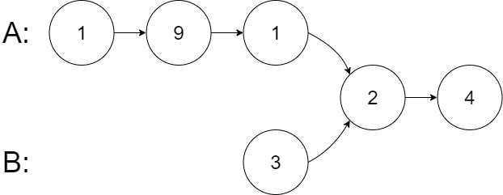

## 链表

### Lc_002.两数之和

给你两个 非空 的链表，表示两个非负的整数。它们每位数字都是按照 逆序 的方式存储的，并且每个节点只能存储 一位 数字。
请你将两个数相加，并以相同形式返回一个表示和的链表。
你可以假设除了数字 0 之外，这两个数都不会以 0 开头。


链接：https://leetcode-cn.com/problems/add-two-numbers

示例 1：
输入：l1 = [2,4,3], l2 = [5,6,4]
输出：[7,0,8]
解释：342 + 465 = 807.

示例 2：
输入：l1 = [0], l2 = [0]
输出：[0]

示例 3：
输入：l1 = [9,9,9,9,9,9,9], l2 = [9,9,9,9]
输出：[8,9,9,9,0,0,0,1]

```java
/**
 * Definition for singly-linked list.
 * public class ListNode {
 *     int val;
 *     ListNode next;
 *     ListNode() {}
 *     ListNode(int val) { this.val = val; }
 *     ListNode(int val, ListNode next) { this.val = val; this.next = next; }
 * }
 */
class Solution {
    public ListNode addTwoNumbers(ListNode l1, ListNode l2) {
        ListNode rst = new ListNode();
        ListNode head = rst;
        int m = 0;
        int tmp =0;

        do{
            tmp = (l1.val + l2.val + m)%10;
            m = (l1.val + l2.val + m)/10;
            head.val = tmp;
            l1 = l1.next;
            l2 = l2.next;
            if(l1 != null && l2 != null){
                ListNode l = new ListNode();
                head.next = l;
                head = head.next;
            }
        }while(l1 != null && l2 != null);

        if(l1 != null){
            while(l1 != null){ 
                
                ListNode l = new ListNode();
                head.next = l;
                head = head.next;
                

                tmp = (l1.val + m)%10;
                m = (l1.val + m)/10;
                head.val = tmp;
                l1 = l1.next;
              
            }
        }

        if(l2 != null){
            while(l2 != null){            
                ListNode l = new ListNode();
                head.next = l;
                head = head.next;           

                tmp = (l2.val + m)%10;
                m = (l2.val + m)/10;
                head.val = tmp;
                l2 = l2.next;
             
            }
        }
        
        if(m != 0){
            ListNode l = new ListNode();
            head.next = l;
            head = head.next;
            head.val = m;      
        }
        return rst;
    }
}
```

```java
class Solution {
    public ListNode addTwoNumbers(ListNode l1, ListNode l2) {
        ListNode head = null, tail = null;
        int carry = 0;
        while (l1 != null || l2 != null) {
            int n1 = l1 != null ? l1.val : 0;//判断是否为空，否则取该值
            int n2 = l2 != null ? l2.val : 0;
            int sum = n1 + n2 + carry;//进位的时候是向后进位
            if (head == null) {//如果是第一次计算
                head = tail = new ListNode(sum % 10);
            } else {
                tail.next = new ListNode(sum % 10);
                tail = tail.next;
            }
            carry = sum / 10;
            if (l1 != null) {
                l1 = l1.next;
            }
            if (l2 != null) {
                l2 = l2.next;
            }
        }
        if (carry > 0) {//最后进位的情况
            tail.next = new ListNode(carry);
        }
        return head;
    }
}
```

### Lc_019.删除链表倒数第N个数

给你一个链表，删除链表的倒数第 n 个结点，并且返回链表的头结点。

示例 1：
输入：head = [1,2,3,4,5], n = 2
输出：[1,2,3,5]

示例 2：
输入：head = [1], n = 1
输出：[]

示例 3：
输入：head = [1,2], n = 1
输出：[1]

链接：https://leetcode-cn.com/problems/remove-nth-node-from-end-of-list

```java
//使用快慢指针的方法
/**
 * Definition for singly-linked list.
 * public class ListNode {
 *     int val;
 *     ListNode next;
 *     ListNode() {}
 *     ListNode(int val) { this.val = val; }
 *     ListNode(int val, ListNode next) { this.val = val; this.next = next; }
 * }
 */
class Solution {
    public ListNode removeNthFromEnd(ListNode head, int n) {
        ListNode h = new ListNode();
        h.next = head;//考虑删除的节点是第一个的情况
        ListNode tail = h;
        ListNode front = h;

        for(int i = 0; i < n; i++){
            tail = tail.next;
        }
        while(tail != null && tail.next != null){
            front = front.next;
            tail = tail.next;
        }

        if(front.next != null){
            front.next = front.next.next;
        }else{
            front = front.next;
        }

        return h.next;
    }
}
```

### Lc_020.合并两个有序链表

将两个升序链表合并为一个新的 升序 链表并返回。新链表是通过拼接给定的两个链表的所有节点组成的。 

示例 1：
输入：l1 = [1,2,4], l2 = [1,3,4]
输出：[1,1,2,3,4,4]

示例 2：
输入：l1 = [], l2 = []
输出：[]

示例 3：
输入：l1 = [], l2 = [0]
输出：[0]

链接：https://leetcode-cn.com/problems/merge-two-sorted-lists

```java
/**
 * Definition for singly-linked list.
 * public class ListNode {
 *     int val;
 *     ListNode next;
 *     ListNode() {}
 *     ListNode(int val) { this.val = val; }
 *     ListNode(int val, ListNode next) { this.val = val; this.next = next; }
 * }
 */
class Solution {
    public ListNode mergeTwoLists(ListNode list1, ListNode list2) {
        ListNode head = new ListNode();
        ListNode tail = head;

        ListNode head1 = list1;
        ListNode head2 = list2;
        while(head1 != null && head2 != null){
            if(head1.val < head2.val){
                tail.next = head1;
                tail = tail.next;
                head1 = head1.next;
            }else{
                tail.next = head2;
                tail = tail.next;
                head2 = head2.next;
            }
        }
        if(head1 != null){
            tail.next = head1;
            tail = tail.next;
            head1 = head1.next;
        }
        if(head2 != null){
            tail.next = head2;
            tail = tail.next;
            head2 = head2.next;
        }
        return head.next;
    }
}
```

### [Lc_146. LRU 缓存](https://leetcode-cn.com/problems/lru-cache/)

请你设计并实现一个满足 [LRU (最近最少使用) 缓存](https://baike.baidu.com/item/LRU) 约束的数据结构。

实现 `LRUCache` 类：

- `LRUCache(int capacity)` 以 **正整数** 作为容量 `capacity` 初始化 LRU 缓存
- `int get(int key)` 如果关键字 `key` 存在于缓存中，则返回关键字的值，否则返回 `-1` 。
- `void put(int key, int value)` 如果关键字 `key` 已经存在，则变更其数据值 `value` ；如果不存在，则向缓存中插入该组 `key-value` 。如果插入操作导致关键字数量超过 `capacity` ，则应该 **逐出** 最久未使用的关键字。

函数 `get` 和 `put` 必须以 `O(1)` 的平均时间复杂度运行。

**示例：**

```
输入
["LRUCache", "put", "put", "get", "put", "get", "put", "get", "get", "get"]
[[2], [1, 1], [2, 2], [1], [3, 3], [2], [4, 4], [1], [3], [4]]
输出
[null, null, null, 1, null, -1, null, -1, 3, 4]

解释
LRUCache lRUCache = new LRUCache(2);
lRUCache.put(1, 1); // 缓存是 {1=1}
lRUCache.put(2, 2); // 缓存是 {1=1, 2=2}
lRUCache.get(1);    // 返回 1
lRUCache.put(3, 3); // 该操作会使得关键字 2 作废，缓存是 {1=1, 3=3}
lRUCache.get(2);    // 返回 -1 (未找到)
lRUCache.put(4, 4); // 该操作会使得关键字 1 作废，缓存是 {4=4, 3=3}
lRUCache.get(1);    // 返回 -1 (未找到)
lRUCache.get(3);    // 返回 3
lRUCache.get(4);    // 返回 4
```

**提示：**

- `1 <= capacity <= 3000`
- `0 <= key <= 10000`
- `0 <= value <= 105`
- 最多调用 `2 * 105` 次 `get` 和 `put`

```java
class LRUCache {
    class DLinkNode{
        int key;
        int value;
        DLinkNode pre;
        DLinkNode next;
        public DLinkNode(){

        }
        public DLinkNode(int key, int value){
            this.key = key;
            this.value = value;
        }
    }

    private int size;
    private int capacity;
    private DLinkNode head;
    private DLinkNode tail;
    Map<Integer,DLinkNode> cache = new HashMap<Integer,DLinkNode>();

    public LRUCache(int capacity) {
        this.size = 0;
        this.capacity = capacity;
        this.head = new DLinkNode();
        this.tail = new DLinkNode();
        head.pre = tail;
        head.next = tail;
        tail.pre = head;
        tail.next = head;
    }
    
    public int get(int key) {
        DLinkNode node = cache.get(key);
        if(node == null){
            return -1;
        }
        //moveLast(node);每次访问就把改节点放到前面
        moveToHead(node);
        return node.value;

    }
    
    public void put(int key, int value) {
        DLinkNode m_node = cache.get(key);
        if(m_node == null){
            DLinkNode node = new DLinkNode(key, value);
            cache.put(key, node);
            addHead(node);//新建的节点直接添加到头，而不是移动，因为移动有删除，会有空指针
            size++;
            if(size > capacity){
                //removeLast();
                DLinkNode tail_node = removeLast();
                cache.remove(tail_node.key);
                size--;
            }
        }else{
            m_node.value = value;
            moveToHead(m_node);
        }

    }
    
    public void addHead(DLinkNode node){
        node.pre = head;
        node.next = head.next;
        head.next.pre = node;
        head.next = node;
    }
    
    public void moveToHead(DLinkNode node){
        removeNode(node);
        addHead(node);
    }

    // public void moveLast(DLinkNode node){
    //     removeNode(node);
    //     node.next = tail;
    //     node.pre = tail.pre;
    //     tail.pre.next = node;
    //     tail.pre = node;
    // }

    public void removeNode(DLinkNode node){
        node.pre.next = node.next;
        node.next.pre = node.pre;
    }

    public DLinkNode removeLast(){
        DLinkNode tail_node = tail.pre;
        removeNode(tail_node);
        return tail_node;
    }
}

/**
 * Your LRUCache object will be instantiated and called as such:
 * LRUCache obj = new LRUCache(capacity);
 * int param_1 = obj.get(key);
 * obj.put(key,value);
 */
```

### [Lc_160. 相交链表](https://leetcode-cn.com/problems/intersection-of-two-linked-lists/)

给你两个单链表的头节点 `headA` 和 `headB` ，请你找出并返回两个单链表相交的起始节点。如果两个链表不存在相交节点，返回 `null` 。

图示两个链表在节点 `c1` 开始相交**：**

[](https://assets.leetcode-cn.com/aliyun-lc-upload/uploads/2018/12/14/160_statement.png)

题目数据 **保证** 整个链式结构中不存在环。

**注意**，函数返回结果后，链表必须 **保持其原始结构** 。

**自定义评测：**

**评测系统** 的输入如下（你设计的程序 **不适用** 此输入）：

- `intersectVal` - 相交的起始节点的值。如果不存在相交节点，这一值为 `0`
- `listA` - 第一个链表
- `listB` - 第二个链表
- `skipA` - 在 `listA` 中（从头节点开始）跳到交叉节点的节点数
- `skipB` - 在 `listB` 中（从头节点开始）跳到交叉节点的节点数

评测系统将根据这些输入创建链式数据结构，并将两个头节点 `headA` 和 `headB` 传递给你的程序。如果程序能够正确返回相交节点，那么你的解决方案将被 **视作正确答案** 。

**示例 1：**

[](https://assets.leetcode.com/uploads/2018/12/13/160_example_1.png)

```
输入：intersectVal = 8, listA = [4,1,8,4,5], listB = [5,6,1,8,4,5], skipA = 2, skipB = 3
输出：Intersected at '8'
解释：相交节点的值为 8 （注意，如果两个链表相交则不能为 0）。
从各自的表头开始算起，链表 A 为 [4,1,8,4,5]，链表 B 为 [5,6,1,8,4,5]。
在 A 中，相交节点前有 2 个节点；在 B 中，相交节点前有 3 个节点。
```

**示例 2：**

[](https://assets.leetcode.com/uploads/2018/12/13/160_example_2.png)

```
输入：intersectVal = 2, listA = [1,9,1,2,4], listB = [3,2,4], skipA = 3, skipB = 1
输出：Intersected at '2'
解释：相交节点的值为 2 （注意，如果两个链表相交则不能为 0）。
从各自的表头开始算起，链表 A 为 [1,9,1,2,4]，链表 B 为 [3,2,4]。
在 A 中，相交节点前有 3 个节点；在 B 中，相交节点前有 1 个节点。
```

**示例 3：**

[](https://assets.leetcode.com/uploads/2018/12/13/160_example_3.png)

```
输入：intersectVal = 0, listA = [2,6,4], listB = [1,5], skipA = 3, skipB = 2
输出：null
解释：从各自的表头开始算起，链表 A 为 [2,6,4]，链表 B 为 [1,5]。
由于这两个链表不相交，所以 intersectVal 必须为 0，而 skipA 和 skipB 可以是任意值。
这两个链表不相交，因此返回 null 。
```

**提示：**

- `listA` 中节点数目为 `m`
- `listB` 中节点数目为 `n`
- `1 <= m, n <= 3 * 104`
- `1 <= Node.val <= 105`
- `0 <= skipA <= m`
- `0 <= skipB <= n`
- 如果 `listA` 和 `listB` 没有交点，`intersectVal` 为 `0`
- 如果 `listA` 和 `listB` 有交点，`intersectVal == listA[skipA] == listB[skipB]`

**进阶：**你能否设计一个时间复杂度 `O(m + n)` 、仅用 `O(1)` 内存的解决方案？

```java
/**
 * Definition for singly-linked list.
 * public class ListNode {
 *     int val;
 *     ListNode next;
 *     ListNode(int x) {
 *         val = x;
 *         next = null;
 *     }
 * }
 */
public class Solution {//算步差，重新走
    public ListNode getIntersectionNode(ListNode headA, ListNode headB) {
        int l1 = 0;
        int l2 = 0;
        ListNode p1 = headA;
        ListNode p2 = headB;
        while(p1.next != null){
            l1++;
            p1 = p1.next;
        }
        while(p2.next != null){
            l2++;
            p2 = p2.next;
        }
        if(p1 != p2){
            return null;
        }
        int diff = l1 - l2;
        if(diff > 0){
            p1 = headA;
            while(diff>0){
                p1 = p1.next;
                diff--;
            }
            p2 = headB;
        }else{
            p2 = headB;
            while(diff<0){
                p2 = p2.next;
                diff++;
            }
            p1 = headA;
        }

        while(p1 != p2){
            p1 = p1.next;
            p2 = p2.next;
        }
        return p1;

    }
}
```

```java
//与上方思想相同，采用双指针，只不过不是计算出步差，而是一方到达结尾时，指向另一方的开头，两次即可完成。如果没有交点时，两者都为空
public class Solution {
    public ListNode getIntersectionNode(ListNode headA, ListNode headB) {
        if (headA == null || headB == null) {
            return null;
        }
        ListNode pA = headA, pB = headB;
        while (pA != pB) {
            pA = pA == null ? headB : pA.next;
            pB = pB == null ? headA : pB.next;
        }
        return pA;
    }
}
```

### [Lc_206. 反转链表](https://leetcode.cn/problems/reverse-linked-list/)

给你单链表的头节点 `head` ，请你反转链表，并返回反转后的链表。

**示例 1：**


```
输入：head = [1,2,3,4,5]
输出：[5,4,3,2,1]
```

**示例 2：**


```
输入：head = [1,2]
输出：[2,1]
```

**示例 3：**

```
输入：head = []
输出：[]
```

```java
//头插法
class Solution {
    public ListNode reverseList(ListNode head) {
        ListNode h = new ListNode();
        //h.next = head;
        ListNode p = head;
        ListNode t = p;
        while(p != null){
            t = p.next;
            p.next = h.next;
            h.next = p;    
            p = t;
            
        }
        return h.next;

    }
}
```

```java

class Solution {
    public ListNode reverseList(ListNode head) {
        
        if(head == null || head.next == null){
            return head;
        }
        ListNode newNode = reverseList(head.next);
        head.next.next = head;
        head.next = null;
        return newNode;

    }
}
```

### [Lc_24. 两两交换链表中的节点](https://leetcode.cn/problems/swap-nodes-in-pairs/)

给你一个链表，两两交换其中相邻的节点，并返回交换后链表的头节点。你必须在不修改节点内部的值的情况下完成本题（即，只能进行节点交换）。

**示例 1：**


```
输入：head = [1,2,3,4]
输出：[2,1,4,3]
```

**示例 2：**

```
输入：head = []
输出：[]
```

**示例 3：**

```
输入：head = [1]
输出：[1]
```

**提示：**

- 链表中节点的数目在范围 `[0, 100]` 内
- `0 <= Node.val <= 100`

```java
class Solution {
    public ListNode swapPairs(ListNode head) {
        if(head == null || head.next == null){
            return head;
        }
        ListNode tmpNode = head.next;
        head.next = swapPairs(tmpNode.next);
        tmpNode.next = head;
        return tmpNode;
    }
}
```

### [Lc_25. K 个一组翻转链表](https://leetcode.cn/problems/reverse-nodes-in-k-group/)

给你链表的头节点 `head` ，每 `k` 个节点一组进行翻转，请你返回修改后的链表。

`k` 是一个正整数，它的值小于或等于链表的长度。如果节点总数不是 `k` 的整数倍，那么请将最后剩余的节点保持原有顺序。

你不能只是单纯的改变节点内部的值，而是需要实际进行节点交换。

**示例 1：**


```
输入：head = [1,2,3,4,5], k = 2
输出：[2,1,4,3,5]
```

**示例 2：**


```
输入：head = [1,2,3,4,5], k = 3
输出：[3,2,1,4,5]
```

**提示：**

- 链表中的节点数目为 `n`
- `1 <= k <= n <= 5000`
- `0 <= Node.val <= 1000`

**进阶：**你可以设计一个只用 `O(1)` 额外内存空间的算法解决此问题吗？

```java
class Solution {
    public ListNode reverseKGroup(ListNode head, int k) {
        ListNode hair = new ListNode();
        hair.next = null;
        ListNode tmp = head;
        ListNode f = hair;
        ListNode p = head;
        if(k == 1){
            return head;
        }
        while(tmp != null){
            int i = 0;
            while(i < k && tmp != null){
                tmp = tmp.next;
                i++;
            }
            if(i < k){
                //当剩余的小于k时，需将前指针指向p，避免断链
                f.next = p;
                return hair.next;               
            }else{
                //采用前插法翻转链表
                ListNode t = p;
                //记录头结点
                ListNode ff = t;
                while(i > 0){
                    t = p.next;
                    p.next = f.next;
                    f.next = p;
                    p = t;
                    i--;
                }
                f = ff;
                p = tmp;
            }
        }
        return hair.next;
    }
}
```

### [Lc_24. 两两交换链表中的节点](https://leetcode.cn/problems/swap-nodes-in-pairs/)

给你一个链表，两两交换其中相邻的节点，并返回交换后链表的头节点。你必须在不修改节点内部的值的情况下完成本题（即，只能进行节点交换）。

 

**示例 1：**


```
输入：head = [1,2,3,4]
输出：[2,1,4,3]
```

**示例 2：**

```
输入：head = []
输出：[]
```

**示例 3：**

```
输入：head = [1]
输出：[1]
```

**提示：**

- 链表中节点的数目在范围 `[0, 100]` 内
- `0 <= Node.val <= 100`

```java
/**
 * Definition for singly-linked list.
 * public class ListNode {
 *     int val;
 *     ListNode next;
 *     ListNode() {}
 *     ListNode(int val) { this.val = val; }
 *     ListNode(int val, ListNode next) { this.val = val; this.next = next; }
 * }
 */
class Solution {
    public ListNode swapPairs(ListNode head) {
        if(head == null || head.next == null){
            return head;
        }
        ListNode tmpNode = head.next;
        head.next = swapPairs(tmpNode.next);
        tmpNode.next = head;
        return tmpNode;
    }
}
```

### [Lc_25. K 个一组翻转链表](https://leetcode.cn/problems/reverse-nodes-in-k-group/)

给你链表的头节点 `head` ，每 `k` 个节点一组进行翻转，请你返回修改后的链表。

`k` 是一个正整数，它的值小于或等于链表的长度。如果节点总数不是 `k` 的整数倍，那么请将最后剩余的节点保持原有顺序。

你不能只是单纯的改变节点内部的值，而是需要实际进行节点交换。

**示例 1：**


```
输入：head = [1,2,3,4,5], k = 2
输出：[2,1,4,3,5]
```

**示例 2：**


```
输入：head = [1,2,3,4,5], k = 3
输出：[3,2,1,4,5]
```

**提示：**

- 链表中的节点数目为 `n`
- `1 <= k <= n <= 5000`
- `0 <= Node.val <= 1000`

```java
/**
 * Definition for singly-linked list.
 * public class ListNode {
 *     int val;
 *     ListNode next;
 *     ListNode() {}
 *     ListNode(int val) { this.val = val; }
 *     ListNode(int val, ListNode next) { this.val = val; this.next = next; }
 * }
 */
class Solution {
    public ListNode reverseKGroup(ListNode head, int k) {
        ListNode hair = new ListNode();
        hair.next = null;
        ListNode tmp = head;
        ListNode f = hair;
        ListNode p = head;
        if(k == 1){
            return head;
        }
        while(tmp != null){
            int i = 0;
            while(i < k && tmp != null){
                tmp = tmp.next;
                i++;
            }
            if(i < k){
                //当剩余的小于k时，需将前指针指向p，避免断链
                f.next = p;
                return hair.next;               
            }else{
                //采用前插法翻转链表
                ListNode t = p;
                //记录头结点
                ListNode ff = t;
                while(i > 0){
                    t = p.next;
                    p.next = f.next;
                    f.next = p;
                    p = t;
                    i--;
                }
                f = ff;
                p = tmp;
            }
        }
        return hair.next;
    }
}
```

### [Lc_61. 旋转链表](https://leetcode.cn/problems/rotate-list/)

给你一个链表的头节点 `head` ，旋转链表，将链表每个节点向右移动 `k` 个位置。

**示例 1：**


```
输入：head = [1,2,3,4,5], k = 2
输出：[4,5,1,2,3]
```

**示例 2：**


```
输入：head = [0,1,2], k = 4
输出：[2,0,1]
```

**提示：**

- 链表中节点的数目在范围 `[0, 500]` 内
- `-100 <= Node.val <= 100`
- `0 <= k <= 2 * 109`

```java
//将链表串成一个环，再到位置断开
class Solution {
    public ListNode rotateRight(ListNode head, int k) {
        if(k == 0 || head ==null || head.next == null){
            return head;
        }
        ListNode tmp = head;
        int len = 1;
        while(tmp.next != null){
            len++;
            tmp = tmp.next;
        }
        int index = len - k%len;
        if(index == len){
            return head;
        }
        tmp.next = head;
        while(index > 0){
            tmp = tmp.next;
            index--;
        }
        ListNode ans = tmp.next;
        tmp.next = null;
        return ans;
    }
}
```

### [Lc_82. 删除排序链表中的重复元素 II](https://leetcode.cn/problems/remove-duplicates-from-sorted-list-ii/)

给定一个已排序的链表的头 `head` ， *删除原始链表中所有重复数字的节点，只留下不同的数字* 。返回 *已排序的链表* 。

**示例 1：**


```
输入：head = [1,2,3,3,4,4,5]
输出：[1,2,5]
```

**示例 2：**


```
输入：head = [1,1,1,2,3]
输出：[2,3]
```

**提示：**

- 链表中节点数目在范围 `[0, 300]` 内
- `-100 <= Node.val <= 100`
- 题目数据保证链表已经按升序 **排列**

```java
class Solution {
    public ListNode deleteDuplicates(ListNode head) {
        ListNode h = new ListNode();
        h.next = head;
        ListNode cur = h;
        while(cur.next != null && cur.next.next != null){
            if(cur.next.val == cur.next.next.val){
                int x = cur.next.val;
                while (cur.next != null && cur.next.val == x) {
                    cur.next = cur.next.next;
                }
            }else{
                cur = cur.next;
            }
        }
        return h.next;
    }
}
```

```java
class Solution {
    public ListNode deleteDuplicates(ListNode head) {
        // ListNode h = new ListNode();
        // h.next = head;
        // ListNode cur = h;
        // while(cur.next != null && cur.next.next != null){
        //     if(cur.next.val == cur.next.next.val){
        //         int x = cur.next.val;
        //         while (cur.next != null && cur.next.val == x) {
        //             cur.next = cur.next.next;
        //         }
        //     }else{
        //         cur = cur.next;
        //     }
        // }
        // return h.next;
        if(head ==null || head.next == null){
            return head;
        }
        if(head.val != head.next.val){
            head.next = deleteDuplicates(head.next);
        }else{
            ListNode tmp = head.next.next;
            while(tmp != null && tmp.val == head.val){
                tmp = tmp.next;
            }
            return deleteDuplicates(tmp);
        }        return head;
    }
}
```

### [Lc_83. 删除排序链表中的重复元素](https://leetcode.cn/problems/remove-duplicates-from-sorted-list/)

给定一个已排序的链表的头 `head` ， *删除所有重复的元素，使每个元素只出现一次* 。返回 *已排序的链表* 。

 

**示例 1：**


```
输入：head = [1,1,2]
输出：[1,2]
```

**示例 2：**


```
输入：head = [1,1,2,3,3]
输出：[1,2,3]
```

**提示：**

- 链表中节点数目在范围 `[0, 300]` 内
- `-100 <= Node.val <= 100`
- 题目数据保证链表已经按升序 **排列**

```java
class Solution {
    public ListNode deleteDuplicates(ListNode head) {
        // if(head == null || head.next == null){
        //     return head;
        // }
        // ListNode f = head;
        // ListNode l = f.next;
        // while(l != null){
        //     while(l != null && l.val == f.val){
        //         l = l.next;
        //     }
        //     f.next = l;
        //     f = l;
        //     if(l == null){//最后重复时l为null
        //         break;
        //     }
        // }
        // return head;
        if(head == null || head.next == null){
            return head;
        }
        if(head.val != head.next.val){
            head.next = deleteDuplicates(head.next);
        }else{
            ListNode tmp = head.next.next;
            while(tmp != null && tmp.val == head.val){
                tmp = tmp.next;
            }
            head.next = tmp;
            deleteDuplicates(tmp);
        }
        return head;
    }
}
```

### [Lc_86. 分隔链表](https://leetcode.cn/problems/partition-list/)

给你一个链表的头节点 `head` 和一个特定值 `x` ，请你对链表进行分隔，使得所有 **小于** `x` 的节点都出现在 **大于或等于** `x` 的节点之前。

你应当 **保留** 两个分区中每个节点的初始相对位置。

 

**示例 1：**


```
输入：head = [1,4,3,2,5,2], x = 3
输出：[1,2,2,4,3,5]
```

**示例 2：**

```
输入：head = [2,1], x = 2
输出：[1,2]
```

 

**提示：**

- 链表中节点的数目在范围 `[0, 200]` 内
- `-100 <= Node.val <= 100`
- `-200 <= x <= 200`

```java
class Solution {
    public ListNode partition(ListNode head, int x) {
        if(head == null || head.next ==null){
            return head;
        }
        //ListNode h = head;
        ListNode s = new ListNode();
        ListNode sl = s;
        ListNode b = new ListNode();
        ListNode bl = b;
        while(head != null){
            ListNode tmp = head.next;
            head.next = null;
            if(head.val < x){
                sl.next = head;
                sl = sl.next;
            }else{
                bl.next = head;
                bl = bl.next;
            }
            head = tmp;
        }
        //bl.next = null;
        sl.next = b.next;
        return s.next;
    }
}
```

### [92. 反转链表 II](https://leetcode.cn/problems/reverse-linked-list-ii/)

给你单链表的头指针 `head` 和两个整数 `left` 和 `right` ，其中 `left <= right` 。请你反转从位置 `left` 到位置 `right` 的链表节点，返回 **反转后的链表** 。

**示例 1：**


```
输入：head = [1,2,3,4,5], left = 2, right = 4
输出：[1,4,3,2,5]
```

**示例 2：**

```
输入：head = [5], left = 1, right = 1
输出：[5]
```

**提示：**

- 链表中节点数目为 `n`
- `1 <= n <= 500`
- `-500 <= Node.val <= 500`
- `1 <= left <= right <= n`

```java
class Solution {
    public ListNode reverseBetween(ListNode head, int left, int right) {
        ListNode h = new ListNode();
        h.next = head;
        ListNode t = h;
        for(int i = 1; i < left; i++){
            t = t.next;
        }
        ListNode f = t.next;
        ListNode p = f.next;
        t.next = null;
        for(int i = left; i <= right; i++){
            f.next = t.next;
            t.next = f;
            f = p;
            //right为最后时
            if(p != null){
                p = p.next;
            }
        }
        while(t.next != null){
            t = t.next;
        }
        t.next = f;
        return h.next;
    }
}
```

### [138. 复制带随机指针的链表](https://leetcode.cn/problems/copy-list-with-random-pointer/)

难度中等983

给你一个长度为 `n` 的链表，每个节点包含一个额外增加的随机指针 `random` ，该指针可以指向链表中的任何节点或空节点。

构造这个链表的 **[深拷贝](https://baike.baidu.com/item/深拷贝/22785317?fr=aladdin)**。 深拷贝应该正好由 `n` 个 **全新** 节点组成，其中每个新节点的值都设为其对应的原节点的值。新节点的 `next` 指针和 `random` 指针也都应指向复制链表中的新节点，并使原链表和复制链表中的这些指针能够表示相同的链表状态。**复制链表中的指针都不应指向原链表中的节点** 。

例如，如果原链表中有 `X` 和 `Y` 两个节点，其中 `X.random --> Y` 。那么在复制链表中对应的两个节点 `x` 和 `y` ，同样有 `x.random --> y` 。

返回复制链表的头节点。

用一个由 `n` 个节点组成的链表来表示输入/输出中的链表。每个节点用一个 `[val, random_index]` 表示：

- `val`：一个表示 `Node.val` 的整数。
- `random_index`：随机指针指向的节点索引（范围从 `0` 到 `n-1`）；如果不指向任何节点，则为 `null` 。

你的代码 **只** 接受原链表的头节点 `head` 作为传入参数。

**示例 1：**


```
输入：head = [[7,null],[13,0],[11,4],[10,2],[1,0]]
输出：[[7,null],[13,0],[11,4],[10,2],[1,0]]
```

**示例 2：**


```
输入：head = [[1,1],[2,1]]
输出：[[1,1],[2,1]]
```

**示例 3：**

****

```
输入：head = [[3,null],[3,0],[3,null]]
输出：[[3,null],[3,0],[3,null]]
```

**提示：**

- `0 <= n <= 1000`
- `-104 <= Node.val <= 104`
- `Node.random` 为 `null` 或指向链表中的节点。

```java

class Solution {
    public Node copyRandomList(Node head) {
        // if(head == null) return null;
        // Map<Node,Node> map = new HashMap<>();
        // for(Node cur = head; cur != null; cur = cur.next){
        //     map.put(cur,new Node(cur.val));
        // }
        // for(Node cur = head; cur != null; cur = cur.next){
        //     map.get(cur).next = map.get(cur.next);
        //     map.get(cur).random = map.get(cur.random);
        // }
        // return map.get(head);
        if(head == null){
            return null;
        }
        Node ans_head = new Node(head.val);
        Node tmp = ans_head;
        Node p = head.next;
        while(p != null){
            Node newNode = new Node(p.val);
            tmp.next = newNode;
            tmp = newNode;
            p = p.next;
        }
        tmp = ans_head;
        p = head;
        while(p != null){
            tmp.random = p.random;
            tmp = tmp.next;
            p = p.next;
        }
        return ans_head;
    }
}
```

### [143. 重排链表](https://leetcode.cn/problems/reorder-list/)

难度中等1023

给定一个单链表 `L` 的头节点 `head` ，单链表 `L` 表示为：

```
L0 → L1 → … → Ln - 1 → Ln
```

请将其重新排列后变为：

```
L0 → Ln → L1 → Ln - 1 → L2 → Ln - 2 → …
```

不能只是单纯的改变节点内部的值，而是需要实际的进行节点交换。

**示例 1：**


```
输入：head = [1,2,3,4]
输出：[1,4,2,3]
```

**示例 2：**


```
输入：head = [1,2,3,4,5]
输出：[1,5,2,4,3]
```

**提示：**

- 链表的长度范围为 `[1, 5 * 104]`
- `1 <= node.val <= 1000`

```java
class Solution {
    public void reorderList(ListNode head) {
        if(head == null || head.next == null){
            return;
        }
        ListNode mid = findMid(head);
        ListNode l2 = mid.next;
        mid.next = null;
        l2 = reverse(l2);
        merge(head,l2);
    }
    public ListNode findMid(ListNode head){
        ListNode slow = head;
        ListNode fast = head;
        while(fast.next != null && fast.next.next != null){
            slow = slow.next;
            fast = fast.next.next;
        }
        return slow;
    }
    public ListNode reverse(ListNode node){
        ListNode pre = null;
        
        while(node != null){
            ListNode tmp = node.next;
            node.next = pre;
            pre = node;
            node = tmp;
        }
        return pre;
    }
    public void merge(ListNode l1, ListNode l2){
        ListNode t1;
        ListNode t2;
        while(l1 != null && l2 != null){
            t1 = l1.next;
            t2 = l2.next;

            l2.next = l1.next;
            l1.next = l2;

            l1 = t1;
            l2 = t2;
        }
    }
}
```

### [147. 对链表进行插入排序](https://leetcode.cn/problems/insertion-sort-list/)

难度中等548

给定单个链表的头 `head` ，使用 **插入排序** 对链表进行排序，并返回 *排序后链表的头* 。

**插入排序** 算法的步骤:

1. 插入排序是迭代的，每次只移动一个元素，直到所有元素可以形成一个有序的输出列表。
2. 每次迭代中，插入排序只从输入数据中移除一个待排序的元素，找到它在序列中适当的位置，并将其插入。
3. 重复直到所有输入数据插入完为止。

下面是插入排序算法的一个图形示例。部分排序的列表(黑色)最初只包含列表中的第一个元素。每次迭代时，从输入数据中删除一个元素(红色)，并就地插入已排序的列表中。

对链表进行插入排序。

**示例 1：**


```
输入: head = [4,2,1,3]
输出: [1,2,3,4]
```

**示例 2：**


```
输入: head = [-1,5,3,4,0]
输出: [-1,0,3,4,5]
```

**提示：**

- 列表中的节点数在 `[1, 5000]`范围内
- `-5000 <= Node.val <= 5000`

```java
class Solution {
    public ListNode insertionSortList(ListNode head) {
        if(head == null || head.next == null){
            return head;
        }
        ListNode h = new ListNode();
        h.next = head;
        ListNode p = h;
        ListNode q = head;
        ListNode index = head.next;
        head.next = null;
        while(index != null){
            ListNode tmp = index.next;
            while(q != null && q.val < index.val){
                q = q.next;
                p = p.next;
            }
            index.next = q;
            p.next = index;
            p = h;
            q = p.next;
            index = tmp;
        }
        return h.next;
    }
}
```

### [203. 移除链表元素](https://leetcode.cn/problems/remove-linked-list-elements/)

难度简单1027

给你一个链表的头节点 `head` 和一个整数 `val` ，请你删除链表中所有满足 `Node.val == val` 的节点，并返回 **新的头节点** 。

**示例 1：**


```
输入：head = [1,2,6,3,4,5,6], val = 6
输出：[1,2,3,4,5]
```

**示例 2：**

```
输入：head = [], val = 1
输出：[]
```

**示例 3：**

```
输入：head = [7,7,7,7], val = 7
输出：[]
```

**提示：**

- 列表中的节点数目在范围 `[0, 104]` 内
- `1 <= Node.val <= 50`
- `0 <= val <= 50`

```java
/**
 * Definition for singly-linked list.
 * public class ListNode {
 *     int val;
 *     ListNode next;
 *     ListNode() {}
 *     ListNode(int val) { this.val = val; }
 *     ListNode(int val, ListNode next) { this.val = val; this.next = next; }
 * }
 */
class Solution {
    public ListNode removeElements(ListNode head, int val) {
        ListNode h = new ListNode();
        ListNode q = head;
        ListNode pre = h;
        h.next = head;
        while(q != null){
            if(q.val == val){
                pre.next = q.next;
                q = q.next;
                continue;
            }
            q = q.next;
            pre = pre.next;
        }
        return h.next;
    }
}
```

